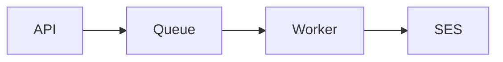

# NEW-FEATURES.md - Quick Start Guide for AI Agents

**Version:** 1.0.0
**Last Updated:** 2025-10-20
**Project:** Email Gateway (NestJS + BullMQ + PostgreSQL + Redis + AWS SES)

---

## How to Use This Guide

This document is your FIRST READ when working on any task. It helps you:

1. Identify your task type quickly (decision tree below)
2. Find ONLY the essential docs you need (not all 20+ docs)
3. Access quick reference patterns and code snippets
4. Avoid common pitfalls with troubleshooting section

**Reading time per section:** ~30 seconds
**Total guide length:** ~800 lines (dense but scannable)

---

## Task Type Decision Tree

Use this flowchart to identify your task type:

```
START: What are you doing?
│
├─ Adding NEW functionality?
│  ├─ Is it a REST endpoint? ────────────────────► [1] NEW API ENDPOINT
│  ├─ Is it a background job? ──────────────────► [2] NEW WORKER/PROCESSOR
│  ├─ Is it a database table/column? ───────────► [3] DATABASE SCHEMA CHANGE
│  ├─ Is it auth/security related? ─────────────► [4] SECURITY/AUTH FEATURE
│  └─ Is it metrics/logging/tracing? ───────────► [5] OBSERVABILITY
│
├─ Fixing EXISTING code?
│  └─ Bug in current functionality? ────────────► [6] BUG FIX
│
├─ Improving EXISTING code structure?
│  └─ No behavior change, just refactoring? ────► [7] REFACTORING
│
├─ Adding/changing CONFIG?
│  └─ New env vars or config? ──────────────────► [8] CONFIGURATION/ENV VARS
│
├─ Writing TESTS?
│  └─ Adding tests to existing code? ───────────► [9] TESTING
│
└─ Updating DOCUMENTATION?
   └─ Only docs, no code? ──────────────────────► [10] DOCUMENTATION
```

**Not sure?** Read [docs/AI_AGENT_GUIDE.md](docs/AI_AGENT_GUIDE.md) first for workflow overview.

---

## Task Type Guides

### [1] NEW API ENDPOINT

**When:** Creating new REST endpoint (e.g., `POST /v1/domain/verify`, `GET /v1/dashboard`)

**Essential Docs (Read these 4 only):**

- [docs/CODE-QUALITY-STANDARDS.md](docs/CODE-QUALITY-STANDARDS.md) - Exception handling, logging, config
- [docs/testing/03-testing-standards.md](docs/testing/03-testing-standards.md) - API testing requirements
- [docs/api/01-endpoints.md](docs/api/01-endpoints.md) - API patterns and conventions
- [docs/architecture/01-visao-geral-sistema.md](docs/architecture/01-visao-geral-sistema.md) - System overview

**Quick Pattern:**

```typescript
// apps/api/src/modules/your-module/controllers/your-feature.controller.ts
import { Controller, Post, Body, UseGuards, HttpCode, Logger } from '@nestjs/common';
import { ApiKeyGuard } from '../guards/api-key.guard';
import { YourFeatureDto } from '../dto/your-feature.dto';
import { YourFeatureService } from '../services/your-feature.service';

@Controller('v1/your-feature')
@UseGuards(ApiKeyGuard)
export class YourFeatureController {
  private readonly logger = new Logger(YourFeatureController.name);

  constructor(private readonly service: YourFeatureService) {}

  @Post()
  @HttpCode(201)
  async create(
    @Body() dto: YourFeatureDto,
    @Req() req: Request,
  ) {
    const requestId = req.headers['x-request-id'] as string;
    const companyId = (req as any).companyId;

    this.logger.log({
      message: 'Feature request received',
      requestId,
      companyId,
      endpoint: req.url,
    });

    return this.service.create({ companyId, body: dto, requestId });
  }
}
```

**Service Pattern:**

```typescript
// apps/api/src/modules/your-module/services/your-feature.service.ts
import { Injectable, Logger } from '@nestjs/common';
import { prisma } from '@email-gateway/database';

@Injectable()
export class YourFeatureService {
  private readonly logger = new Logger(YourFeatureService.name);

  async create(params: { companyId: string; body: any; requestId: string }) {
    const { companyId, body, requestId } = params;

    try {
      // Business logic here
      const result = await prisma.yourTable.create({
        data: { companyId, ...body },
      });

      this.logger.log({
        message: 'Feature created successfully',
        requestId,
        companyId,
        resultId: result.id,
      });

      return result;
    } catch (error) {
      this.logger.error({
        message: 'Failed to create feature',
        requestId,
        companyId,
        error: error.message,
        stack: error.stack,
      });
      throw error;
    }
  }
}
```

**DTO Pattern:**

```typescript
// apps/api/src/modules/your-module/dto/your-feature.dto.ts
import { IsString, IsEmail, MaxLength, IsOptional } from 'class-validator';

export class YourFeatureDto {
  @IsString()
  @MaxLength(200)
  field1: string;

  @IsEmail()
  email: string;

  @IsOptional()
  @IsString()
  optionalField?: string;
}
```

**Checklist:**

- [ ] Controller uses `@UseGuards(ApiKeyGuard)` for authentication
- [ ] All methods log with structured JSON (requestId, companyId)
- [ ] DTO uses class-validator decorators
- [ ] Service uses Dependency Injection (constructor injection)
- [ ] Errors throw custom exceptions (see CODE-QUALITY-STANDARDS.md:136)
- [ ] Integration tests created (see 03-testing-standards.md:260)
- [ ] OpenAPI endpoint documented in `docs/api/` if public

**Example Files:**

- Controller: `apps/api/src/modules/email/controllers/email-send.controller.ts`
- Service: `apps/api/src/modules/email/services/email-send.service.ts:39`
- Tests: `apps/api/test/email.e2e-spec.ts`

---

### [2] NEW WORKER/PROCESSOR

**When:** Creating new background job processor (e.g., `email:send`, `email:retry`)

**Essential Docs (Read these 4 only):**

- [docs/CODE-QUALITY-STANDARDS.md](docs/CODE-QUALITY-STANDARDS.md) - Error handling for workers
- [docs/worker/02-retry-strategy.md](docs/worker/02-retry-strategy.md) - Retry patterns
- [docs/queue-redis/03-retry-backoff-dlq.md](docs/queue-redis/03-retry-backoff-dlq.md) - Queue config
- [docs/worker/04-failure-modes-recovery.md](docs/worker/04-failure-modes-recovery.md) - Failure handling

**Quick Pattern:**

```typescript
// apps/worker/src/processors/your-job.processor.ts
import { Job } from 'bullmq';
import { PrismaClient } from '@email-gateway/database';
import { YourJobData } from '@email-gateway/shared';

export class YourJobProcessor {
  constructor(private readonly prisma: PrismaClient) {}

  async process(job: Job<YourJobData>) {
    const { jobId, requestId, companyId } = job.data;
    const startTime = Date.now();

    try {
      console.log({
        message: 'Processing job',
        jobId,
        requestId,
        companyId,
        attempt: job.attemptsMade + 1,
      });

      // Business logic here
      await this.doWork(job.data);

      const duration = Date.now() - startTime;
      console.log({
        message: 'Job completed successfully',
        jobId,
        requestId,
        duration,
      });

      return { success: true, duration };
    } catch (error) {
      const duration = Date.now() - startTime;

      console.error({
        message: 'Job failed',
        jobId,
        requestId,
        error: error.message,
        stack: error.stack,
        attempt: job.attemptsMade + 1,
        duration,
      });

      // Classify error for retry decision
      if (this.isPermanentError(error)) {
        // Don't retry, move to DLQ
        throw new Error(`PERMANENT_ERROR: ${error.message}`);
      }

      // Retry for transient errors
      throw error;
    }
  }

  private isPermanentError(error: Error): boolean {
    const permanentCodes = [
      'INVALID_INPUT',
      'VALIDATION_FAILED',
      'UNAUTHORIZED',
    ];
    return permanentCodes.some(code => error.message.includes(code));
  }

  private async doWork(data: YourJobData) {
    // Implement your business logic
  }
}
```

**Job Data Interface:**

```typescript
// packages/shared/src/types/jobs.ts (or create if missing)
export interface YourJobData {
  jobId: string;
  requestId: string;
  companyId: string;
  // Add your job-specific fields
  payload: any;
}
```

**Checklist:**

- [ ] Error handling classifies permanent vs transient errors
- [ ] Logs include jobId, requestId, attempt number
- [ ] Uses structured logging (JSON format)
- [ ] Permanent errors throw immediately (no retry)
- [ ] Transient errors re-throw for BullMQ retry
- [ ] Integration tests with mocked dependencies
- [ ] Job config in BullMQ with retry settings

**Example Files:**

- Processor: `apps/worker/src/processors/email-send.processor.ts:75`
- Error classification: `apps/worker/src/processors/email-send.processor.ts:356`
- Logging: `apps/worker/src/services/logging.service.ts`

---

### [3] DATABASE SCHEMA CHANGE

**When:** Adding new table, column, index, or modifying schema

**Essential Docs (Read these 3 only):**

- [docs/CODE-QUALITY-STANDARDS.md](docs/CODE-QUALITY-STANDARDS.md) - Performance guidelines (indexes)
- [docs/data/03-data-retention-privacy.md](docs/data/03-data-retention-privacy.md) - Data privacy rules
- [docs/SETUP-INSTRUCTIONS.md](docs/SETUP-INSTRUCTIONS.md) - Database setup

**Quick Pattern:**

```prisma
// packages/database/prisma/schema.prisma

model YourNewTable {
  id        String   @id @default(cuid())
  companyId String
  company   Company  @relation(fields: [companyId], references: [id])

  // Add your fields
  name      String   @db.VarChar(200)
  email     String?
  metadata  Json?

  // Always include timestamps
  createdAt DateTime @default(now())
  updatedAt DateTime @updatedAt

  // Indexes for performance
  @@index([companyId, createdAt])  // For queries filtered by company + time
  @@map("your_table_name")          // Snake case table name
}
```

**Migration Workflow:**

```bash
# 1. Update schema.prisma
# 2. Create migration
npx prisma migrate dev --name add_your_feature

# 3. Generate Prisma Client
npx prisma generate

# 4. Test migration
npx prisma migrate deploy  # In test environment

# 5. Verify indexes
# Check EXPLAIN ANALYZE for your queries
```

**Checklist:**

- [ ] New tables have `id`, `createdAt`, `updatedAt`
- [ ] Foreign keys use proper relations
- [ ] Add indexes for query performance (see CODE-QUALITY-STANDARDS.md:697)
- [ ] Use snake_case for table names (`@@map`)
- [ ] PII fields encrypted (cpfCnpjEnc) + hashed (cpfCnpjHash)
- [ ] Sensitive data never in plain text
- [ ] Migration tested locally before PR
- [ ] Update `.env.example` if new fields need config

**PII Storage Pattern:**

```prisma
model Recipient {
  id           String   @id @default(cuid())
  companyId    String
  email        String

  // CORRECT: Store PII encrypted + hash for search
  cpfCnpjEnc   String?  // Encrypted value (AES-256-CBC)
  cpfCnpjHash  String?  // HMAC-SHA256 for searching

  @@index([companyId, cpfCnpjHash])  // Search by hash, not plaintext
  @@map("recipients")
}
```

**Example Files:**

- Schema: `packages/database/prisma/schema.prisma`
- Migrations: `packages/database/prisma/migrations/`
- Encryption: `apps/api/src/modules/email/services/email-send.service.ts:332`

---

### [4] SECURITY/AUTH FEATURE

**When:** Implementing authentication, rate limiting, encryption, PII handling

**Essential Docs (Read these 4 only):**

- [docs/CODE-QUALITY-STANDARDS.md](docs/CODE-QUALITY-STANDARDS.md) - Security standards
- [docs/data/03-data-retention-privacy.md](docs/data/03-data-retention-privacy.md) - PII protection
- [docs/testing/03-testing-standards.md](docs/testing/03-testing-standards.md) - Security testing
- [docs/api/01-endpoints.md](docs/api/01-endpoints.md) - Auth patterns

**Quick Pattern - API Key Auth:**

```typescript
// apps/api/src/modules/auth/guards/api-key.guard.ts
import { Injectable, CanActivate, ExecutionContext, UnauthorizedException } from '@nestjs/common';
import { AuthService } from '../auth.service';

@Injectable()
export class ApiKeyGuard implements CanActivate {
  constructor(private authService: AuthService) {}

  async canActivate(context: ExecutionContext): Promise<boolean> {
    const request = context.switchToHttp().getRequest();
    const apiKey = request.headers['x-api-key'];

    if (!apiKey) {
      throw new UnauthorizedException('API key required');
    }

    const company = await this.authService.validateApiKey(apiKey);
    if (!company) {
      throw new UnauthorizedException('Invalid API key');
    }

    // Attach to request for use in controllers
    request.companyId = company.id;
    request.company = company;

    return true;
  }
}
```

**Rate Limiting Pattern:**

```typescript
// apps/api/src/modules/your-module/your-controller.ts
import { UseGuards } from '@nestjs/common';
import { ThrottlerGuard, Throttle } from '@nestjs/throttler';

@Controller('v1/your-endpoint')
@UseGuards(ApiKeyGuard, ThrottlerGuard)  // Apply both
export class YourController {

  @Post('send')
  @Throttle(60, 60)  // 60 requests per 60 seconds
  async sensitiveOperation() {
    // Protected by rate limit
  }
}
```

**PII Encryption Pattern (CORRECT):**

```typescript
import { encryptCpfCnpj, decryptCpfCnpj, maskCpfCnpj } from '@email-gateway/shared';

// ENCRYPT before storing
const { encrypted, salt } = encryptCpfCnpj(cpfCnpj, process.env.ENCRYPTION_KEY);
await prisma.recipient.create({
  data: {
    cpfCnpjEnc: encrypted,
    cpfCnpjHash: createHash('sha256').update(cpfCnpj).digest('hex'),
  },
});

// DECRYPT when authorized access needed
const decrypted = decryptCpfCnpj(encrypted, process.env.ENCRYPTION_KEY, salt);

// MASK for logging
console.log({ cpf: maskCpfCnpj(cpfCnpj) });  // 123.***.***-01
```

**NEVER Do This:**

```typescript
// WRONG: Using deprecated crypto.createCipher
const cipher = crypto.createCipher('aes-256-cbc', key);  // INSECURE!

// WRONG: Logging PII without masking
console.log({ email: user.email });  // Logs full email

// WRONG: Storing PII in plain text
await prisma.user.create({ data: { cpf: '12345678901' } });  // NO ENCRYPTION!
```

**Checklist:**

- [ ] Use `@email-gateway/shared` encryption functions (NOT crypto.createCipher)
- [ ] Always mask PII in logs (maskEmail, maskCpfCnpj)
- [ ] Store encrypted + hash for PII (cpfCnpjEnc + cpfCnpjHash)
- [ ] API keys hashed with bcrypt (never plaintext)
- [ ] Rate limiting on sensitive endpoints
- [ ] Input validation with class-validator
- [ ] No secrets in code (use env vars)
- [ ] Security tests for auth bypasses

**Example Files:**

- Auth Guard: `apps/api/src/modules/auth/guards/api-key.guard.ts`
- Encryption: `libs/shared/src/utils/encryption.util.ts` (if exists)
- Masking: `libs/shared/src/utils/masking.util.ts` (if exists)

---

### [5] OBSERVABILITY

**When:** Adding metrics, structured logging, distributed tracing

**Essential Docs (Read these 2 only):**

- [docs/CODE-QUALITY-STANDARDS.md](docs/CODE-QUALITY-STANDARDS.md) - Logging standards
- [docs/architecture/01-visao-geral-sistema.md](docs/architecture/01-visao-geral-sistema.md) - System overview

**Quick Pattern - Structured Logging:**

```typescript
import { Logger } from '@nestjs/common';

export class YourService {
  private readonly logger = new Logger(YourService.name);

  async doWork(params: { companyId: string; requestId: string }) {
    const { companyId, requestId } = params;

    // CORRECT: Structured JSON logging
    this.logger.log({
      message: 'Work started',
      requestId,
      companyId,
      timestamp: new Date().toISOString(),
    });

    try {
      // Business logic
      const result = await this.processWork();

      this.logger.log({
        message: 'Work completed',
        requestId,
        companyId,
        resultId: result.id,
        duration: result.duration,
      });

      return result;
    } catch (error) {
      this.logger.error({
        message: 'Work failed',
        requestId,
        companyId,
        error: error.message,
        stack: error.stack,
      });
      throw error;
    }
  }
}
```

**Metrics Pattern:**

```typescript
// apps/worker/src/services/metrics.service.ts
export class MetricsService {
  async recordEmailSent(companyId: string) {
    // Increment counter
    await redis.incr(`metrics:emails:sent:${companyId}`);
    await redis.incr(`metrics:emails:sent:total`);
  }

  async recordLatency(durationMs: number, companyId: string) {
    // Record histogram
    await redis.zadd(
      `metrics:latency:${companyId}`,
      Date.now(),
      durationMs,
    );
  }
}
```

**Request ID Propagation:**

```typescript
// API → Queue → Worker
// 1. API receives request
const requestId = req.headers['x-request-id'] || uuid();
res.setHeader('x-request-id', requestId);

// 2. API enqueues job with requestId
await queue.add('email:send', {
  outboxId: email.id,
  requestId,  // PROPAGATE
});

// 3. Worker logs with same requestId
this.logger.log({
  message: 'Processing email',
  jobId: job.id,
  requestId: job.data.requestId,  // SAME ID
});
```

**Checklist:**

- [ ] All logs use JSON format (not string concatenation)
- [ ] Every log has `message`, `requestId`/`jobId`, `timestamp`
- [ ] Request IDs propagated: API → Queue → Worker
- [ ] No PII logged without masking
- [ ] Metrics recorded for key operations (sent, failed, latency)
- [ ] Errors include stack traces (but not in production responses)
- [ ] Use appropriate log levels (error, warn, log, debug)

**Log Levels:**

| Level   | Use When                          | Example                                  |
|---------|-----------------------------------|------------------------------------------|
| `error` | Errors requiring attention        | SES rejected email, DB connection failed |
| `warn`  | Abnormal but recoverable          | Rate limit approaching, retry scheduled  |
| `log`   | Important system events           | Email sent, job processed, user created  |
| `debug` | Detailed info for debugging       | Variable values, intermediate states     |

**Example Files:**

- Logging: `apps/worker/src/services/logging.service.ts`
- Metrics: `apps/worker/src/services/metrics.service.ts`
- Tracing: `apps/worker/src/services/tracing.service.ts`
- Request ID: `apps/api/src/middleware/request-id.middleware.ts`

---

### [6] BUG FIX

**When:** Fixing existing broken functionality

**Essential Docs (Read these 3 only):**

- [docs/CODE-QUALITY-STANDARDS.md](docs/CODE-QUALITY-STANDARDS.md) - Code standards
- [docs/testing/03-testing-standards.md](docs/testing/03-testing-standards.md) - Test requirements
- [docs/PR_ADJUSTMENTS.md](docs/PR_ADJUSTMENTS.md) - How to document fixes

**Bug Fix Workflow:**

1. **Reproduce the bug**
   - Create a failing test that demonstrates the bug
   - Document exact steps to reproduce

2. **Root cause analysis**
   - Use logs to trace the issue
   - Check for correlation IDs in logs (requestId/jobId)
   - Review error messages and stack traces

3. **Fix the bug**
   - Apply minimal change to fix root cause
   - Don't add features while fixing
   - Keep scope tight

4. **Test the fix**
   - Ensure failing test now passes
   - Add regression tests
   - Verify no side effects

5. **Document in PR**
   - Link to issue or error report
   - Explain root cause
   - Show before/after behavior

**Bug Fix Pattern:**

```typescript
// BEFORE (Bug):
async sendEmail(recipient: string) {
  // BUG: No validation, crashes on invalid email
  await sesClient.send(recipient);
}

// AFTER (Fixed):
async sendEmail(recipient: string) {
  // FIX: Validate before sending
  if (!this.isValidEmail(recipient)) {
    throw new InvalidRecipientException(recipient);
  }
  await sesClient.send(recipient);
}

// REGRESSION TEST:
it('should throw error for invalid email', async () => {
  await expect(
    service.sendEmail('invalid-email')
  ).rejects.toThrow(InvalidRecipientException);
});
```

**Checklist:**

- [ ] Bug reproduced with failing test
- [ ] Root cause identified and documented
- [ ] Fix is minimal and targeted
- [ ] Regression test added
- [ ] No scope creep (only fix, no new features)
- [ ] PR describes root cause clearly
- [ ] Related logs/errors linked in PR

**Example PR Structure:**

```markdown
## Bug Description
Email validation fails for emails with '+' character.

## Root Cause
Regex pattern in `isValidEmail()` doesn't allow '+' in local part.

## Fix
Updated regex to RFC 5322 compliant pattern.

## Testing
- Added test case for 'user+tag@example.com'
- All existing tests pass
- Manual testing: sent email to '+' address successfully

## Related
- Error logs: [link to logs]
- Issue: #123
```

---

### [7] REFACTORING

**When:** Improving code structure without changing behavior

**Essential Docs (Read these 2 only):**

- [docs/CODE-QUALITY-STANDARDS.md](docs/CODE-QUALITY-STANDARDS.md) - Code organization
- [docs/testing/03-testing-standards.md](docs/testing/03-testing-standards.md) - Test coverage

**Refactoring Principles:**

1. **NO behavior changes** - Output must be identical
2. **Keep tests green** - All existing tests must pass
3. **Incremental changes** - Small steps, not big rewrites
4. **Test coverage maintained** - Don't reduce coverage

**Common Refactorings:**

**Extract Method:**

```typescript
// BEFORE: Long method
async processEmail(data) {
  // 50 lines of code doing multiple things
  // Validation
  // Transformation
  // Sending
  // Logging
}

// AFTER: Extracted methods
async processEmail(data) {
  this.validate(data);
  const transformed = this.transform(data);
  const result = await this.send(transformed);
  this.log(result);
  return result;
}

private validate(data) { /* ... */ }
private transform(data) { /* ... */ }
private async send(data) { /* ... */ }
private log(result) { /* ... */ }
```

**Dependency Injection:**

```typescript
// BEFORE: Hard-coded dependency
export class EmailService {
  private sesClient = new SESClient({ region: 'us-east-1' });
}

// AFTER: Injected dependency
export class EmailService {
  constructor(
    private readonly sesClient: SESClient,  // Injected
  ) {}
}
```

**Extract Interface:**

```typescript
// BEFORE: Direct implementation usage
export class EmailService {
  constructor(private sesClient: SESClient) {}
}

// AFTER: Interface for flexibility
export interface IEmailProvider {
  send(params: SendParams): Promise<SendResult>;
}

export class EmailService {
  constructor(private provider: IEmailProvider) {}  // Any implementation
}
```

**Checklist:**

- [ ] Behavior unchanged (output identical)
- [ ] All tests still pass (no failures)
- [ ] Test coverage >= original (preferably higher)
- [ ] PR clearly states "Refactor only, no behavior change"
- [ ] Code follows Single Responsibility Principle
- [ ] Dependencies properly injected
- [ ] No scope creep (don't add features)

---

### [8] CONFIGURATION/ENV VARS

**When:** Adding new environment variables or configuration

**Essential Docs (Read these 2 only):**

- [docs/CODE-QUALITY-STANDARDS.md](docs/CODE-QUALITY-STANDARDS.md) - Config management
- [docs/SETUP-INSTRUCTIONS.md](docs/SETUP-INSTRUCTIONS.md) - Setup guide

**Configuration Pattern:**

```typescript
// 1. Add to environment validation
// apps/api/src/config/env.validation.ts
import { IsString, IsNumber, IsUrl, Min, Max } from 'class-validator';

class EnvironmentVariables {
  // ... existing vars

  @IsString()
  YOUR_NEW_VAR: string;

  @IsNumber()
  @Min(1)
  @Max(100)
  YOUR_NUMERIC_VAR: number;

  @IsUrl()
  YOUR_URL_VAR: string;
}
```

```typescript
// 2. Add to config service
// apps/api/src/config/app.config.ts
@Injectable()
export class AppConfigService {
  constructor(private configService: ConfigService) {}

  get yourFeature() {
    return {
      varName: this.configService.get<string>('YOUR_NEW_VAR'),
      numericVar: this.configService.get<number>('YOUR_NUMERIC_VAR'),
      urlVar: this.configService.get<string>('YOUR_URL_VAR'),
    };
  }
}
```

```bash
# 3. Update .env.example
YOUR_NEW_VAR=default_value
YOUR_NUMERIC_VAR=10
YOUR_URL_VAR=https://example.com
```

```typescript
// 4. Use in your code
export class YourService {
  constructor(private config: AppConfigService) {}

  doWork() {
    const config = this.config.yourFeature;
    console.log(config.varName);  // Type-safe access
  }
}
```

**Checklist:**

- [ ] Added to `EnvironmentVariables` class with validation
- [ ] Added to `AppConfigService` for type-safe access
- [ ] Documented in `.env.example`
- [ ] Documented in PR (what it does, default value)
- [ ] NO secrets committed (use .env, not hardcoded)
- [ ] Validation rules appropriate (type, min, max, format)
- [ ] App fails fast if invalid (throws on startup)

**Security Rules:**

- NEVER commit `.env` files
- NEVER hardcode secrets in code
- ALWAYS validate env vars on startup
- ALWAYS document required vs optional vars

**Example Files:**

- Validation: `apps/api/src/config/env.validation.ts`
- Config service: `apps/api/src/config/app.config.ts`
- Example: `.env.example`

---

### [9] TESTING

**When:** Adding tests to existing code (unit, integration, E2E)

**Essential Docs (Read these 2 only):**

- [docs/testing/03-testing-standards.md](docs/testing/03-testing-standards.md) - **FULL READ REQUIRED**
- [docs/CODE-QUALITY-STANDARDS.md](docs/CODE-QUALITY-STANDARDS.md) - Code patterns to test

**Coverage Requirements:**

| Code Type        | Minimum Coverage |
|------------------|------------------|
| Services         | 80%              |
| Utils            | 90%              |
| Controllers      | 70%              |
| Processors       | 80%              |
| Overall Project  | 70%              |

**Test Types:**

**Unit Test (70% of tests):**

```typescript
// apps/api/src/modules/email/services/email.service.spec.ts
import { Test } from '@nestjs/testing';
import { EmailService } from './email.service';
import { PrismaService } from '../../../prisma/prisma.service';

describe('EmailService', () => {
  let service: EmailService;
  let prisma: PrismaService;

  beforeEach(async () => {
    const module = await Test.createTestingModule({
      providers: [EmailService, PrismaService],
    }).compile();

    service = module.get(EmailService);
    prisma = module.get(PrismaService);
  });

  it('should create email record', async () => {
    // Arrange
    const dto = { recipient: 'test@example.com', subject: 'Test' };
    jest.spyOn(prisma.emailOutbox, 'create').mockResolvedValue({ id: '123' } as any);

    // Act
    const result = await service.create(dto);

    // Assert
    expect(result.id).toBe('123');
    expect(prisma.emailOutbox.create).toHaveBeenCalledWith(
      expect.objectContaining({ data: expect.objectContaining(dto) })
    );
  });
});
```

**Integration Test (25% of tests):**

```typescript
// apps/api/test/email.integration.spec.ts
import { Test } from '@nestjs/testing';
import { INestApplication } from '@nestjs/common';
import * as request from 'supertest';
import { AppModule } from '../src/app.module';

describe('Email API (integration)', () => {
  let app: INestApplication;

  beforeAll(async () => {
    const module = await Test.createTestingModule({
      imports: [AppModule],
    }).compile();
    app = moduleFixture.createNestApplication();
    await app.init();
  });

  afterAll(async () => {
    await app.close();
  });

  it('POST /v1/email/send should create email', async () => {
    const response = await request(app.getHttpServer())
      .post('/v1/email/send')
      .set('x-api-key', 'test-key')
      .send({ recipient: 'test@example.com', subject: 'Test' })
      .expect(201);

    expect(response.body).toHaveProperty('id');
  });
});
```

**E2E Test (5% of tests):**

```typescript
// apps/api/test/email-flow.e2e-spec.ts
describe('Email Send Flow (E2E)', () => {
  it('should send email end-to-end', async () => {
    // 1. Send request
    const response = await request(app.getHttpServer())
      .post('/v1/email/send')
      .set('x-api-key', 'test-key')
      .send({ recipient: 'test@example.com', subject: 'E2E' })
      .expect(201);

    // 2. Wait for processing
    await waitFor(async () => {
      const email = await prisma.emailOutbox.findUnique({ where: { id: response.body.id } });
      return email.status === 'SENT';
    }, { timeout: 5000 });

    // 3. Verify result
    const email = await prisma.emailOutbox.findUnique({ where: { id: response.body.id } });
    expect(email.status).toBe('SENT');
  });
});
```

**Commands:**

```bash
# Run all tests
npm run test

# Run with coverage
npm run test:cov

# Run specific test file
npm run test email.service.spec.ts

# Run integration tests
npm run test:integration

# Run E2E tests
npm run test:e2e

# Watch mode
npm run test:watch
```

**Checklist:**

- [ ] Unit tests for all services/utils (>= 80%)
- [ ] Integration tests for API endpoints (>= 70%)
- [ ] Mocks for external dependencies (SES, Redis)
- [ ] Edge cases covered (validation errors, null values)
- [ ] All tests pass (`npm run test`)
- [ ] Coverage meets minimum (`npm run test:cov`)
- [ ] AAA pattern (Arrange, Act, Assert)
- [ ] Descriptive test names (`should X when Y`)

**Example Files:**

- Unit: `apps/api/src/modules/email/services/email.service.spec.ts`
- Integration: `apps/api/test/email.integration.spec.ts`
- E2E: `apps/api/test/email-flow.e2e-spec.ts`

---

### [10] DOCUMENTATION

**When:** Updating docs only (no code changes)

**Essential Docs (Read these 2 only):**

- [docs/CONTRIBUTING-docs.md](docs/CONTRIBUTING-docs.md) - Documentation guidelines
- [docs/TEMPLATE-DOC.md](docs/TEMPLATE-DOC.md) - Documentation template

**Documentation Types:**

1. **Architecture Docs** (`docs/architecture/`)
   - System design and diagrams
   - Component interactions
   - Use Mermaid for diagrams

2. **API Docs** (`docs/api/`)
   - Endpoint specifications
   - Request/response examples
   - OpenAPI format when possible

3. **ADRs** (`docs/adrs/`)
   - Architecture Decision Records
   - Follow template: `docs/TEMPLATE-ADR.md`
   - Format: `ADR-YYYYMMDD-title.md`

4. **Operational Docs** (`docs/worker/`, `docs/queue-redis/`)
   - Configuration guides
   - Troubleshooting runbooks
   - Failure scenarios

**Quick Template:**

```markdown
# Title - Brief Description

> **Type:** [Architecture|API|ADR|Operational]
> **Status:** [Draft|Approved|Deprecated]
> **Last Updated:** YYYY-MM-DD
> **Responsible:** Team Name

## Overview
Brief description of what this document covers.

## Context
Why does this exist? What problem does it solve?

## Details
Main content here with code examples, diagrams, etc.

## References
- [Related Doc 1](../path/to/doc.md)
- [Related Doc 2](../path/to/doc.md)

---
**Template version:** 1.0
**Last updated:** YYYY-MM-DD
```

**Mermaid Diagram Example:**

```markdown
## System Architecture


```

**Checklist:**

- [ ] Used template from `docs/TEMPLATE-DOC.md` or `docs/TEMPLATE-ADR.md`
- [ ] Includes metadata (Type, Status, Last Updated)
- [ ] Clear and concise (avoid fluff)
- [ ] Code examples use syntax highlighting
- [ ] Diagrams use Mermaid format
- [ ] Cross-references to related docs
- [ ] Typos checked
- [ ] PR description explains what changed and why

**Example Files:**

- Architecture: `docs/architecture/01-visao-geral-sistema.md`
- ADR: `docs/adrs/ADR-20250116-escolha-redis-queue.md`
- API: `docs/api/03-email-send-contract.md`

---

## Quick Reference Patterns

### Exception Handling

**Global Filter (API):**

Location: `apps/api/src/filters/http-exception.filter.ts`

```typescript
@Catch()
export class AllExceptionsFilter implements ExceptionFilter {
  catch(exception: unknown, host: ArgumentsHost) {
    const status = exception instanceof HttpException
      ? exception.getStatus()
      : HttpStatus.INTERNAL_SERVER_ERROR;

    const errorResponse = {
      error: {
        code: this.getErrorCode(exception),
        message: this.getErrorMessage(exception),
        requestId: request.headers['x-request-id'],
        timestamp: new Date().toISOString(),
      }
    };

    response.status(status).json(errorResponse);
  }
}
```

**Custom Exception:**

```typescript
export class BusinessException extends HttpException {
  constructor(
    public readonly code: string,
    message: string,
    status: HttpStatus = HttpStatus.BAD_REQUEST,
  ) {
    super({ code, message }, status);
  }
}

// Usage
throw new BusinessException('EMAIL_NOT_FOUND', 'Email not found', HttpStatus.NOT_FOUND);
```

**Reference:** `docs/CODE-QUALITY-STANDARDS.md:30`

---

### Structured Logging

**Format:**

```typescript
this.logger.log({
  message: 'Clear description of event',
  requestId: req.headers['x-request-id'],
  companyId: req.user.companyId,
  // Add relevant context
});
```

**Log Levels:**

- `error` - Requires attention (DB failures, SES errors)
- `warn` - Abnormal but recoverable (rate limit warning)
- `log` - Important events (email sent, job processed)
- `debug` - Detailed info (dev only)

**Never Log:**

- Passwords, API keys, tokens
- CPF/CNPJ without masking
- Full email addresses (use masking)
- Message content

**Masking:**

```typescript
import { maskEmail, maskCpfCnpj } from '@email-gateway/shared';

this.logger.log({
  email: maskEmail('user@example.com'),  // u***@e***.com
  cpf: maskCpfCnpj('12345678901'),        // 123.***.***-01
});
```

**Reference:** `docs/CODE-QUALITY-STANDARDS.md:237`

---

### Request ID Propagation

**Middleware (API):**

```typescript
// apps/api/src/middleware/request-id.middleware.ts
export class RequestIdMiddleware implements NestMiddleware {
  use(req: Request, res: Response, next: NextFunction) {
    const requestId = (req.headers['x-request-id'] as string) || uuidv4();
    req.headers['x-request-id'] = requestId;
    res.setHeader('x-request-id', requestId);
    next();
  }
}
```

**Enqueue Job:**

```typescript
await queue.add('email:send', {
  outboxId: email.id,
  requestId: req.headers['x-request-id'],  // Propagate
});
```

**Worker Log:**

```typescript
this.logger.log({
  message: 'Processing',
  jobId: job.id,
  requestId: job.data.requestId,  // Same ID
});
```

**Reference:** `docs/CODE-QUALITY-STANDARDS.md:337`

---

### Database Queries

**Optimized Query:**

```typescript
// Use indexes
const emails = await prisma.emailOutbox.findMany({
  where: { companyId, status: 'SENT' },
  orderBy: { createdAt: 'desc' },
  take: 100,
});

// Schema index:
// @@index([companyId, status, createdAt])
```

**Avoid N+1:**

```typescript
// WRONG: N+1 queries
const emails = await prisma.emailOutbox.findMany();
for (const email of emails) {
  const recipient = await prisma.recipient.findUnique({ where: { id: email.recipientId } });
}

// CORRECT: Single query with include
const emails = await prisma.emailOutbox.findMany({
  include: { recipient: true },
});
```

**Pagination:**

```typescript
const emails = await prisma.emailOutbox.findMany({
  take: limit + 1,
  cursor: cursor ? { id: cursor } : undefined,
  orderBy: { createdAt: 'desc' },
});

const hasMore = emails.length > limit;
const items = hasMore ? emails.slice(0, -1) : emails;
```

**Reference:** `docs/CODE-QUALITY-STANDARDS.md:697`

---

### Encryption (PII)

**CORRECT Pattern:**

```typescript
import { encryptCpfCnpj, decryptCpfCnpj } from '@email-gateway/shared';

// Encrypt
const { encrypted, salt } = encryptCpfCnpj(cpfCnpj, process.env.ENCRYPTION_KEY);

// Store
await prisma.recipient.create({
  data: {
    cpfCnpjEnc: encrypted,
    cpfCnpjHash: createHash('sha256').update(cpfCnpj).digest('hex'),
  },
});

// Decrypt
const decrypted = decryptCpfCnpj(encrypted, process.env.ENCRYPTION_KEY, salt);
```

**WRONG Pattern:**

```typescript
// NEVER use crypto.createCipher (deprecated, insecure)
const cipher = crypto.createCipher('aes-256-cbc', key);  // NO!
```

**Reference:** `docs/CODE-QUALITY-STANDARDS.md:645`

---

## Troubleshooting & FAQ

### Common Issues

#### Issue: Tests failing in CI but pass locally

**Cause:** Environment differences (DB, Redis, Node version)

**Solution:**

1. Check CI logs for specific error
2. Run tests with same Node version as CI
3. Ensure test DB is clean before tests
4. Check for race conditions (async timing)

```bash
# Match CI environment
nvm use 18  # Or your CI Node version
npm ci      # Clean install
npm run test
```

---

#### Issue: Coverage below 70%

**Cause:** New code not tested, or mocks missing

**Solution:**

1. Check coverage report: `npm run test:cov`
2. Open `coverage/lcov-report/index.html`
3. Identify uncovered lines (red)
4. Add tests for uncovered code

```bash
npm run test:cov
open coverage/lcov-report/index.html  # Mac
start coverage/lcov-report/index.html  # Windows
```

---

#### Issue: Request ID not propagating to worker

**Cause:** Not passing requestId in job data

**Solution:**

```typescript
// API: Pass requestId when enqueueing
await queue.add('email:send', {
  outboxId: email.id,
  requestId: req.headers['x-request-id'],  // MUST PASS
});

// Worker: Use it in logs
console.log({
  jobId: job.id,
  requestId: job.data.requestId,  // Access here
});
```

---

#### Issue: PII showing in logs

**Cause:** Logging without masking

**Solution:**

```typescript
import { maskEmail, maskCpfCnpj } from '@email-gateway/shared';

// WRONG
console.log({ email: user.email });

// CORRECT
console.log({ email: maskEmail(user.email) });
```

---

#### Issue: Migration fails in production

**Cause:** Schema incompatible with existing data

**Solution:**

1. Test migration in staging first
2. Backup database before running
3. Use data migration if needed

```bash
# Staging
npx prisma migrate deploy --preview-feature

# Check for errors
# If OK, deploy to production
```

---

#### Issue: Queue jobs stuck in "active"

**Cause:** Worker crashed without completing job

**Solution:**

1. Check worker logs for errors
2. Restart worker
3. Jobs will auto-retry after timeout

```bash
# Check BullMQ dashboard or Redis
redis-cli
> KEYS bull:email:send:*
> HGETALL bull:email:send:123  # Inspect job
```

---

#### Issue: API returns 401 Unauthorized

**Cause:** Missing or invalid API key

**Solution:**

```bash
# Check request has API key header
curl -H "x-api-key: your-key" http://localhost:3000/v1/endpoint

# Verify key exists in database
SELECT * FROM api_keys WHERE key_hash = bcrypt_hash('your-key');
```

---

### Performance Tips

1. **Add indexes for common queries**
   - `@@index([companyId, createdAt])` for time-range queries
   - `@@index([companyId, status])` for status filters

2. **Use cursor pagination, not offset**
   - Offset gets slower with large datasets
   - Cursor is O(1) regardless of position

3. **Cache frequently accessed data**
   - Use Redis for hot data
   - Set TTL appropriately

4. **Batch operations when possible**
   - `prisma.emailOutbox.createMany()` instead of multiple `create()`

5. **Monitor slow queries**
   - Use Prisma query logging
   - Check EXPLAIN ANALYZE in PostgreSQL

---

## Full Documentation Index

Quick reference to all docs (for when you need more detail):

### Architecture

- [01-visao-geral-sistema.md](docs/architecture/01-visao-geral-sistema.md) - System overview, components, flows

### API

- [01-endpoints.md](docs/api/01-endpoints.md) - All API endpoints
- [03-email-send-contract.md](docs/api/03-email-send-contract.md) - Email send API spec
- [04-email-get-contract.md](docs/api/04-email-get-contract.md) - Email query API spec
- [04-integration-example-end-to-end.md](docs/api/04-integration-example-end-to-end.md) - E2E examples

### Worker

- [01-configuracao.md](docs/worker/01-configuracao.md) - Worker setup
- [02-retry-strategy.md](docs/worker/02-retry-strategy.md) - Retry patterns
- [04-failure-modes-recovery.md](docs/worker/04-failure-modes-recovery.md) - Failure handling

### Queue

- [02-job-contracts.md](docs/queue-redis/02-job-contracts.md) - Job data schemas
- [03-retry-backoff-dlq.md](docs/queue-redis/03-retry-backoff-dlq.md) - Queue config, DLQ

### Data

- [03-data-retention-privacy.md](docs/data/03-data-retention-privacy.md) - PII, retention, encryption

### ADRs

- [ADR-20250116-escolha-redis-queue.md](docs/adrs/ADR-20250116-escolha-redis-queue.md) - Why Redis + BullMQ

### Standards (CRITICAL)

- [CODE-QUALITY-STANDARDS.md](docs/CODE-QUALITY-STANDARDS.md) - **MUST READ** - Exception handling, logging, config
- [03-testing-standards.md](docs/testing/03-testing-standards.md) - **MUST READ** - Test requirements, coverage

### Process

- [AI_AGENT_GUIDE.md](docs/AI_AGENT_GUIDE.md) - Git workflow, commits, PRs
- [PR_REVIEW_RULES.md](docs/PR_REVIEW_RULES.md) - How PRs are reviewed
- [PR_ADJUSTMENTS.md](docs/PR_ADJUSTMENTS.md) - How to handle review comments
- [CONTRIBUTING.md](CONTRIBUTING.md) - Contributing guide
- [SETUP-INSTRUCTIONS.md](docs/SETUP-INSTRUCTIONS.md) - Local setup

### Templates

- [TEMPLATE-DOC.md](docs/TEMPLATE-DOC.md) - Documentation template
- [TEMPLATE-ADR.md](docs/TEMPLATE-ADR.md) - ADR template
- [TEMPLATE-PR-TASK.md](task/TEMPLATE-PR-TASK.md) - Out-of-scope task template

---

## Appendix: Key File Locations

### API Application

```
apps/api/
├── src/
│   ├── filters/
│   │   └── http-exception.filter.ts       # Global exception handler
│   ├── middleware/
│   │   └── request-id.middleware.ts       # Request ID injection
│   ├── config/
│   │   ├── env.validation.ts              # Env var validation
│   │   └── app.config.ts                  # Config service
│   ├── modules/
│   │   ├── email/
│   │   │   ├── controllers/
│   │   │   │   └── email-send.controller.ts
│   │   │   ├── services/
│   │   │   │   └── email-send.service.ts
│   │   │   └── dto/
│   │   │       └── send-email.dto.ts
│   │   └── auth/
│   │       ├── guards/
│   │       │   └── api-key.guard.ts
│   │       └── auth.service.ts
│   └── main.ts                             # App bootstrap
└── test/
    ├── fixtures/                            # Test data
    ├── mocks/                               # Mock objects
    └── *.e2e-spec.ts                        # E2E tests
```

### Worker Application

```
apps/worker/
└── src/
    ├── processors/
    │   └── email-send.processor.ts         # Main job processor
    └── services/
        ├── logging.service.ts               # Structured logging
        ├── metrics.service.ts               # Metrics recording
        ├── tracing.service.ts               # Distributed tracing
        ├── ses.service.ts                   # AWS SES client
        └── validation.service.ts            # Job validation
```

### Database

```
packages/database/
└── prisma/
    ├── schema.prisma                        # Database schema
    └── migrations/                          # Migration files
```

### Shared Libraries

```
libs/shared/src/
├── types/
│   ├── jobs.ts                              # Job data interfaces
│   └── email.ts                             # Email types
└── utils/
    ├── masking.util.ts                      # PII masking (maskEmail, maskCpfCnpj)
    └── encryption.util.ts                   # Encryption functions
```

---

## Version History

| Version | Date       | Changes                                  |
|---------|------------|------------------------------------------|
| 1.0.0   | 2025-10-20 | Initial version - comprehensive guide    |

---

**Questions or Issues?**

If this guide is missing something or unclear:

1. Check the full docs in `/docs`
2. Ask in team chat
3. Open an issue to improve this guide

**Remember:** This guide is a living document. Keep it updated as the project evolves.
