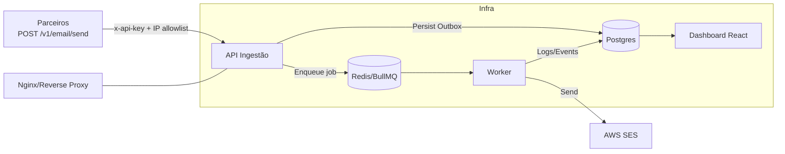

# Pacote de Documentos de Arquitetura — MVP Envio de Boletos

> Objetivo: listar **quais documentos** vamos produzir e **o que cada um cobre**, com foco no MVP. Sem código.

---

## 0. Estrutura & Convenções
- **Repositório de docs**: `/docs/` no monorepo
- **Formato**: Markdown (`.md`)
- **Versão**: Semantic (ex.: v1.0.0)
- **Rastreio de decisões**: ADRs (Architecture Decision Records)
- **Diagramas**: C4 + Fluxo (Mermaid/Draw.io)

```
/docs
  /architecture
    01-system-design-overview.md
    02-context-c4.md
    03-container-c4.md
    04-component-c4.md
    05-sequence-flows.md
    06-security-architecture.md
    07-observability.md
    08-deployment-infra.md
    09-capacity-slo-drrto.md
  /api
    01-api-overview.md
    02-auth-security.md
    03-email-send-contract.md
    04-webhooks-callbacks.md (opcional)
    05-error-models-retries.md
    06-rate-limits.md
  /queue-redis
    01-queue-overview.md
    02-job-contracts.md
    03-retry-backoff-dlq.md
    04-idempotency-dedup.md
    05-scheduling-crons.md
  /worker
    01-worker-overview.md
    02-processing-pipeline.md
    03-ses-integration.md
    04-failure-modes-recovery.md
  /data
    01-domain-data-model.md
    02-erd-schema.md
    03-data-retention-privacy.md
    04-backup-restore-runbook.md
    05-migrations-versioning.md
  /frontend
    01-ux-kpis.md
    02-ia-navigation.md
    03-frontend-architecture.md
    04-states-empty-error-loading.md
    05-access-control-basic-auth.md
  /adrs
    ADR-0001-outbox-vs-sqs.md
    ADR-0002-mvp-auth-model.md
    ADR-0003-dashboard-no-login.md
```

---

## 1) System Design Overview (01-system-design-overview.md)

**Resumo Executivo**  
Este documento descreve a visão macro da solução do MVP de envio de boletos por e‑mail, incluindo objetivos, escopo, requisitos não‑funcionais, componentes, fluxos, integrações e riscos. Serve como porta de entrada para qualquer pessoa entender o sistema em **5 minutos** e localizar os demais artefatos.

### 1.1 Contexto de Negócio
- Parceiros (M2, CodeWave, TrustCloud, CertShift, Pixel) geram HTML do boleto e metadados e chamam nossa API.
- Necessidade principal: **entrega confiável**, **auditoria completa** e **baixo custo**.
- MVP: validação do fluxo ponta‑a‑ponta com **40k e‑mails/mês (~1.300/dia)** e dashboard básico para operação.

### 1.2 Objetivos do Sistema
1. Receber requisições com HTML + metadados e **aceitar de forma segura** (API Key + IP allowlist).  
2. **Enfileirar** cada requisição de envio garantindo **não‑perda** (Outbox + Redis persistente).  
3. **Processar** em background (Worker) e enviar via **AWS SES** com rastreabilidade (`messageId`).  
4. **Auditar** todos os eventos e disponibilizar **dashboard** para métricas e histórico.  

### 1.3 Escopo
**Dentro:** API de ingestão, fila (Redis/BullMQ), Worker de envio, Postgres (logs/outbox/eventos), Dashboard React, Nginx (proxy/rate‑limit/Basic Auth), SES.  
**Fora (MVP):** autenticação avançada no dashboard (usaremos Basic Auth), webhooks de bounce/complaint (apenas monitoramento básico), multi‑região, SSO, templates de e‑mail gerenciados.

### 1.4 Requisitos Não‑Funcionais (NFRs)
- **Confiabilidade:** zero perda aceitável de pedidos já persistidos em outbox.  
- **Disponibilidade:** alvo de **≥ 99,5%** (horário comercial).  
- **Latência de ingestão (P95):** \<= **250 ms** para aceitar e enfileirar.  
- **Tempo médio fila→envio (P95):** \<= **60 s** com fila nominal.  
- **Throughput:** ≥ **2.000 envios/hora** em pico curto (com 2 workers concorrentes).  
- **Custo:** \<= **US$10/mês** infra de produção (exclui mão‑de‑obra).  
- **Segurança:** dados em trânsito via TLS; payload \<= **1MB**; sanitização de HTML armazenado.  
- **Observabilidade:** logs estruturados + métricas essenciais + correlação por `requestId`/`jobId`/`messageId`.

### 1.5 Suposições e Restrições
- Operação em **VPS única** (Redis + Postgres + apps) com backups.  
- **Região única** no SES.  
- Parceiros conseguem **retransmitir** em caso de 429/5xx (cliente implementa retry simples).  
- Crescimento planejado 10x será tratado com escala horizontal simples (mais workers e, se necessário, mover fila para SQS).

### 1.6 Visão Macro (Diagrama)


### 1.7 Fluxos Primários
1. **Envio**: API valida → grava `email_outbox` → enfileira job → worker envia SES → atualiza `email_logs` + `email_events`.  
2. **Retry**: Falha transitória → BullMQ aplica backoff exponencial (até N tentativas) → sucesso ou envio para **DLQ**.  
3. **Reprocessamento**: Cron de verificação varre `outbox`/DLQ e reenvia jobs elegíveis.  
4. **Auditoria**: Dashboard lista logs, eventos e exibe HTML armazenado.

### 1.8 Componentes e Responsabilidades
- **API (NestJS):** autenticação, validação, persistência inicial (Outbox), enqueue.  
- **Redis/BullMQ:** fila persistente, retries, DLQ, agendamentos.  
- **Worker (NestJS):** consumo da fila, integração SES, atualização de logs/eventos.  
- **Postgres:** armazenamento durável de outbox, logs e eventos.  
- **Dashboard:** leitura de KPIs e auditorias.  
- **Nginx:** reverse proxy, Basic Auth, rate limit.  
- **SES:** envio confiável e `MessageId` para rastreio.

### 1.9 Dados e Persistência
- **Tabelas‑chave:** `email_outbox`, `email_logs`, `email_events`, `companies`, **`recipients`** (nova).  
- **PII mínima necessária** para rastreabilidade operacional e conciliação com parceiros.  
- **Retenção:** definir política por compliance/custo (ver Data Retention).  
- **Integridade:** chaves/índices para consultas por empresa, destinatário, datas, status; **chaves naturais** (`external_id`, `cpf_cnpj`) com unicidade por empresa.

**Campos adicionais (padrão do domínio):**  
- `external_id` (string curta) — identificador do parceiro p/ o destinatário.  
- `cpf_cnpj` (string normalizada, somente dígitos) — opcional; **hash + mascarado** em logs.  
- `razao_social` (string) — opcional.  
- `nome` (string) — opcional, preferencial p/ pessoa física.  
- `email` (string) — já existente nos envios, referenciado em `recipients`.  
- `company_id` (fk) — escopo por empresa.  
- `recipient_id` (fk) — referência estável em `email_logs`/`email_outbox`.

### 1.10 Segurança (resumo)
- **Autenticação** por **API Key** por empresa + **IP allowlist** na borda.  
- **Controle de acesso** do painel com **Basic Auth**.  
- **Sanitização** de HTML em armazenamento/visualização.  
- **TLS** em todos os endpoints públicos.  
- **Rate limit** por empresa.

### 1.11 Observabilidade (resumo)
- **Logs estruturados** com correlação (headers/ids).  
- **Métricas:** tamanho da fila, taxa de sucesso/erro, latências, retries, DLQ.  
- **Alertas:** thresholds simples (ex.: taxa de erro > 2% por 5 min; jobs em DLQ > X).

### 1.12 Operação, Deploy e Backups
- **Deploy**: feito via [Coolify](https://coolify.io/) instalado na VPS. Builds automáticos são disparados ao detectar commits na branch `prod` do repositório GitHub. Suporte a deploy blue/green ou parada curta (downtime tolerável no MVP).  
- **Backups**: Postgres diário + Redis AOF habilitado; testes de restore mensais.  
- **Runbooks**: incidentes comuns (SES fora, Redis down, DB lock) com passos de mitigação.

### 1.13 Riscos & Mitigações
- **Vendor lock-in SES** → abstração de envio e ADR p/ migração futura.  
- **Single‑node VPS** → backups e procedimentos de recuperação documentados.  
- **Picos de carga** → limites e backoff no cliente + scale out de workers.  
- **HTML malicioso** → sanitização e limite de payload.

### 1.14 Evolução (Pós‑MVP)
- Webhooks de bounce/complaint → reconciliação de status.  
- Autenticação do dashboard (RBAC, SSO).  
- Migração de fila para SQS/Kafka conforme volume.  
- Multi‑região/DR avançado.

## 2) C4 — Context & Container (02-03-context/container-c4.md)
**Escopo**: C4 nível 1 (Context) e nível 2 (Container) com responsabilidades de API, Redis, Worker, Postgres, Frontend, SES.
**Aceite**: limites claros, protocolos, confidencialidade/integração.

## 3) C4 — Component (04-component-c4.md)
**Escopo**: componentes internos da API (Controllers, Services, Outbox), Worker (Consumers, Mailer), Frontend (Páginas/Views, serviços de dados).
**Aceite**: fronteiras e dependências explícitas.

## 4) Sequence & Flows (05-sequence-flows.md)
**Escopo**: fluxos principais (Enviar E-mail; Retry; DLQ; Reprocessamento; Visualização no dashboard).
**Aceite**: cada passo tem eventos/estado claros.

## 5) Security Architecture (06-security-architecture.md)
**Escopo**: `x-api-key`, allowlist IP, Basic Auth no painel, CORS, limites de payload, sanitização do HTML, criptografia em trânsito/repouso, segredos.
**Aceite**: mapa de ameaças + controles mínimos do MVP.

## 6) Observability (07-observability.md)
**Escopo**: logs estruturados, correlação (requestId/jobId/messageId), métricas (fila, latência, taxa de erro), alertas simples (thresholds), dashboards essenciais.
**Aceite**: como detectar e reagir a falhas.

## 7) Deployment & Infra (08-deployment-infra.md)
**Escopo**: VPS, Nginx (reverse proxy, rate limit, Basic Auth), Rede/Firewall, SES configuração, Postgres/Redis persistentes (AOF), backups, processo de deploy e rollback.
**Aceite**: passo a passo para subir/derrubar sem ambiguidade.

**Coolify**:
- Gerenciador de deploy e infraestrutura via dashboard.
- Instanciado na VPS, com acesso ao repositório GitHub.
- Automatiza deploys contínuos a partir de commits na branch `prod`.
- Centraliza variáveis de ambiente, restart de containers, builds e observabilidade básica.

## 8) Capacity, SLO e DR/RTO (09-capacity-slo-drrto.md)
**Escopo**: volume 40k/mês, throughput alvo, SLO de entrega, metas de latência, estratégia de recuperação (RTO/RPO), crescimento 10x.
**Aceite**: números claros e testáveis.

---

# API

## 9) API Overview (01-api-overview.md)
**Escopo**: recursos do MVP, formatos (JSON + HTML), limites, versionamento `/v1`, status codes globais.
**Aceite**: catálogo dos endpoints sem entrar em código.

## 10) Auth & Security (02-auth-security.md)
**Escopo**: cabeçalhos obrigatórios, como provisionar API keys por empresa, rotação, revogação, IP allowlist, rate limit.
**Aceite**: processo operacional claro.

## 11) Email Send Contract (03-email-send-contract.md)

**Endpoint**: `POST /v1/email/send`  
**Comportamento**: **Assíncrono**. Persiste em outbox, enfileira e retorna `202 Accepted` com identificadores de rastreio.

### 11.1 Headers Obrigatórios
- `X-API-Key`: chave da empresa.  
- `Content-Type`: `application/json`.  
- `Idempotency-Key` (recomendado): string ≤ 128 chars.  
- `X-Request-Id` (opcional): propagação de correlação.

### 11.2 Corpo — Campos e Regras
**Envelope**
- `to` (**obrigatório**): endereço único do destinatário; validação RFC básica.  
- `cc` (opcional): lista (0..5).  
- `bcc` (opcional): lista (0..5).  
- `subject` (**obrigatório**): 1..150 chars.  
- `html` (**obrigatório**): string; **≤ 1MB** após serialização; não aceitar URLs remotas.  
- `replyTo` (opcional).  
- `headers` (opcional): pares chave/valor safe‑list (ex.: `X-Custom-*`).  
- `tags` (opcional): até 5 etiquetas curtas.

**Identificação do Destinatário (novo bloco `recipient`)**  
`recipient` (**opcional porém recomendado**):
- `externalId` (string 1..64) — id do destinatário no parceiro; **unicidade por empresa**.  
- `cpfCnpj` (string dígitos 11 ou 14) — armazenado **normalizado**; exibição mascarada no dashboard.  
- `razaoSocial` (string 1..150) — para pessoa jurídica.  
- `nome` (string 1..120) — para pessoa física.  
- `email` (string) — se fornecido aqui, deve coincidir com `to` (senão `422`).

**Correlação do Pedido**
- `externalId` (opcional): id **do envio** no parceiro (diferente de `recipient.externalId`).  

> **Anexos**: **fora do escopo do MVP**.

### 11.3 Validações Importantes
- Tamanho total do JSON ≤ 1MB.  
- `to/cc/bcc` domínio válido; normalização de case.  
- `subject` sem quebras de linha; sanitização básica.  
- `recipient.cpfCnpj` validado por dígitos e consistência básica; armazenamento separado (hash + claro criptografado).

### 11.4 Respostas
- **202 Accepted**: retorna `outboxId`, `jobId`, `requestId`, `status: ENQUEUED`, `receivedAt`, e ecoa `recipient.externalId` (quando enviado).  
- **4xx/5xx**: modelo padrão de erro (ver §12), sempre com `requestId`.

### 11.5 Idempotência
- Se `Idempotency-Key` **ou** `externalId` coincide com requisição anterior **equivalente**, retornamos `202` com **mesmos** `outboxId/jobId`.  
- Requisições não equivalentes com mesma chave retornam `409 Conflict` (corpo difere).

### 11.6 Semântica de Entrega
- A API **não garante envio imediato**; garante **aceite** e **enfileiramento**.  
- Resultado final pode ser consultado via `/v1/emails/{id}` ou listagem.

### 11.7 Consultas (GETs)
- **GET `/v1/emails`**: novos filtros: `recipient.externalId`, `cpfCnpj`, `razaoSocial`, `nome`, além dos já existentes (ver §9.3).  
- **GET `/v1/emails/{id}`**: inclui `recipient` resolvido por `recipient_id` (com masking).  

## 12) Error Models & Retries (05-error-models-retries.md)
**Escopo**: taxonomia de erros (4xx/5xx), mapeamento para eventos, política de retries na API (quando aplicável), mensagens de erro padronizadas.
**Aceite**: erros previsíveis e consistentes.

## 13) Rate Limits (06-rate-limits.md)
**Escopo**: limites por API Key/empresa, estratégia de backoff do cliente.
**Aceite**: evita abuso e estabiliza carga.

---

# Redis / Fila (BullMQ)

## 14) Queue Overview (01-queue-overview.md)
**Escopo**: nome das filas, persistência (AOF), naming conventions de jobs, relação com outbox.
**Aceite**: time sabe onde cada job vive e persiste.

## 15) Job Contracts (02-job-contracts.md)
**Contrato de Job (BullMQ)** — **`email:send`**

### 15.1 Payload do Job
- `outboxId` (uuid)
- `companyId` (uuid)
- `to`, `cc?`, `bcc?`, `subject`, `htmlRef` (ponteiro p/ storage/DB)  
- `headers?`, `tags?`
- **`recipient`** (objeto): `recipientId` (uuid) **ou** `{ externalId?, cpfCnpjHash?, razaoSocial?, nome?, email }`
- `attempt` (contador), `enqueueAt`

> **Observação**: `html` grande não trafega no job — apenas referência (`htmlRef`).

### 15.2 Garantias e Índices
- `jobId = outboxId` (idempotência).  
- Índices por `companyId`, `recipient.externalId`, `cpfCnpjHash` para inspeção/consulta operacional.

### 15.3 Privacidade no Job
- **Nunca** incluir `cpfCnpj` em claro no payload do job; usar hash/ID somente.

## 16) Retry, Backoff & DLQ (03-retry-backoff-dlq.md)
**Escopo**: política de tentativas, backoff exponencial, critérios de DLQ, processos de reprocessamento.
**Aceite**: previsibilidade operacional.

## 17) Idempotency & Dedup (04-idempotency-dedup.md)
**Escopo**: chaves idempotentes (por outboxId/message hash), como evitar reenvios acidentais.
**Aceite**: zero duplicidade perceptível ao destinatário.

## 18) Scheduling & Crons (05-scheduling-crons.md)
**Escopo**: jobs de manutenção (reprocessamento outbox, limpeza DLQ, métricas).
**Aceite**: manutenção automática documentada.

---

# Worker

## 19) Worker Overview (01-worker-overview.md)
**Escopo**: responsabilidades, concorrência, limites (parallelism), isolamento de falhas, consumo de filas.

### 19.1 Responsabilidades Relevantes a Dados do Destinatário
- Resolver/gerar **`recipientId`** a partir de `recipient` no job (upsert por `companyId` + `externalId` **ou** `cpfCnpjHash` **ou** `email`).  
- Garantir **masking** de PII nos logs (ex.: `cpfCnpj` → `***.***.***-**`).  
- Propagar `recipientId` a `email_logs`/`email_events`.

### 19.2 Falhas Específicas
- Inconsistência entre `recipient.email` e `to` → marcar como `FAILED` com `validation-error` (não reprocessar automaticamente).

## 20) Processing Pipeline (02-processing-pipeline.md)
**Escopo**: passos do processamento (carrega job → valida → envia SES → registra logs/eventos → ack/retry), estados (`PENDING`, `ENQUEUED`, `PROCESSING`, `SUCCESS`, `FAILED`).
**Aceite**: pipeline claro fim-a-fim.

## 21) SES Integration (03-ses-integration.md)
**Escopo**: regiões, domínio verificado, limites de envio, política de templates vs HTML livre, captura de `MessageId`, tratamento de bounces/complaints (nível MVP: monitoramento básico).
**Aceite**: integração auditável.

## 22) Failure Modes & Recovery (04-failure-modes-recovery.md)
**Escopo**: cenários (falha SES, Redis indisponível, Postgres indisponível), estratégias (retry, circuit-break simples via flags, fila local), runbooks.
**Aceite**: resposta operacional definida.

---

# Dados / Banco

## 23) Domain Data Model (01-domain-data-model.md)
**Entidades principais**
- **companies**: empresas parceiras (dona da API Key).  
- **recipients** (**nova**): catálogo de destinatários por empresa.  
- **email_outbox**: pedidos aceitos e aguardando/associados a jobs.  
- **email_logs**: registro principal do envio (1:1 com tentativa consolidada).  
- **email_events**: histórico de eventos do envio.

**`recipients`** (por empresa)
- `id` (uuid), `company_id` (fk)  
- `external_id` (string 1..64, **única por `company_id`**)  
- `cpf_cnpj_hash` (char(64)) e **`cpf_cnpj_enc`** (ciphertext) — armazenado cifrado; **hash** para busca.  
- `razao_social` (string), `nome` (string)  
- `email` (string)  
- `created_at`, `updated_at`, `deleted_at?`

**Relacionamentos**
- `email_logs.recipient_id -> recipients.id` (FK).  
- `email_outbox.recipient_id -> recipients.id` (FK).  
- `email_events.email_log_id -> email_logs.id`.

**Regras**
- Upsert de `recipients` por (`company_id`, `external_id`) **ou** (`company_id`, `cpf_cnpj_hash`) **ou** (`company_id`, `email`).  
- `cpf_cnpj` **nunca** logado em claro; apenas exibido **mascarado** no dashboard.

## 24) ERD & Schema (02-erd-schema.md)
**Tabelas e Campos Relevantes (MVP)**

**recipients**
- `id` uuid PK  
- `company_id` uuid FK → companies.id (índice composto)  
- `external_id` varchar(64) **UNIQUE** por `company_id`  
- `cpf_cnpj_hash` char(64) INDEX, `cpf_cnpj_enc` bytea (ou varbinary)  
- `razao_social` varchar(150), `nome` varchar(120)  
- `email` varchar(254) INDEX  
- timestamps

**email_outbox**
- `id` uuid PK  
- `company_id` uuid FK  
- `recipient_id` uuid FK → recipients.id  
- `external_id` (do **envio**) varchar(64) INDEX  
- `subject` varchar(150)  
- `html_ref` text (ou pointer p/ storage)  
- `status` enum(`PENDING`,`ENQUEUED`,`PROCESSING`,`SUCCESS`,`FAILED`)  
- timestamps

**email_logs**
- `id` uuid PK  
- `company_id` uuid FK  
- `recipient_id` uuid FK → recipients.id  
- `ses_message_id` varchar(128)  
- `status` enum  
- `error_code`/`error_reason` nullable  
- `duration_ms` int  
- timestamps

**Índices-chave**
- Por `company_id + external_id` (envio)  
- Por `company_id + recipient.external_id`  
- Por `company_id + cpf_cnpj_hash`

> **Nota**: versões iniciais podem guardar `html` no Postgres; caso cresça, mover para storage e manter `html_ref`.

## 25) Data Retention & Privacy (03-data-retention-privacy.md)

### 25.1 Retenção
- `recipients`: retenção **indefinida** enquanto ativo com a empresa; remoção a pedido.  
- `email_logs`/`email_events`/`email_outbox`: retenção **12 meses** (configurável) para auditoria; após, **pseudonimização** dos campos sensíveis.

### 25.2 PII e Proteções
- **CPF/CNPJ**: armazenar **cifrado** (AES/GCM via KMS) + `cpf_cnpj_hash` para busca; exibir **mascarado** no dashboard.  
- **Campos exibidos**: `razao_social`/`nome`/`email`/`external_id` (sem mascarar), `cpf_cnpj` **sempre mascarado**.  
- **Acesso**: painel com Basic Auth + logs de acesso às páginas de auditoria.  
- **Exportações**: desabilitadas no MVP ou limitadas a CSV com masking.

### 25.3 Direitos do Titular (LGPD — mínimo viável)
- **Exclusão**: endpoint/admin interno para soft‑delete do `recipient` e ofuscação dos logs associados.  
- **Correção**: atualização de `razao_social`/`nome`/`email` sob `company_id`.  
- **Transparência**: política de privacidade alinhada ao uso operacional.

## 26) Backup & Restore Runbook (04-backup-restore-runbook.md)
**Escopo**: estratégia de backups (freq., retenção), testes de restore, responsabilidades.
**Aceite**: RPO/RTO atendidos.

## 27) Migrations & Versioning (05-migrations-versioning.md)
**Escopo**: convenções de versionamento de esquema, ordem de aplicação, rollback de migrações críticas.
**Aceite**: mudanças de banco previsíveis.

---

# Frontend (Dashboard)

## 28) UX & KPIs (01-ux-kpis.md)

**Objetivo do Dashboard**: oferecer **leitura rápida** do estado operacional do envio de boletos, com drill‑down para auditoria de casos.

### 28.1 Personas e Tarefas
- **Operação**: verificar se a fila/entregas estão saudáveis; investigar falhas.  
- **Suporte**: localizar envio por CPF/CNPJ, e‑mail, `externalId` (destinatário) ou `externalId` (envio).  
- **Gestão**: acompanhar KPIs diários/semanais.

### 28.2 KPIs (hero cards no topo)
- **Total Enviados (D‑1 / D0)**  
- **Falhas (D‑1 / D0)**  
- **Taxa de Sucesso % (janela selecionada)**  
- **Enviados últimas 24h** (mini‑gráfico simples)  
- **Tempo Médio Fila → Envio (P50/P95)**

### 28.3 Painéis/Seções
1. **Overview**: KPIs + status da fila (jobs pendentes, em processamento, DLQ).  
2. **Logs**: tabela paginada com filtros; ações de drill‑down.  
3. **Detalhe do Envio**: lateral/modal com metadados, eventos e **visualização do HTML sanitizado**.  
4. **Métricas (opcional MVP+)**: gráfico simples por hora/dia.

### 28.4 Métricas e Definições
- **Sucesso%** = `sent / (sent + failed)` na janela.  
- **Tempo médio** = `first(PROCESSING) → SUCCESS` por envio.  
- **Saúde da fila**: `queued`, `active`, `failed`, `dlq`.

### 28.5 Requisitos Não‑Funcionais de UX
- **Primeira pintura < 2s** em rede interna; interações < 150ms.  
- **A11y**: navegação por teclado nas tabelas e modais; contraste AA.  
- **Responsivo**: desktop primeiro; leitura aceitável em 1280px e 1024px.

---

## 29) IA (Informação & Navegação) (02-ia-navigation.md)

### 29.1 Sitemap
- `/` → Overview (KPIs + saúde)  
- `/logs` → Lista de envios  
- `/logs/:id` → Detalhe (pode abrir como modal sobre a lista)  

### 29.2 Navegação e Descoberta
- **Switch de Empresa** (dropdown fixo no topo).  
- **Filtros persistentes via querystring** (compartilháveis): `status`, `dateFrom`, `dateTo`, `to`, `recipientExternalId`, `cpfCnpj`, `razaoSocial`, `nome`, `externalId` (envio).  
- **Paginação**: `page`, `pageSize` com retenção no URL.  
- **Ordenação**: `sort` (`createdAt:desc` default).

### 29.3 Busca
- Barra de busca rápida: aceita e‑mail/CPF/CNPJ/`externalId` (auto‑detecção com máscara).  
- Filtros avançados recolhíveis.

### 29.4 Comportamentos
- **Deep‑link seguro** para `/logs/:id` (não expor PII em claro na URL além de ID).  
- **Refresh** manual e **auto‑refresh** opcional (30–60s) na lista.

---

## 30) Frontend Architecture (03-frontend-architecture.md)

### 30.1 Camadas & Responsabilidades
- **Apresentação (Páginas/Componentes)**: KPIs, tabelas, modais.  
- **Dados**: módulo de fetch com **retry leve** e **cache**; uniformiza erros.  
- **Estado**: mínimo global (filtros, empresa) + estado local (ui).  

### 30.2 Data Fetching
- **Leituras**: GETs com cache **stale‑while‑revalidate** (TTL 30s na lista; 5 min em overview).  
- **Paginação** server‑side.  
- **Tratamento de erro** padronizado (mapa de `code` → mensagens UX).  
- **Evitar PII em logs do browser**; não armazenar CPF/CNPJ em `localStorage`.

### 30.3 Segurança no Frontend
- **Basic Auth** no Nginx (fora do app).  
- **CSP** restritivo; desabilitar `dangerouslySetInnerHTML` fora do viewer sanitizado.  
- **Sanitização**: o viewer do HTML usa whitelist de tags/atributos; bloqueia scripts/iframes.

### 30.4 Performance
- Limitar renderizações da tabela (virtualização se > 1k linhas).  
- `HTML viewer` carrega sob demanda ao abrir o detalhe.

### 30.5 Observabilidade de UX
- Telemetria mínima (contagem de erros de tela, tempo de carregamento); correlacionar com `requestId`.

---

## 31) Estados: Empty, Error, Loading (04-states-empty-error-loading.md)

### 31.1 Lista de Logs
- **Empty**: "Nenhum envio encontrado" + dica de filtros.  
- **Loading**: skeleton de 5–10 linhas.  
- **Error**: mensagem com `requestId` e ação "Tentar novamente".

### 31.2 Detalhe do Envio
- **Loading**: skeleton em blocos.  
- **Error**: mensagem; link para abrir em nova aba `/logs/:id`.

### 31.3 Overview
- **Empty** (sem dados no período): cards zerados e gráfico sem série.  
- **Degradação**: se métricas falharem, exibir estado mínimo (contagem de logs) e banner de indisponibilidade de métricas.

---

## 32) Access Control — Basic Auth (05-access-control-basic-auth.md)

### 32.1 Escopo
- Protege todo o dashboard (**/dashboard/**).  
- Usuários limitados (time interno) com credenciais rotacionadas.

### 32.2 Operação
- Provisionamento pelo Nginx (`htpasswd`).  
- **Rotação trimestral** e revogação imediata em desligamentos.  
- Auditoria de acessos (logs de Nginx) retidos por 90 dias.

### 32.3 Limitações (MVP)
- Sem RBAC/grupos.  
- Sem auditoria por usuário dentro do app (somente Nginx).  
- Plano de evolução: autenticação própria e SSO.

## 33) ADR-0001 Outbox + Redis vs SQS/Kinesis
**Escopo**: contexto, decisão, consequências, alternativas.

## 34) ADR-0002 Autenticação por API Key + IP Allowlist
**Escopo**: contexto, decisão, consequências, alternativas.

## 35) ADR-0003 Dashboard sem login (MVP)
**Escopo**: contexto, decisão, consequências, alternativas.

---


# Critérios Gerais de Aceite por Documento
- Objetivo claro em 1 parágrafo
- Escopo/fora de escopo explícito
- Entradas/Saídas (quando aplicável)
- Requisitos não-funcionais relevantes
- Riscos e trade-offs
- Métricas/observabilidade
- Decisões abertas (e dono)

---

# RACI Resumido
- **Owner**: Marcus (arquitetura) – consolidar, cobrar consistência
- **Contribuidores**: Rafael (implementação), Alex (priorização/roadmap), [Você]
- **Consultados**: Parceiros de integração
- **Informados**: Stakeholders internos

---

> Próximo passo: escolher 5 arquivos prioritários (Sprint 0) e eu já abro os esqueletos com headings e placeholders para preenchimento rápido.

