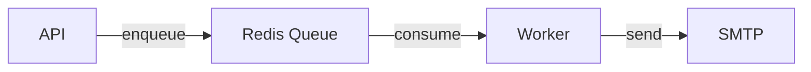
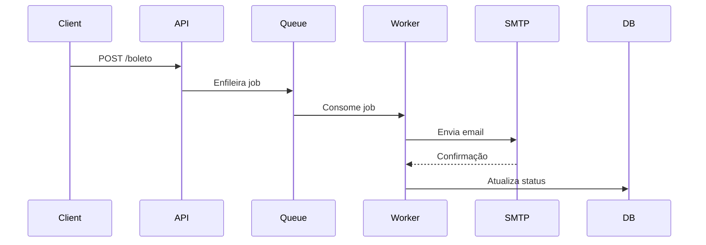
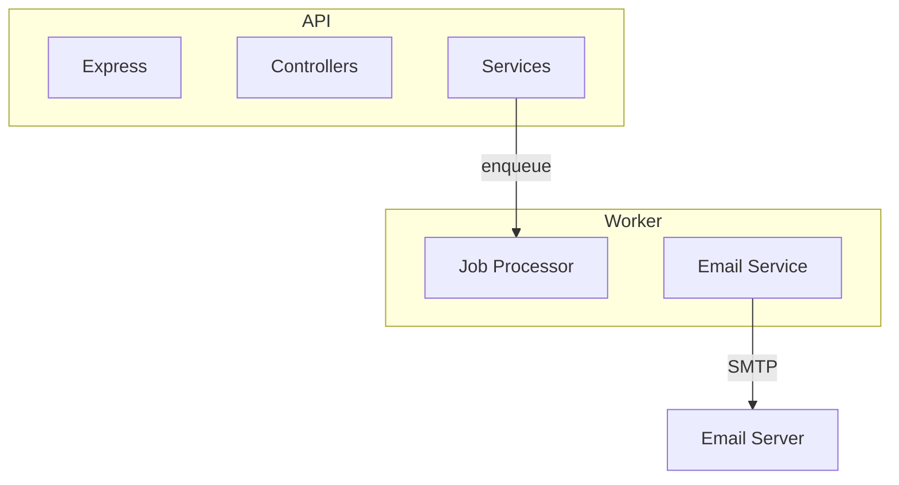

# Guia de Contribuição para Documentação

Este guia descreve as práticas e padrões para contribuir com a documentação do projeto MVP Envio de Boletos.

## Índice

- [Estrutura de Diretórios](#estrutura-de-diretórios)
- [Padrões de Nomenclatura](#padrões-de-nomenclatura)
- [Templates](#templates)
- [Processo de Contribuição](#processo-de-contribuição)
- [Boas Práticas](#boas-práticas)
- [Revisão de Documentação](#revisão-de-documentação)

## Estrutura de Diretórios

A documentação está organizada da seguinte forma:

```text
docs/
├── architecture/          # Documentação de arquitetura geral
├── api/                  # Documentação da API REST
├── queue-redis/          # Documentação do sistema de filas
├── worker/               # Documentação dos workers
├── data/                 # Documentação de modelos de dados e banco
├── frontend/             # Documentação do frontend
├── adrs/                 # Architecture Decision Records
├── runbooks/             # Guias operacionais e troubleshooting
├── testing/              # Documentação de testes
├── TEMPLATE-ADR.md       # Template para ADRs
├── TEMPLATE-DOC.md       # Template para documentação geral
└── CONTRIBUTING-docs.md  # Este arquivo
```

### Onde Documentar

- **architecture/**: Visão geral, diagramas de sistema, fluxos principais
- **api/**: Endpoints, contratos, autenticação, exemplos de requisições
- **queue-redis/**: Configuração de filas, workers, retry policies
- **worker/**: Lógica de processamento, workers específicos
- **data/**: Schemas, migrations, relacionamentos, queries importantes
- **frontend/**: Componentes, rotas, estado, integrações
- **adrs/**: Decisões arquiteturais importantes e suas justificativas
- **runbooks/**: Procedimentos operacionais, deploy, troubleshooting
- **testing/**: Estratégias de teste, casos de teste importantes

## Padrões de Nomenclatura

### Documentação Geral

Use o padrão `NN-nome-kebab.md` onde:

- `NN` = número sequencial com dois dígitos (01, 02, 03, etc.)
- `nome-kebab` = nome descritivo em kebab-case (minúsculas com hífens)

**Exemplos:**

- `01-visao-geral-sistema.md`
- `02-fluxo-envio-email.md`
- `03-integracao-smtp.md`

### Architecture Decision Records (ADRs)

Use o padrão `ADR-YYYYMMDD-titulo.md` onde:

- `YYYYMMDD` = data no formato ISO (ex: 20250116)
- `titulo` = título descritivo em kebab-case

**Exemplos:**

- `ADR-20250116-escolha-banco-dados.md`
- `ADR-20250120-estrategia-retry-email.md`
- `ADR-20250125-autenticacao-api.md`

### Runbooks

Use o padrão descritivo em kebab-case:

- `deploy-producao.md`
- `rollback-procedure.md`
- `troubleshooting-email-failures.md`

## Templates

### Para Documentação Geral

Use `TEMPLATE-DOC.md` como base para:

- Documentação de componentes
- Guias de configuração
- Referências técnicas
- Tutoriais

**Como usar:**

1. Copie o template: `cp docs/TEMPLATE-DOC.md docs/pasta-alvo/NN-nome-doc.md`
2. Preencha as seções relevantes
3. Remova seções não aplicáveis
4. Atualize os metadados no cabeçalho

### Para ADRs

Use `TEMPLATE-ADR.md` para documentar decisões arquiteturais:

1. Copie o template: `cp docs/TEMPLATE-ADR.md docs/adrs/ADR-YYYYMMDD-titulo.md`
2. Preencha todas as seções obrigatórias
3. Descreva o contexto, decisão, alternativas e consequências
4. Atualize o status conforme o ciclo de vida da decisão

## Processo de Contribuição

### 1. Antes de Começar

- Verifique se já existe documentação sobre o tópico
- Se existir, considere atualizar ao invés de criar nova
- Para mudanças significativas, abra uma issue primeiro para discussão

### 2. Criando/Atualizando Documentação

```bash
# 1. Crie um branch
git checkout -b docs/nome-da-mudanca

# 2. Crie ou edite o arquivo de documentação
# Use os templates como base

# 3. Valide a formatação
npm run lint:docs  # se disponível

# 4. Commit suas mudanças
git add docs/
git commit -m "docs: adiciona documentação sobre [tópico]"

# 5. Push e abra um PR
git push origin docs/nome-da-mudanca
```

### 3. Pull Request

Ao abrir um PR de documentação:

- Use o prefixo `docs:` no título
- Descreva o que foi documentado e por quê
- Adicione screenshots se aplicável (diagramas, exemplos visuais)
- Marque reviewers relevantes
- Aguarde aprovação antes de merge

**Exemplo de descrição de PR:**

```markdown
## Descrição
Adiciona documentação sobre o fluxo de retry de emails falhos.

## Mudanças
- Novo documento: docs/worker/02-retry-strategy.md
- Atualizado: docs/architecture/01-visao-geral.md (link para novo doc)

## Checklist
- [x] Usei template apropriado
- [x] Segui convenções de nomenclatura
- [x] Adicionei diagramas onde necessário
- [x] Revisei ortografia e gramática
```

## Boas Práticas

### Conteúdo

1. **Seja claro e conciso**
   - Use linguagem simples e direta
   - Evite jargões desnecessários
   - Prefira exemplos a longas explicações

2. **Use diagramas**
   - Diagramas Mermaid são preferidos por serem versionáveis
   - Use diagramas para fluxos, arquitetura, sequências
   - Sempre adicione legenda/descrição

3. **Mantenha atualizado**
   - Ao mudar código, atualize a documentação relacionada
   - Revise documentação periodicamente
   - Marque documentação desatualizada como `[DEPRECIADO]`

4. **Exemplos práticos**
   - Inclua exemplos de código quando relevante
   - Mostre casos de uso reais
   - Documente edge cases importantes

### Formatação

1. **Markdown**
   - Use Markdown padrão (CommonMark)
   - Valide sintaxe antes de commitar
   - Use formatação consistente

2. **Código**
   - Use syntax highlighting apropriado
   - Formate código corretamente
   - Comente trechos complexos

3. **Links**
   - Use links relativos para docs internas
   - Mantenha links externos atualizados
   - Evite links quebrados

### Diagramas Mermaid

Exemplos de diagramas úteis:

**Fluxo de dados:**



**Sequência:**



**Componentes:**



## Revisão de Documentação

### Checklist para Reviewers

Ao revisar PRs de documentação, verifique:

- [ ] Nomenclatura segue os padrões estabelecidos
- [ ] Template apropriado foi utilizado
- [ ] Informações estão corretas e atualizadas
- [ ] Exemplos funcionam corretamente
- [ ] Diagramas são claros e úteis
- [ ] Links funcionam corretamente
- [ ] Ortografia e gramática estão corretas
- [ ] Estrutura e organização fazem sentido
- [ ] Documentação está no diretório correto

### Critérios de Aprovação

Documentação deve ser aprovada quando:

1. **Precisão**: Informações estão corretas e verificadas
2. **Completude**: Cobre os aspectos necessários do tópico
3. **Clareza**: É fácil de entender e seguir
4. **Padrões**: Segue as convenções deste guia
5. **Utilidade**: Agrega valor para o leitor

## Validação Automática

O projeto possui validação automática em PRs que:

- Verifica formatação Markdown
- Valida links internos
- Checa nomenclatura de arquivos
- Valida sintaxe de diagramas Mermaid

Se o CI falhar, corrija os problemas antes de solicitar review.

## Dúvidas?

- Consulte os templates para exemplos
- Veja documentação existente como referência
- Abra uma issue com tag `documentation` para discussões
- Entre em contato com o time no Slack #docs

---

**Última atualização:** 2025-10-16
**Versão:** 1.0
