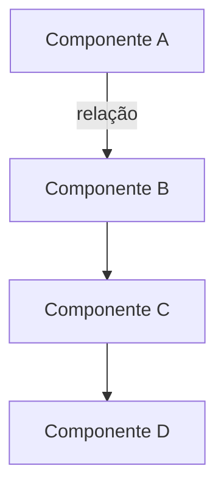

# NN-nome-do-documento

> **Tipo:** [Arquitetura | API | Configuração | Guia | Referência]
> **Status:** [Rascunho | Em Revisão | Aprovado | Depreciado]
> **Última atualização:** YYYY-MM-DD
> **Responsável:** Nome do autor/time

## Visão Geral

Breve descrição (2-3 linhas) do que este documento cobre e seu propósito.

## Índice

- [Visão Geral](#visão-geral)
- [Objetivos](#objetivos)
- [Contexto](#contexto)
- [Conceitos Principais](#conceitos-principais)
- [Arquitetura/Implementação](#arquiteturaimplementação)
- [Exemplos](#exemplos)
- [Considerações](#considerações)
- [Referências](#referências)

## Objetivos

Liste os principais objetivos deste documento:

- Objetivo 1
- Objetivo 2
- Objetivo 3

## Contexto

Forneça o contexto necessário para entender o conteúdo:

- Qual problema este documento aborda?
- Quem deve ler este documento?
- Pré-requisitos de conhecimento necessários

## Conceitos Principais

### Conceito 1

Descrição do conceito 1.

### Conceito 2

Descrição do conceito 2.

## Arquitetura/Implementação

Descreva a arquitetura, design ou implementação relevante.

### Diagrama



### Componentes

#### Componente A

Descrição do componente A, sua responsabilidade e comportamento.

**Responsabilidades:**

- Responsabilidade 1
- Responsabilidade 2

**Dependências:**

- Dependência 1
- Dependência 2

#### Componente B

Descrição do componente B.

## Exemplos

### Exemplo 1: [Título do exemplo]

Descrição do cenário.

```typescript
// Código de exemplo
const exemplo = {
  propriedade: 'valor'
};
```

### Exemplo 2: [Título do exemplo]

Descrição do cenário.

```bash
# Comando de exemplo
npm run exemplo
```

## Configuração

Se aplicável, descreva as configurações necessárias.

### Variáveis de Ambiente

| Variável | Descrição | Padrão | Obrigatória |
|----------|-----------|--------|-------------|
| `VAR_NAME` | Descrição da variável | `default_value` | Sim/Não |

### Arquivo de Configuração

```json
{
  "config": {
    "option1": "value1",
    "option2": "value2"
  }
}
```

## Considerações

### Performance

Considerações sobre performance e otimização.

### Segurança

Aspectos de segurança a serem observados.

### Escalabilidade

Como o sistema/componente escala.

### Manutenibilidade

Aspectos que facilitam ou dificultam a manutenção.

## Troubleshooting

Problemas comuns e suas soluções.

### Problema 1

**Sintoma:** Descrição do sintoma

**Causa:** Causa raiz provável

**Solução:**

1. Passo 1
2. Passo 2
3. Passo 3

## Roadmap

Se aplicável, descreva melhorias planejadas ou pendências conhecidas.

- [ ] Item pendente 1
- [ ] Item pendente 2
- [x] Item concluído

## Referências

- [Documento relacionado 1](link)
- [Documento relacionado 2](link)
- [ADR relacionado](link)
- [Issue/PR relacionado](link)

## Glossário

**Termo 1:** Definição do termo 1

**Termo 2:** Definição do termo 2

---

**Template version:** 1.0
**Last updated:** 2025-10-16
