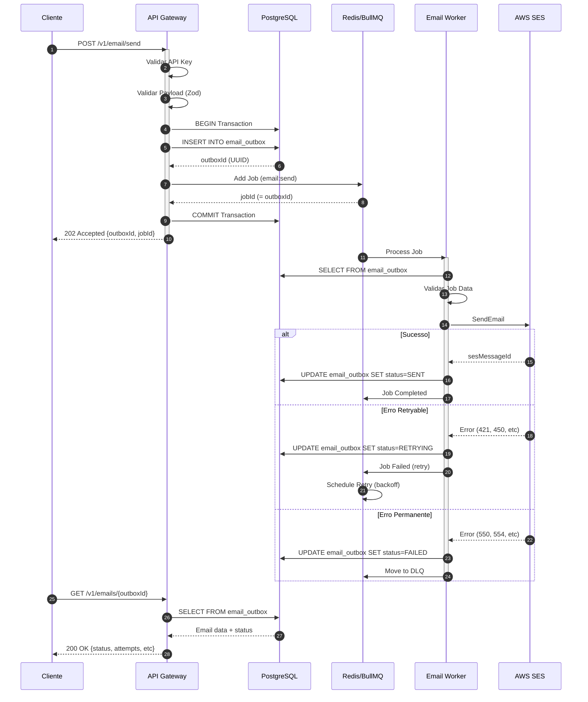

# Exemplo de Integração End-to-End: API → Worker

**Status:** Draft
**Criado em:** 2025-01-19
**Última atualização:** 2025-01-19
**Responsável:** Time de Desenvolvimento
**Task:** TASK 3.4

---

## 📋 Sumário

Este documento apresenta um exemplo completo de integração mostrando o fluxo de envio de email desde a requisição na API até o processamento pelo Worker, incluindo casos de sucesso, erro e retry.

---

## 🔄 Visão Geral do Fluxo



---

## 📝 Exemplo Passo a Passo

### 1️⃣ Cliente envia requisição de email

**Request:**

```http
POST /v1/email/send HTTP/1.1
Host: api.certshift.com
Content-Type: application/json
X-API-Key: live_abc123xyz789
Idempotency-Key: order-12345-notification
X-Request-Id: req_1737329400_abc123

{
  "to": "cliente@example.com",
  "subject": "Seu pedido foi confirmado",
  "html": "<html><body><h1>Pedido #12345</h1><p>Obrigado pela compra!</p></body></html>",
  "replyTo": "suporte@certshift.com",
  "tags": ["order-confirmation", "transactional"],
  "recipient": {
    "externalId": "customer-67890",
    "nome": "João Silva",
    "email": "cliente@example.com"
  },
  "externalId": "order-12345"
}
```

**Response:**

```http
HTTP/1.1 202 Accepted
Content-Type: application/json
X-Request-Id: req_1737329400_abc123

{
  "outboxId": "550e8400-e29b-41d4-a716-446655440000",
  "jobId": "550e8400-e29b-41d4-a716-446655440000",
  "requestId": "req_1737329400_abc123",
  "status": "ENQUEUED",
  "receivedAt": "2025-01-19T19:30:00.123Z",
  "recipient": {
    "externalId": "customer-67890"
  }
}
```

---

### 2️⃣ API processa a requisição

**`apps/api/src/modules/email/controllers/email.controller.ts`**

```typescript
@Post('send')
@HttpCode(202)
async sendEmail(
  @Body() body: EmailSendBody,
  @Req() req: RequestWithCompany,
): Promise<EmailSendResponse> {
  const requestId = req.headers['x-request-id'] || generateRequestId();
  const idempotencyKey = req.headers['idempotency-key'];

  // 1. Validar payload com Zod
  const validatedData = emailSendBodySchema.parse(body);

  // 2. Criar registro no outbox (transacional)
  const outboxId = await this.emailService.enqueueEmail({
    companyId: req.company.id,
    requestId,
    idempotencyKey,
    ...validatedData,
  });

  // 3. Retornar resposta imediata
  return {
    outboxId,
    jobId: outboxId, // jobId = outboxId para idempotência
    requestId,
    status: 'ENQUEUED',
    receivedAt: new Date().toISOString(),
    recipient: {
      externalId: body.recipient?.externalId,
    },
  };
}
```

**`apps/api/src/modules/email/services/email.service.ts`**

```typescript
async enqueueEmail(data: EnqueueEmailDto): Promise<string> {
  const { companyId, requestId, idempotencyKey, ...emailData } = data;

  return await this.prisma.$transaction(async (tx) => {
    // 1. Criar registro no outbox
    const outbox = await tx.emailOutbox.create({
      data: {
        id: uuidv4(), // Este será o outboxId e jobId
        companyId,
        requestId,
        idempotencyKey,
        status: 'ENQUEUED',
        to: emailData.to,
        subject: emailData.subject,
        htmlContent: emailData.html,
        // ... outros campos
        metadata: {
          recipient: emailData.recipient,
          externalId: emailData.externalId,
          tags: emailData.tags,
        },
      },
    });

    // 2. Adicionar job na fila
    await this.emailQueue.add(
      'email:send',
      {
        outboxId: outbox.id,
        companyId,
        requestId,
        to: emailData.to,
        subject: emailData.subject,
        htmlRef: `db:${outbox.id}`, // Referência ao HTML no DB
        recipient: {
          ...emailData.recipient,
          email: emailData.to,
        },
        attempt: 1,
        enqueuedAt: new Date().toISOString(),
      } satisfies EmailSendJobData,
      {
        jobId: outbox.id, // jobId = outboxId para idempotência
        ttl: EMAIL_JOB_CONFIG.DEFAULT_TTL, // 24h
        priority: EMAIL_JOB_CONFIG.DEFAULT_PRIORITY, // 5
        removeOnComplete: true,
      } satisfies EmailSendJobOptions,
    );

    return outbox.id;
  });
}
```

**Estado do banco após enfileiramento:**

```sql
SELECT id, company_id, status, to_email, subject, attempts, created_at
FROM email_outbox
WHERE id = '550e8400-e29b-41d4-a716-446655440000';

-- Resultado:
-- id                                  | company_id | status    | to_email              | subject                      | attempts | created_at
-- 550e8400-e29b-41d4-a716-446655440000| abc-123    | ENQUEUED  | cliente@example.com   | Seu pedido foi confirmado    | 0        | 2025-01-19 19:30:00
```

---

### 3️⃣ Worker processa o job

**`apps/worker/src/processors/email.processor.ts`**

```typescript
@Processor('email:send')
export class EmailProcessor {
  @Process('email:send')
  async sendEmail(job: Job<EmailSendJobData>): Promise<EmailSendJobResult> {
    const startTime = Date.now();
    const { outboxId, companyId, to, subject, htmlRef, recipient, attempt } = job.data;

    try {
      // 1. Buscar dados do outbox
      const outbox = await this.prisma.emailOutbox.findUniqueOrThrow({
        where: { id: outboxId },
      });

      // 2. Validar job data
      const validatedData = validateEmailJobData(job.data);

      // 3. Obter HTML content (DB ou S3)
      const htmlContent = await this.getHtmlContent(htmlRef);

      // 4. Enviar via SES
      const sesResult = await this.sesService.sendEmail({
        to: [to],
        subject,
        htmlContent,
        replyTo: outbox.metadata.replyTo,
        tags: outbox.metadata.tags,
      });

      // 5. Atualizar status no banco
      await this.prisma.emailOutbox.update({
        where: { id: outboxId },
        data: {
          status: 'SENT',
          sentAt: new Date(),
          sesMessageId: sesResult.MessageId,
          attempts: attempt,
        },
      });

      // 6. Retornar resultado
      return {
        sesMessageId: sesResult.MessageId,
        status: 'SENT',
        processedAt: new Date().toISOString(),
        durationMs: Date.now() - startTime,
        attempt,
      };
    } catch (error) {
      // Tratamento de erro...
      return this.handleError(error, job, startTime);
    }
  }

  private async handleError(
    error: any,
    job: Job<EmailSendJobData>,
    startTime: number,
  ): Promise<EmailSendJobResult> {
    const { outboxId, attempt } = job.data;
    const errorCode = this.extractErrorCode(error);
    const errorReason = error.message;

    // Verificar se é erro retryable
    if (isRetryableError(errorCode) && attempt < EMAIL_JOB_RETRY_CONFIG.MAX_ATTEMPTS) {
      // Atualizar status para RETRYING
      await this.prisma.emailOutbox.update({
        where: { id: outboxId },
        data: {
          status: 'RETRYING',
          attempts: attempt,
          lastFailureReason: errorReason,
          lastFailureCode: errorCode,
          lastFailureAt: new Date(),
        },
      });

      // Calcular backoff delay
      const delayMs = calculateBackoffDelay(attempt);

      // Throw erro para BullMQ fazer retry
      throw new Error(`Retryable error: ${errorReason} (retry in ${delayMs}ms)`);
    }

    // Erro permanente - mover para DLQ
    await this.prisma.emailOutbox.update({
      where: { id: outboxId },
      data: {
        status: 'FAILED',
        failedAt: new Date(),
        attempts: attempt,
        lastFailureReason: errorReason,
        lastFailureCode: errorCode,
      },
    });

    return {
      status: 'FAILED',
      processedAt: new Date().toISOString(),
      durationMs: Date.now() - startTime,
      errorCode,
      errorReason,
      attempt,
    };
  }
}
```

---

### 4️⃣ Casos de Processamento

#### ✅ Caso 1: Sucesso no primeiro envio

**Worker logs:**

```
[EmailProcessor] Processing job 550e8400-e29b-41d4-a716-446655440000 (attempt 1/5)
[SESService] Sending email to cliente@example.com
[SESService] Email sent successfully. MessageId: 0000018d-1234-5678-abcd-ef1234567890
[EmailProcessor] Job completed in 234ms
```

**Estado do banco após sucesso:**

```sql
SELECT id, status, sent_at, ses_message_id, attempts
FROM email_outbox
WHERE id = '550e8400-e29b-41d4-a716-446655440000';

-- Resultado:
-- id                                  | status | sent_at                  | ses_message_id                       | attempts
-- 550e8400-e29b-41d4-a716-446655440000| SENT   | 2025-01-19 19:30:05.234  | 0000018d-1234-5678-abcd-ef1234567890 | 1
```

---

#### 🔄 Caso 2: Erro retryable (throttling)

**Worker logs (tentativa 1):**

```
[EmailProcessor] Processing job 550e8400-e29b-41d4-a716-446655440000 (attempt 1/5)
[SESService] Sending email to cliente@example.com
[SESService] Error: Throttling - Maximum sending rate exceeded
[EmailProcessor] Retryable error detected. Scheduling retry with backoff.
[EmailProcessor] Next attempt in 1000ms (1s)
```

**Estado do banco após erro:**

```sql
SELECT id, status, attempts, last_failure_reason, last_failure_code
FROM email_outbox
WHERE id = '550e8400-e29b-41d4-a716-446655440000';

-- Resultado:
-- id                                  | status    | attempts | last_failure_reason                        | last_failure_code
-- 550e8400-e29b-41d4-a716-446655440000| RETRYING  | 1        | Throttling - Maximum sending rate exceeded | Throttling
```

**Worker logs (tentativa 2 - após 1s de backoff):**

```
[EmailProcessor] Processing job 550e8400-e29b-41d4-a716-446655440000 (attempt 2/5)
[SESService] Sending email to cliente@example.com
[SESService] Email sent successfully. MessageId: 0000018d-1234-5678-abcd-ef1234567890
[EmailProcessor] Job completed in 189ms
```

**Estado final:**

```sql
-- status    | sent_at                  | attempts
-- SENT      | 2025-01-19 19:30:06.189  | 2
```

---

#### ❌ Caso 3: Erro permanente (email inválido)

**Worker logs:**

```
[EmailProcessor] Processing job 550e8400-e29b-41d4-a716-446655440000 (attempt 1/5)
[SESService] Sending email to invalidemail@nonexistent-domain-xyz.com
[SESService] Error: MessageRejected - Address does not exist
[EmailProcessor] Permanent error detected. Moving to DLQ.
```

**Estado do banco:**

```sql
SELECT id, status, failed_at, attempts, last_failure_reason, last_failure_code
FROM email_outbox
WHERE id = '550e8400-e29b-41d4-a716-446655440000';

-- Resultado:
-- id                                  | status | failed_at                | attempts | last_failure_reason                 | last_failure_code
-- 550e8400-e29b-41d4-a716-446655440000| FAILED | 2025-01-19 19:30:05.123  | 1        | MessageRejected - Address does not exist | MessageRejected
```

**DLQ entry:**

```typescript
{
  jobId: '550e8400-e29b-41d4-a716-446655440000',
  outboxId: '550e8400-e29b-41d4-a716-446655440000',
  companyId: 'abc-123',
  originalData: { /* job data */ },
  failedAttempts: 1,
  lastFailureReason: 'MessageRejected - Address does not exist',
  lastFailureCode: 'MessageRejected',
  lastFailureTimestamp: '2025-01-19T19:30:05.123Z',
  enqueuedAt: '2025-01-19T19:30:00.123Z',
  movedToDLQAt: '2025-01-19T19:30:05.123Z',
  ttl: 604800000, // 7 dias
}
```

---

#### 🔄 Caso 4: Falha após 5 tentativas → DLQ

**Timeline de retries:**

| Tentativa | Delay (s) | Timestamp        | Resultado                    |
|-----------|-----------|------------------|------------------------------|
| 1         | 0         | 19:30:00.000     | Erro 450 (Mailbox busy)      |
| 2         | ~1        | 19:30:01.123     | Erro 450 (Mailbox busy)      |
| 3         | ~2        | 19:30:03.456     | Erro 450 (Mailbox busy)      |
| 4         | ~4        | 19:30:07.789     | Erro 450 (Mailbox busy)      |
| 5         | ~8        | 19:30:15.012     | Erro 450 (Mailbox busy)      |
| -         | -         | 19:30:15.012     | **Movido para DLQ**          |

**Worker logs (tentativa 5):**

```
[EmailProcessor] Processing job 550e8400-e29b-41d4-a716-446655440000 (attempt 5/5)
[SESService] Error: 450 Mailbox busy
[EmailProcessor] Max attempts reached (5/5). Moving to DLQ.
```

**Estado final:**

```sql
SELECT id, status, failed_at, attempts, last_failure_reason
FROM email_outbox
WHERE id = '550e8400-e29b-41d4-a716-446655440000';

-- Resultado:
-- status | failed_at                | attempts | last_failure_reason
-- FAILED | 2025-01-19 19:30:15.012  | 5        | 450 Mailbox busy
```

---

### 5️⃣ Cliente consulta o status

**Request:**

```http
GET /v1/emails/550e8400-e29b-41d4-a716-446655440000 HTTP/1.1
Host: api.certshift.com
X-API-Key: live_abc123xyz789
```

**Response (sucesso):**

```http
HTTP/1.1 200 OK
Content-Type: application/json

{
  "id": "550e8400-e29b-41d4-a716-446655440000",
  "status": "SENT",
  "to": "cliente@example.com",
  "subject": "Seu pedido foi confirmado",
  "sentAt": "2025-01-19T19:30:05.234Z",
  "createdAt": "2025-01-19T19:30:00.123Z",
  "attempts": 1,
  "sesMessageId": "0000018d-1234-5678-abcd-ef1234567890",
  "tags": ["order-confirmation", "transactional"],
  "recipientExternalId": "customer-67890"
}
```

**Response (falha):**

```http
HTTP/1.1 200 OK
Content-Type: application/json

{
  "id": "550e8400-e29b-41d4-a716-446655440000",
  "status": "FAILED",
  "to": "invalidemail@nonexistent-domain-xyz.com",
  "subject": "Seu pedido foi confirmado",
  "failedAt": "2025-01-19T19:30:05.123Z",
  "createdAt": "2025-01-19T19:30:00.123Z",
  "attempts": 1,
  "lastFailureReason": "MessageRejected - Address does not exist",
  "lastFailureCode": "MessageRejected",
  "tags": ["order-confirmation", "transactional"],
  "recipientExternalId": "customer-67890"
}
```

---

## 🔍 Monitoramento e Observabilidade

### Métricas Importantes

**1. Latência de enfileiramento (API):**

```typescript
const startTime = Date.now();
await this.emailService.enqueueEmail(data);
const enqueueLatency = Date.now() - startTime;

// Métrica: email.enqueue.duration_ms
this.metrics.histogram('email.enqueue.duration_ms', enqueueLatency);
```

**2. Latência de processamento (Worker):**

```typescript
const processingTime = Date.now() - job.timestamp;

// Métrica: email.processing.duration_ms
this.metrics.histogram('email.processing.duration_ms', processingTime);
```

**3. Taxa de sucesso/falha:**

```typescript
// Métrica: email.send.result (success | retryable_error | permanent_error)
this.metrics.counter('email.send.result', {
  status: result.status,
  errorCode: result.errorCode || 'none',
  attempt: job.data.attempt,
});
```

**4. Tamanho da fila:**

```typescript
// Métrica: email.queue.size
const queueSize = await this.emailQueue.count();
this.metrics.gauge('email.queue.size', queueSize);
```

**5. Jobs em DLQ:**

```typescript
// Métrica: email.dlq.size
const dlqSize = await this.emailQueue.getDlqSize();
this.metrics.gauge('email.dlq.size', dlqSize);
```

### Logs Estruturados

**Exemplo de log de sucesso:**

```json
{
  "timestamp": "2025-01-19T19:30:05.234Z",
  "level": "info",
  "message": "Email sent successfully",
  "context": {
    "outboxId": "550e8400-e29b-41d4-a716-446655440000",
    "companyId": "abc-123",
    "to": "***@example.com",
    "subject": "Seu pedido foi confirmado",
    "attempt": 1,
    "durationMs": 234,
    "sesMessageId": "0000018d-1234-5678-abcd-ef1234567890"
  }
}
```

**Exemplo de log de erro:**

```json
{
  "timestamp": "2025-01-19T19:30:05.123Z",
  "level": "error",
  "message": "Email failed permanently",
  "context": {
    "outboxId": "550e8400-e29b-41d4-a716-446655440000",
    "companyId": "abc-123",
    "to": "***@nonexistent-domain-xyz.com",
    "attempt": 1,
    "errorCode": "MessageRejected",
    "errorReason": "Address does not exist",
    "movedToDLQ": true
  }
}
```

### Alertas Recomendados

**1. Taxa de erro elevada:**

```yaml
alert: HighEmailFailureRate
expr: |
  sum(rate(email_send_result{status="permanent_error"}[5m])) /
  sum(rate(email_send_result[5m])) > 0.05
for: 5m
severity: warning
description: "Email failure rate above 5% for 5 minutes"
```

**2. DLQ crescendo:**

```yaml
alert: DLQSizeIncreasing
expr: |
  email_dlq_size > 100 AND
  delta(email_dlq_size[1h]) > 50
for: 10m
severity: critical
description: "DLQ size is increasing rapidly"
```

**3. Latência alta de processamento:**

```yaml
alert: HighProcessingLatency
expr: |
  histogram_quantile(0.95, email_processing_duration_ms) > 5000
for: 10m
severity: warning
description: "95th percentile processing latency above 5 seconds"
```

---

## 🛠️ Troubleshooting

### Problema: Email não está sendo enviado

**Passos de diagnóstico:**

1. **Verificar se o job foi enfileirado:**

   ```sql
   SELECT * FROM email_outbox WHERE id = '<outboxId>';
   ```

2. **Verificar jobs na fila Redis:**

   ```bash
   redis-cli LLEN bull:email:send:wait
   redis-cli LRANGE bull:email:send:wait 0 10
   ```

3. **Verificar workers ativos:**

   ```bash
   redis-cli SMEMBERS bull:email:send:workers
   ```

4. **Verificar logs do worker:**

   ```bash
   kubectl logs -f deployment/email-worker --tail=100
   ```

### Problema: Email ficou preso em RETRYING

**Investigação:**

1. **Verificar tentativas:**

   ```sql
   SELECT id, attempts, last_failure_reason, last_failure_code, last_failure_at
   FROM email_outbox
   WHERE status = 'RETRYING'
   ORDER BY last_failure_at DESC;
   ```

2. **Verificar próximo retry:**

   ```bash
   redis-cli ZRANGEBYSCORE bull:email:send:delayed -inf +inf WITHSCORES
   ```

3. **Forçar reprocessamento (se necessário):**

   ```typescript
   // Via BullMQ Board ou código
   await emailQueue.getJob(jobId).retry();
   ```

### Problema: Muitos emails na DLQ

**Análise:**

1. **Verificar causas mais comuns:**

   ```sql
   SELECT last_failure_code, COUNT(*) as count
   FROM email_outbox
   WHERE status = 'FAILED'
   GROUP BY last_failure_code
   ORDER BY count DESC;
   ```

2. **Identificar tenants afetados:**

   ```sql
   SELECT company_id, COUNT(*) as failed_count
   FROM email_outbox
   WHERE status = 'FAILED' AND failed_at > NOW() - INTERVAL '1 hour'
   GROUP BY company_id
   ORDER BY failed_count DESC;
   ```

3. **Reprocessar jobs da DLQ (após correção):**

   ```typescript
   // Script de reprocessamento
   const dlqJobs = await emailQueue.getDlqJobs();
   for (const job of dlqJobs) {
     if (shouldRetry(job)) {
       await emailQueue.add('email:send', job.data, { jobId: uuidv4() });
       await job.remove(); // Remove da DLQ
     }
   }
   ```

---

## 📚 Referências

- [Contrato da API - POST /v1/email/send](./03-email-send-contract.md)
- [Contrato do Job email:send](../../packages/shared/src/schemas/email-job.schema.ts)
- [Retry, Backoff e DLQ](../queue-redis/03-retry-backoff-dlq.md)
- [Fairness por Tenant](../queue-redis/04-fairness-implementation.md)
- [Worker Architecture](../worker/01-worker-architecture.md)

---

## ✅ Checklist de Implementação

- [x] API recebe requisição e valida payload
- [x] API cria registro em email_outbox (transacional)
- [x] API adiciona job na fila Redis
- [x] API retorna 202 Accepted com outboxId
- [x] Worker processa job e valida dados
- [x] Worker envia email via SES
- [x] Worker atualiza status no banco (SENT/RETRYING/FAILED)
- [x] Worker implementa retry com backoff exponencial
- [x] Worker move para DLQ após max attempts
- [x] Cliente pode consultar status via GET /v1/emails/{id}
- [x] Métricas de observabilidade implementadas
- [x] Logs estruturados em todos os pontos
- [x] Alertas configurados para falhas

---

**Última revisão:** 2025-01-19
**Próxima revisão:** Após implementação completa da API e Worker
