# 06-event-catalog-suppression

> **Tipo:** API | Referência
> **Status:** Em Revisão
> **Última atualização:** 2025-10-23
> **Responsável:** Equipe MVP Email Gateway

## Visão Geral

Este documento define o **catálogo completo de eventos** do ciclo de vida de emails e o sistema de **lista de supressão** para prevenir envios a endereços problemáticos (bounces, complaints). Inclui especificação de eventos, política de supressão automática, métricas e UI de auditoria.

## Índice

- [Visão Geral](#visão-geral)
- [Objetivos](#objetivos)
- [Contexto](#contexto)
- [1. Catálogo de Eventos](#1-catálogo-de-eventos)
  - [1.1 QUEUED](#11-queued)
  - [1.2 SENT](#12-sent)
  - [1.3 DELIVERED](#13-delivered)
  - [1.4 BOUNCE](#14-bounce)
  - [1.5 COMPLAINT](#15-complaint)
  - [1.6 REJECTED](#16-rejected)
  - [1.7 DLQ_MOVED](#17-dlq_moved)
- [2. Máquina de Estados](#2-máquina-de-estados)
- [3. Sistema de Supressão](#3-sistema-de-supressão)
  - [3.1 O que é Supressão](#31-o-que-é-supressão)
  - [3.2 Política de Supressão](#32-política-de-supressão)
  - [3.3 Janela Configurável](#33-janela-configurável)
  - [3.4 Schema do Banco](#34-schema-do-banco)
- [4. Métricas de Supressão](#4-métricas-de-supressão)
- [5. UI de Revisão e Auditoria](#5-ui-de-revisão-e-auditoria)
- [6. Integração com AWS SES](#6-integração-com-aws-ses)
- [7. API Endpoints](#7-api-endpoints)
- [8. Implementação](#8-implementação)
- [Referências](#referências)

## Objetivos

Este documento tem como objetivos:

- Definir todos os eventos do ciclo de vida de um email
- Especificar transições de estado válidas
- Documentar política de supressão automática
- Definir métricas de supressão ("suppression hit rate")
- Especificar UI de revisão e auditoria da lista de supressão

## Contexto

### Quem deve ler este documento?

- **Desenvolvedores:** Implementar eventos e supressão
- **DevOps/SRE:** Configurar SNS topics do SES e monitorar métricas
- **Product/Support:** Entender motivos de bloqueio de envios
- **Compliance/Legal:** Validar conformidade com LGPD e anti-spam

### Por que Supressão?

**Problemas sem supressão:**
- ❌ Envios repetidos a emails inexistentes (waste de recursos)
- ❌ Reclamações de spam danificam reputação do domínio
- ❌ Custo desnecessário com SES para emails que falharão
- ❌ Risco de suspensão da conta SES por alta taxa de bounce

**Benefícios da supressão:**
- ✅ Redução de custos (não enviar para emails problemáticos)
- ✅ Proteção de reputação do sender
- ✅ Conformidade com LGPD (direito de recusar comunicações)
- ✅ Melhoria de métricas de deliverability

### MVP Constraints

- **Supressão global:** Lista única compartilhada entre empresas (MVP simplificado)
- **Janela padrão:** 90 dias para hard bounces, permanente para complaints
- **Auto-supressão:** Automática para BOUNCE (permanent) e COMPLAINT
- **Manual override:** Suporte pode remover email da lista (com auditoria)

---

## 1. Catálogo de Eventos

### 1.1 QUEUED

**Quando ocorre:** Email aceito pela API e enfileirado no Redis (BullMQ).

**Detalhes:**
- Primeiro estado após validação bem-sucedida
- Email persistido em `email_outbox` com status `PENDING`
- Job enfileirado no Redis
- Registro criado em `email_events`

**Payload do Evento:**

```typescript
{
  eventType: 'QUEUED',
  outboxId: 'out_01HQABC123',
  externalId: 'BOL-M2-2025-00123',
  companyId: 'm2',
  recipient: 'user@example.com',
  recipientHash: 'sha256:abc123...',
  queuedAt: '2025-01-23T10:00:00.000Z',
  priority: 'normal',
}
```

**Persistência:**

```sql
INSERT INTO email_events (
  event_id, outbox_id, event_type, created_at, metadata
) VALUES (
  'evt_01HQXYZ789', 'out_01HQABC123', 'QUEUED', NOW(),
  '{"queuedAt": "2025-01-23T10:00:00.000Z"}'::jsonb
);
```

**Webhook:** ❌ Não envia webhook (evento interno)

---

### 1.2 SENT

**Quando ocorre:** SES aceitou o email e retornou Message ID.

**Detalhes:**
- Email enviado com sucesso para servidor SMTP do SES
- SES retornou `MessageId`
- Status em `email_outbox` atualizado para `SENT`
- Job marcado como completo no BullMQ

**Payload do Evento:**

```typescript
{
  eventType: 'SENT',
  outboxId: 'out_01HQABC123',
  externalId: 'BOL-M2-2025-00123',
  companyId: 'm2',
  recipient: 'user@example.com',
  recipientHash: 'sha256:abc123...',
  messageId: '0102018d1234abcd-5678efgh-9012ijkl-0000-000000',
  sentAt: '2025-01-23T10:00:05.000Z',
  attempts: 1,
  processingTimeMs: 5234,
}
```

**Persistência:**

```sql
UPDATE email_outbox
SET status = 'SENT',
    message_id = '0102018d1234abcd...',
    sent_at = NOW()
WHERE outbox_id = 'out_01HQABC123';

INSERT INTO email_events (
  event_id, outbox_id, event_type, created_at, metadata
) VALUES (
  'evt_01HQXYZ790', 'out_01HQABC123', 'SENT', NOW(),
  '{"messageId": "0102018d1234abcd...", "processingTimeMs": 5234}'::jsonb
);
```

**Webhook:** ✅ Envia `email.sent` (ver [Webhook Contract](./05-webhook-contract.md))

---

### 1.3 DELIVERED

**Quando ocorre:** SES recebeu confirmação do servidor SMTP destinatário que o email foi entregue.

**Detalhes:**
- **Disponível via SNS topic** do SES (configuration sets)
- Confirmação de entrega bem-sucedida ao mailbox
- Não garante que usuário abriu/leu (isso seria "open tracking")
- Estado final de sucesso

**Payload SNS (AWS SES):**

```json
{
  "eventType": "Delivery",
  "mail": {
    "messageId": "0102018d1234abcd-5678efgh-9012ijkl-0000-000000",
    "timestamp": "2025-01-23T10:00:10.000Z",
    "source": "noreply@emailgateway.com",
    "destination": ["user@example.com"]
  },
  "delivery": {
    "timestamp": "2025-01-23T10:00:10.000Z",
    "processingTimeMillis": 4567,
    "recipients": ["user@example.com"],
    "smtpResponse": "250 2.0.0 OK  1706012410 abc123.456.xyz",
    "reportingMTA": "a8-123.smtp-out.amazonses.com"
  }
}
```

**Payload Interno:**

```typescript
{
  eventType: 'DELIVERED',
  outboxId: 'out_01HQABC123', // Lookup via messageId
  messageId: '0102018d1234abcd...',
  recipient: 'user@example.com',
  recipientHash: 'sha256:abc123...',
  deliveredAt: '2025-01-23T10:00:10.000Z',
  smtpResponse: '250 2.0.0 OK',
  processingTimeMs: 4567,
}
```

**Persistência:**

```sql
UPDATE email_outbox
SET status = 'DELIVERED',
    delivered_at = '2025-01-23T10:00:10.000Z'
WHERE message_id = '0102018d1234abcd...';

INSERT INTO email_events (
  event_id, outbox_id, event_type, created_at, metadata
) VALUES (
  'evt_01HQXYZ791', 'out_01HQABC123', 'DELIVERED', NOW(),
  '{"smtpResponse": "250 2.0.0 OK"}'::jsonb
);
```

**Webhook:** ❌ Não envia webhook no MVP (future: `email.delivered`)

**⚠️ NOTA MVP:** Configuração de SNS topic para DELIVERED é **opcional** no MVP. Se não configurado, o último estado confirmado é `SENT`.

---

### 1.4 BOUNCE

**Quando ocorre:** Email retornou como bounce (hard ou soft).

**Tipos de Bounce:**

#### Hard Bounce (Permanent Failure)

- **Mailbox doesn't exist:** Email não existe no servidor destinatário
- **Domain doesn't exist:** Domínio inválido ou não resolvido
- **Recipient server rejected:** Servidor bloqueou permanentemente

**Ação:** ✅ Adicionar à lista de supressão (automático)

#### Soft Bounce (Temporary Failure)

- **Mailbox full:** Caixa de entrada cheia
- **Server temporarily unavailable:** Servidor fora do ar
- **Message too large:** Email excede limite do destinatário

**Ação:** ⚠️ Não adicionar à supressão (pode recuperar)

**Payload SNS (AWS SES):**

```json
{
  "eventType": "Bounce",
  "mail": {
    "messageId": "0102018d1234abcd...",
    "timestamp": "2025-01-23T10:00:08.000Z"
  },
  "bounce": {
    "bounceType": "Permanent",
    "bounceSubType": "General",
    "bouncedRecipients": [
      {
        "emailAddress": "nonexistent@example.com",
        "action": "failed",
        "status": "5.1.1",
        "diagnosticCode": "smtp; 550 5.1.1 user unknown"
      }
    ],
    "timestamp": "2025-01-23T10:00:08.000Z",
    "feedbackId": "0102018d-..."
  }
}
```

**Payload Interno:**

```typescript
{
  eventType: 'BOUNCE',
  outboxId: 'out_01HQABC123',
  messageId: '0102018d1234abcd...',
  recipient: 'nonexistent@example.com',
  recipientHash: 'sha256:def456...',
  bounceType: 'Permanent', // ou 'Transient'
  bounceSubType: 'General', // ou 'MailboxFull', etc
  bouncedAt: '2025-01-23T10:00:08.000Z',
  diagnosticCode: 'smtp; 550 5.1.1 user unknown',
  feedbackId: '0102018d-...',
}
```

**Persistência:**

```sql
UPDATE email_outbox
SET status = 'BOUNCED',
    bounced_at = '2025-01-23T10:00:08.000Z',
    bounce_type = 'Permanent'
WHERE message_id = '0102018d1234abcd...';

INSERT INTO email_events (
  event_id, outbox_id, event_type, created_at, metadata
) VALUES (
  'evt_01HQXYZ792', 'out_01HQABC123', 'BOUNCE', NOW(),
  '{"bounceType": "Permanent", "diagnosticCode": "smtp; 550 5.1.1 user unknown"}'::jsonb
);

-- Se hard bounce: adicionar à supressão (ver seção 3)
INSERT INTO suppression_list (
  email_hash, reason, added_at, expires_at
) VALUES (
  'sha256:def456...', 'HARD_BOUNCE', NOW(), NOW() + INTERVAL '90 days'
) ON CONFLICT (email_hash) DO UPDATE SET updated_at = NOW();
```

**Webhook:** ❌ Não envia webhook no MVP (future: `email.bounced`)

---

### 1.5 COMPLAINT

**Quando ocorre:** Destinatário marcou email como spam (via botão "Report Spam").

**Detalhes:**
- Usuário clicou "Report Spam" ou similar no client de email
- SES recebeu feedback loop (FBL) do provedor (Gmail, Outlook, etc.)
- **Ação crítica:** Adicionar à supressão **permanentemente** (LGPD/CAN-SPAM)
- Estado final de falha

**Payload SNS (AWS SES):**

```json
{
  "eventType": "Complaint",
  "mail": {
    "messageId": "0102018d1234abcd...",
    "timestamp": "2025-01-23T10:05:00.000Z"
  },
  "complaint": {
    "complainedRecipients": [
      {
        "emailAddress": "annoyed@example.com"
      }
    ],
    "timestamp": "2025-01-23T10:05:00.000Z",
    "feedbackId": "0102018d-...",
    "userAgent": "Gmail",
    "complaintFeedbackType": "abuse",
    "arrivalDate": "2025-01-23T10:00:00.000Z"
  }
}
```

**Payload Interno:**

```typescript
{
  eventType: 'COMPLAINT',
  outboxId: 'out_01HQABC123',
  messageId: '0102018d1234abcd...',
  recipient: 'annoyed@example.com',
  recipientHash: 'sha256:ghi789...',
  complaintAt: '2025-01-23T10:05:00.000Z',
  feedbackType: 'abuse', // ou 'fraud', 'virus'
  userAgent: 'Gmail',
}
```

**Persistência:**

```sql
UPDATE email_outbox
SET status = 'COMPLAINED',
    complained_at = '2025-01-23T10:05:00.000Z'
WHERE message_id = '0102018d1234abcd...';

INSERT INTO email_events (
  event_id, outbox_id, event_type, created_at, metadata
) VALUES (
  'evt_01HQXYZ793', 'out_01HQABC123', 'COMPLAINT', NOW(),
  '{"feedbackType": "abuse", "userAgent": "Gmail"}'::jsonb
);

-- CRÍTICO: Supressão permanente
INSERT INTO suppression_list (
  email_hash, reason, added_at, expires_at
) VALUES (
  'sha256:ghi789...', 'COMPLAINT', NOW(), NULL -- NULL = permanente
) ON CONFLICT (email_hash) DO UPDATE
SET reason = 'COMPLAINT', expires_at = NULL, updated_at = NOW();
```

**Webhook:** ❌ Não envia webhook no MVP (future: `email.complained`)

**⚠️ COMPLIANCE:** Complaints devem resultar em supressão **permanente** para conformidade com LGPD (Art. 7, VI - direito de recusar) e CAN-SPAM Act.

---

### 1.6 REJECTED

**Quando ocorre:** SES rejeitou o email **antes** de tentar enviar.

**Motivos de Rejeição:**
- Email na **SES suppression list** (account-level)
- Domínio não verificado (sandbox mode)
- Payload inválido (malformed)
- Rate limit excedido (sending quota)

**Payload Interno:**

```typescript
{
  eventType: 'REJECTED',
  outboxId: 'out_01HQABC123',
  externalId: 'BOL-M2-2025-00123',
  recipient: 'blacklisted@example.com',
  recipientHash: 'sha256:jkl012...',
  rejectedAt: '2025-01-23T10:00:01.000Z',
  reason: 'Address is on suppression list for this account',
  sesError: 'AccountSendingPausedException',
}
```

**Persistência:**

```sql
UPDATE email_outbox
SET status = 'REJECTED',
    failed_at = NOW(),
    failure_reason = 'Address is on suppression list'
WHERE outbox_id = 'out_01HQABC123';

INSERT INTO email_events (
  event_id, outbox_id, event_type, created_at, metadata
) VALUES (
  'evt_01HQXYZ794', 'out_01HQABC123', 'REJECTED', NOW(),
  '{"reason": "Address is on suppression list", "sesError": "AccountSendingPausedException"}'::jsonb
);
```

**Webhook:** ✅ Envia `email.failed` com failureCode: `REJECTED`

---

### 1.7 DLQ_MOVED

**Quando ocorre:** Email foi movido para Dead Letter Queue após múltiplos retries falhados.

**Detalhes:**
- Todas as tentativas de envio falharam (5-6 retries)
- Job movido de `email-queue:active` para `email-queue:failed`
- Requer intervenção manual ou reprocessamento
- Estado final de falha operacional

**Payload Interno:**

```typescript
{
  eventType: 'DLQ_MOVED',
  outboxId: 'out_01HQABC123',
  externalId: 'BOL-M2-2025-00123',
  recipient: 'temp-fail@example.com',
  recipientHash: 'sha256:mno345...',
  movedAt: '2025-01-23T12:00:00.000Z',
  attempts: 6,
  lastError: 'SES Throttling: Maximum sending rate exceeded',
  retryHistory: [
    { attempt: 1, timestamp: '2025-01-23T10:00:00Z', error: 'Throttling' },
    { attempt: 2, timestamp: '2025-01-23T10:01:00Z', error: 'Throttling' },
    // ... até attempt 6
  ],
}
```

**Persistência:**

```sql
UPDATE email_outbox
SET status = 'DLQ',
    failed_at = NOW(),
    failure_reason = 'Moved to DLQ after 6 failed attempts'
WHERE outbox_id = 'out_01HQABC123';

INSERT INTO email_events (
  event_id, outbox_id, event_type, created_at, metadata
) VALUES (
  'evt_01HQXYZ795', 'out_01HQABC123', 'DLQ_MOVED', NOW(),
  '{"attempts": 6, "lastError": "SES Throttling"}'::jsonb
);
```

**Webhook:** ✅ Envia `email.failed` com failureCode: `DLQ_MOVED`

---

## 2. Máquina de Estados

### 2.1 Diagrama de Transições

```mermaid
stateDiagram-v2
    [*] --> QUEUED: API aceita request

    QUEUED --> SENT: SES aceitou email
    QUEUED --> REJECTED: SES rejeitou (supressão, quota)
    QUEUED --> DLQ_MOVED: Retries esgotados

    SENT --> DELIVERED: Confirmação de entrega
    SENT --> BOUNCE: Email retornou (hard/soft)
    SENT --> COMPLAINT: Usuário reportou spam

    REJECTED --> [*]: Estado final (falha)
    BOUNCE --> [*]: Estado final (falha)
    COMPLAINT --> [*]: Estado final (falha)
    DELIVERED --> [*]: Estado final (sucesso)
    DLQ_MOVED --> [*]: Estado final (falha operacional)
```



### 2.2 Estados Finais

| Estado | Tipo | Descrição |
|--------|------|-----------|
| `DELIVERED` | ✅ Sucesso | Email entregue ao mailbox destinatário |
| `BOUNCE` | ❌ Falha | Email retornou (hard ou soft bounce) |
| `COMPLAINT` | ❌ Falha | Usuário marcou como spam |
| `REJECTED` | ❌ Falha | SES rejeitou antes de enviar |
| `DLQ_MOVED` | ⚠️ Falha Ops | Retries esgotados, requer intervenção |

**SENT sem follow-up:** Se SNS não configurado para DELIVERED/BOUNCE, `SENT` é considerado estado final de sucesso (MVP).

### 2.3 Transições Inválidas

Transições **não permitidas**:

- ❌ `DELIVERED` → `BOUNCE` (delivered é final)
- ❌ `BOUNCE` → `SENT` (bounce é final)
- ❌ `COMPLAINT` → qualquer outro (complaint é final)
- ❌ `REJECTED` → `SENT` (rejected é final, não há retry)

**Validação em código:**

```typescript
const VALID_TRANSITIONS = {
  QUEUED: ['SENT', 'REJECTED', 'DLQ_MOVED'],
  SENT: ['DELIVERED', 'BOUNCE', 'COMPLAINT'],
  DELIVERED: [], // Estado final
  BOUNCE: [], // Estado final
  COMPLAINT: [], // Estado final
  REJECTED: [], // Estado final
  DLQ_MOVED: [], // Estado final
};

function validateTransition(currentStatus: string, newStatus: string): boolean {
  return VALID_TRANSITIONS[currentStatus]?.includes(newStatus) ?? false;
}
```

---

## 3. Sistema de Supressão

### 3.1 O que é Supressão?

**Lista de supressão** é um registro de emails que **não devem** receber comunicações do Email Gateway, por motivos de:

1. **Hard bounces:** Email não existe ou domínio inválido
2. **Complaints:** Usuário marcou como spam
3. **Manual:** Suporte adicionou manualmente (requisição do cliente)

### 3.2 Política de Supressão

#### Regras de Auto-Supressão

| Evento | Ação | TTL | Motivo |
|--------|------|-----|--------|
| **Hard Bounce** (Permanent) | ✅ Adicionar | 90 dias | Email provavelmente inválido |
| **Soft Bounce** (Transient) | ❌ Não adicionar | N/A | Problema temporário |
| **Complaint** | ✅ Adicionar | Permanente | LGPD/CAN-SPAM compliance |
| **Manual (suporte)** | ✅ Adicionar | Configurável | Requisição do cliente |

#### Processo de Supressão

1. **Evento gatilho:** BOUNCE (permanent) ou COMPLAINT recebido via SNS
2. **Hash do email:** Calcular SHA-256 do email lowercase
3. **Inserir na tabela:** `suppression_list` com razão e expiração
4. **Log de auditoria:** Registrar em `suppression_audit_log`
5. **Métrica:** Incrementar `suppression_added_total{reason="..."}`

### 3.3 Janela Configurável

**Configuração via env vars:**

```bash
# Duração da supressão por tipo (em dias)
SUPPRESSION_TTL_HARD_BOUNCE=90   # 90 dias
SUPPRESSION_TTL_COMPLAINT=0      # 0 = permanente (NULL no banco)
SUPPRESSION_TTL_MANUAL=365       # 1 ano (padrão)

# Habilitar/desabilitar supressão automática
SUPPRESSION_AUTO_BOUNCE_ENABLED=true
SUPPRESSION_AUTO_COMPLAINT_ENABLED=true
```

**Cálculo de expiração:**

```typescript
function calculateExpiration(reason: string): Date | null {
  const ttlDays = {
    HARD_BOUNCE: parseInt(process.env.SUPPRESSION_TTL_HARD_BOUNCE || '90', 10),
    COMPLAINT: 0, // Permanente
    MANUAL: parseInt(process.env.SUPPRESSION_TTL_MANUAL || '365', 10),
  };

  const days = ttlDays[reason];
  if (days === 0) return null; // Permanente

  const expiration = new Date();
  expiration.setDate(expiration.getDate() + days);
  return expiration;
}
```

### 3.4 Schema do Banco

#### Tabela: `suppression_list`

```sql
CREATE TABLE suppression_list (
  id UUID PRIMARY KEY DEFAULT gen_random_uuid(),
  email_hash VARCHAR(64) UNIQUE NOT NULL, -- SHA-256 do email lowercase
  reason VARCHAR(50) NOT NULL, -- HARD_BOUNCE, COMPLAINT, MANUAL
  added_at TIMESTAMP NOT NULL DEFAULT NOW(),
  expires_at TIMESTAMP, -- NULL = permanente
  updated_at TIMESTAMP NOT NULL DEFAULT NOW(),
  metadata JSONB -- Informações adicionais (ex: bounce diagnosticCode)
);

CREATE INDEX idx_suppression_list_email_hash ON suppression_list(email_hash);
CREATE INDEX idx_suppression_list_expires_at ON suppression_list(expires_at) WHERE expires_at IS NOT NULL;
CREATE INDEX idx_suppression_list_reason ON suppression_list(reason);
```

#### Tabela: `suppression_audit_log`

```sql
CREATE TABLE suppression_audit_log (
  id UUID PRIMARY KEY DEFAULT gen_random_uuid(),
  email_hash VARCHAR(64) NOT NULL,
  action VARCHAR(20) NOT NULL, -- ADDED, REMOVED, EXPIRED
  reason VARCHAR(50),
  performed_by VARCHAR(100), -- 'system' ou user_id
  performed_at TIMESTAMP NOT NULL DEFAULT NOW(),
  metadata JSONB -- Contexto adicional
);

CREATE INDEX idx_suppression_audit_log_email_hash ON suppression_audit_log(email_hash);
CREATE INDEX idx_suppression_audit_log_performed_at ON suppression_audit_log(performed_at DESC);
```

#### Cleanup de Expirados

```sql
-- Cronjob diário: remover supressões expiradas
DELETE FROM suppression_list
WHERE expires_at IS NOT NULL
  AND expires_at < NOW();

-- Registrar na auditoria
INSERT INTO suppression_audit_log (email_hash, action, performed_by)
SELECT email_hash, 'EXPIRED', 'system'
FROM suppression_list
WHERE expires_at IS NOT NULL AND expires_at < NOW();
```

---

## 4. Métricas de Supressão

### 4.1 Suppression Hit Rate

**Definição:** Percentual de envios bloqueados por supressão.

**Cálculo:**

```
suppression_hit_rate = (emails_blocked / total_send_requests) × 100
```

**Coleta com Prometheus:**

```typescript
import { Counter } from 'prom-client';

const emailSendRequests = new Counter({
  name: 'email_send_requests_total',
  help: 'Total email send requests',
  labelNames: ['company_id', 'suppressed'],
});

// No endpoint POST /v1/email/send
async function sendEmail(dto: SendEmailDto) {
  const emailHash = hashEmail(dto.recipient);
  const isSuppressed = await checkSuppression(emailHash);

  if (isSuppressed) {
    emailSendRequests.labels(dto.companyId, 'true').inc();
    throw new ForbiddenException('Recipient is on suppression list');
  }

  emailSendRequests.labels(dto.companyId, 'false').inc();
  // Continue com envio...
}
```

**Query PromQL:**

```promql
# Suppression hit rate (últimos 5 minutos)
sum(rate(email_send_requests_total{suppressed="true"}[5m]))
/
sum(rate(email_send_requests_total[5m]))
```

**Grafana Dashboard:**

```json
{
  "title": "Suppression Hit Rate",
  "targets": [
    {
      "expr": "sum(rate(email_send_requests_total{suppressed=\"true\"}[5m])) / sum(rate(email_send_requests_total[5m])) * 100",
      "legendFormat": "Hit Rate %"
    }
  ],
  "yAxes": [{ "format": "percent", "max": 100 }]
}
```

### 4.2 Outras Métricas

#### Suppression List Size

```typescript
const suppressionListSize = new Gauge({
  name: 'suppression_list_size',
  help: 'Total entries in suppression list',
  labelNames: ['reason'],
});

// Atualizar periodicamente (cronjob a cada 5 minutos)
async function updateSuppressionMetrics() {
  const counts = await db.query(`
    SELECT reason, COUNT(*) as count
    FROM suppression_list
    WHERE expires_at IS NULL OR expires_at > NOW()
    GROUP BY reason
  `);

  for (const row of counts.rows) {
    suppressionListSize.labels(row.reason).set(row.count);
  }
}
```

#### Suppressions Added

```typescript
const suppressionsAdded = new Counter({
  name: 'suppression_added_total',
  help: 'Total suppressions added',
  labelNames: ['reason'],
});

// Incrementar ao adicionar supressão
async function addSuppression(emailHash: string, reason: string) {
  await db.query(
    'INSERT INTO suppression_list (email_hash, reason, expires_at) VALUES ($1, $2, $3)',
    [emailHash, reason, calculateExpiration(reason)]
  );
  suppressionsAdded.labels(reason).inc();
}
```

#### Suppressions Removed

```typescript
const suppressionsRemoved = new Counter({
  name: 'suppression_removed_total',
  help: 'Total suppressions removed',
  labelNames: ['action'], // EXPIRED, MANUAL
});
```

### 4.3 Alertas

```yaml
# prometheus/alerts.yml
groups:
  - name: suppression
    rules:
      - alert: HighSuppressionHitRate
        expr: |
          sum(rate(email_send_requests_total{suppressed="true"}[5m]))
          /
          sum(rate(email_send_requests_total[5m]))
          > 0.10
        for: 15m
        labels:
          severity: warning
        annotations:
          summary: "Suppression hit rate above 10%"
          description: "{{ $value | humanizePercentage }} of send requests are being suppressed"

      - alert: SuppressionListGrowing
        expr: increase(suppression_list_size[24h]) > 1000
        for: 1h
        labels:
          severity: warning
        annotations:
          summary: "Suppression list grew by 1000+ in 24h"
          description: "Check for unusual bounce/complaint patterns"
```

---

## 5. UI de Revisão e Auditoria

### 5.1 Dashboard de Supressão

**Localização:** `http://localhost:3000/admin/suppression`

**Autenticação:** HTTP Basic Auth (admin user)

**Funcionalidades:**

1. **Listagem de Supressões**
   - Tabela paginada (cursor-based)
   - Filtros: reason, added_at, expires_at
   - Busca por email hash
   - Ordenação por coluna

2. **Detalhes de Supressão**
   - Email hash (SHA-256)
   - Reason (HARD_BOUNCE, COMPLAINT, MANUAL)
   - Added at, Expires at
   - Metadata (diagnostic code, feedback type)
   - Histórico de auditoria

3. **Remoção Manual**
   - Botão "Remove from suppression"
   - Confirmação obrigatória
   - Registro em audit log
   - Requer justificativa

4. **Estatísticas**
   - Total de supressões ativas
   - Breakdown por reason
   - Gráfico de crescimento (últimos 30 dias)
   - Suppression hit rate (último dia)

### 5.2 API Endpoints

#### GET /admin/suppression

```typescript
GET /admin/suppression?cursor=xxx&limit=50&reason=HARD_BOUNCE

Response 200:
{
  "data": [
    {
      "id": "123e4567-e89b-12d3-a456-426614174000",
      "emailHash": "sha256:abc123...",
      "reason": "HARD_BOUNCE",
      "addedAt": "2025-01-23T10:00:00.000Z",
      "expiresAt": "2025-04-23T10:00:00.000Z",
      "metadata": {
        "bounceType": "Permanent",
        "diagnosticCode": "smtp; 550 5.1.1 user unknown"
      }
    }
  ],
  "cursor": "next_cursor_base64",
  "hasMore": true
}
```

#### GET /admin/suppression/:emailHash

```typescript
GET /admin/suppression/sha256:abc123...

Response 200:
{
  "id": "123e4567-e89b-12d3-a456-426614174000",
  "emailHash": "sha256:abc123...",
  "reason": "HARD_BOUNCE",
  "addedAt": "2025-01-23T10:00:00.000Z",
  "expiresAt": "2025-04-23T10:00:00.000Z",
  "updatedAt": "2025-01-23T10:00:00.000Z",
  "metadata": {...},
  "auditLog": [
    {
      "action": "ADDED",
      "performedBy": "system",
      "performedAt": "2025-01-23T10:00:00.000Z",
      "reason": "HARD_BOUNCE"
    }
  ]
}
```

#### DELETE /admin/suppression/:emailHash

```typescript
DELETE /admin/suppression/sha256:abc123...
Content-Type: application/json
{
  "justification": "Cliente solicitou remoção após correção do email"
}

Response 200:
{
  "removed": true,
  "emailHash": "sha256:abc123...",
  "removedBy": "admin_user_123",
  "removedAt": "2025-01-24T15:00:00.000Z"
}
```

#### POST /admin/suppression

```typescript
POST /admin/suppression
Content-Type: application/json
{
  "email": "spam@example.com",
  "reason": "MANUAL",
  "expiresInDays": 365,
  "justification": "Cliente solicitou bloqueio"
}

Response 201:
{
  "added": true,
  "emailHash": "sha256:def456...",
  "expiresAt": "2026-01-24T15:00:00.000Z"
}
```

### 5.3 UI Screenshot (Mockup)

```
┌─────────────────────────────────────────────────────────────────────┐
│ Email Gateway - Suppression List                          [Logout]  │
├─────────────────────────────────────────────────────────────────────┤
│                                                                      │
│ 📊 Statistics (Last 24h)                                            │
│ ┌──────────────┬──────────────┬──────────────┬─────────────────┐   │
│ │ Total Active │ Hard Bounces │ Complaints   │ Suppression Hit │   │
│ │    1,234     │     987      │     247      │      8.5%       │   │
│ └──────────────┴──────────────┴──────────────┴─────────────────┘   │
│                                                                      │
│ 🔍 Filters                                                           │
│ Reason: [All ▼] | Added: [Last 30 days ▼] | Search: [__________]   │
│                                                                      │
│ 📋 Suppression Entries (1,234 total)                                │
│ ┌──────────────────────┬──────────────┬─────────────┬────────────┐ │
│ │ Email Hash           │ Reason       │ Added At    │ Expires    │ │
│ ├──────────────────────┼──────────────┼─────────────┼────────────┤ │
│ │ sha256:abc123...     │ HARD_BOUNCE  │ 2025-01-23  │ 2025-04-23 │ │
│ │ sha256:def456...     │ COMPLAINT    │ 2025-01-22  │ Never      │ │
│ │ sha256:ghi789...     │ MANUAL       │ 2025-01-21  │ 2026-01-21 │ │
│ └──────────────────────┴──────────────┴─────────────┴────────────┘ │
│                                                                      │
│ [◀ Previous]  Page 1 of 25  [Next ▶]                                │
└─────────────────────────────────────────────────────────────────────┘
```

### 5.4 Implementação do Controller

```typescript
// apps/api/src/modules/admin/controllers/suppression.controller.ts
import { Controller, Get, Delete, Post, Query, Param, Body, UseGuards } from '@nestjs/common';
import { BasicAuthGuard } from '../guards/basic-auth.guard';
import { SuppressionService } from '../services/suppression.service';

@Controller('admin/suppression')
@UseGuards(BasicAuthGuard)
export class SuppressionController {
  constructor(private readonly suppressionService: SuppressionService) {}

  @Get()
  async list(
    @Query('cursor') cursor?: string,
    @Query('limit') limit: number = 50,
    @Query('reason') reason?: string,
  ) {
    return this.suppressionService.list({ cursor, limit, reason });
  }

  @Get(':emailHash')
  async get(@Param('emailHash') emailHash: string) {
    return this.suppressionService.getDetails(emailHash);
  }

  @Delete(':emailHash')
  async remove(
    @Param('emailHash') emailHash: string,
    @Body('justification') justification: string,
    @Request() req,
  ) {
    return this.suppressionService.remove(emailHash, {
      justification,
      performedBy: req.user.id,
    });
  }

  @Post()
  async add(
    @Body() dto: AddSuppressionDto,
    @Request() req,
  ) {
    return this.suppressionService.add({
      email: dto.email,
      reason: 'MANUAL',
      expiresInDays: dto.expiresInDays,
      justification: dto.justification,
      performedBy: req.user.id,
    });
  }
}
```

---

## 6. Integração com AWS SES

### 6.1 Configuração SNS Topics

**SNS Topics necessários:**

1. **Bounces:** `arn:aws:sns:us-east-1:123456789:email-gateway-bounces`
2. **Complaints:** `arn:aws:sns:us-east-1:123456789:email-gateway-complaints`
3. **Deliveries:** `arn:aws:sns:us-east-1:123456789:email-gateway-deliveries` (opcional)

**Configuration Set do SES:**

```typescript
// Via AWS SDK
await sesV2.createConfigurationSet({
  ConfigurationSetName: 'email-gateway-prod',
});

await sesV2.createConfigurationSetEventDestination({
  ConfigurationSetName: 'email-gateway-prod',
  EventDestinationName: 'bounce-tracking',
  EventDestination: {
    Enabled: true,
    MatchingEventTypes: ['BOUNCE', 'COMPLAINT'],
    SnsDestination: {
      TopicArn: 'arn:aws:sns:us-east-1:123456789:email-gateway-events',
    },
  },
});
```

**Terraform (IaC):**

```hcl
resource "aws_ses_configuration_set" "email_gateway" {
  name = "email-gateway-prod"
}

resource "aws_ses_event_destination" "bounce_complaint" {
  name                   = "bounce-complaint-tracking"
  configuration_set_name = aws_ses_configuration_set.email_gateway.name
  enabled                = true
  matching_types         = ["bounce", "complaint", "delivery"]

  sns_destination {
    topic_arn = aws_sns_topic.email_events.arn
  }
}

resource "aws_sns_topic" "email_events" {
  name = "email-gateway-events"
}

resource "aws_sns_topic_subscription" "email_events_subscription" {
  topic_arn = aws_sns_topic.email_events.arn
  protocol  = "https"
  endpoint  = "https://emailgateway.com/webhooks/ses"
}
```

### 6.2 Endpoint de Recepção SNS

```typescript
// apps/api/src/modules/webhooks/controllers/ses-webhook.controller.ts
import { Controller, Post, Body, Headers } from '@nestjs/common';
import { SesWebhookService } from '../services/ses-webhook.service';

@Controller('webhooks/ses')
export class SesWebhookController {
  constructor(private readonly sesWebhookService: SesWebhookService) {}

  @Post()
  async handleSnsNotification(
    @Body() body: any,
    @Headers('x-amz-sns-message-type') messageType: string,
  ) {
    // 1. Validar assinatura SNS (HMAC)
    if (messageType === 'SubscriptionConfirmation') {
      await this.sesWebhookService.confirmSubscription(body.SubscribeURL);
      return { confirmed: true };
    }

    // 2. Processar notificação
    if (messageType === 'Notification') {
      const message = JSON.parse(body.Message);

      switch (message.eventType) {
        case 'Bounce':
          await this.sesWebhookService.handleBounce(message);
          break;
        case 'Complaint':
          await this.sesWebhookService.handleComplaint(message);
          break;
        case 'Delivery':
          await this.sesWebhookService.handleDelivery(message);
          break;
      }

      return { processed: true };
    }
  }
}
```

### 6.3 Processamento de Bounce

```typescript
async handleBounce(message: any) {
  const { mail, bounce } = message;
  const messageId = mail.messageId;
  const bounceType = bounce.bounceType; // Permanent or Transient

  // 1. Atualizar email_outbox
  await this.db.query(
    'UPDATE email_outbox SET status = $1, bounce_type = $2, bounced_at = NOW() WHERE message_id = $3',
    ['BOUNCED', bounceType, messageId]
  );

  // 2. Registrar evento
  await this.eventsService.createEvent({
    outboxId: await this.getOutboxIdByMessageId(messageId),
    eventType: 'BOUNCE',
    metadata: { bounceType, diagnosticCode: bounce.bouncedRecipients[0].diagnosticCode },
  });

  // 3. Se hard bounce: adicionar à supressão
  if (bounceType === 'Permanent') {
    for (const recipient of bounce.bouncedRecipients) {
      const emailHash = this.hashEmail(recipient.emailAddress);
      await this.suppressionService.add({
        emailHash,
        reason: 'HARD_BOUNCE',
        expiresInDays: 90,
        performedBy: 'system',
      });
    }
  }
}
```

---

## 7. API Endpoints

### 7.1 Verificar Supressão

**Uso:** Clientes podem verificar se um email está suprimido antes de enviar.

```typescript
GET /v1/suppression/check?email=test@example.com

Headers:
  X-API-Key: sk_live_abc123

Response 200:
{
  "suppressed": true,
  "reason": "HARD_BOUNCE",
  "addedAt": "2025-01-23T10:00:00.000Z",
  "expiresAt": "2025-04-23T10:00:00.000Z"
}
```

**Implementação:**

```typescript
@Get('suppression/check')
@UseGuards(ApiKeyGuard)
async checkSuppression(@Query('email') email: string) {
  const emailHash = hashEmail(email);
  const suppression = await this.db.query(
    'SELECT * FROM suppression_list WHERE email_hash = $1 AND (expires_at IS NULL OR expires_at > NOW())',
    [emailHash]
  );

  if (suppression.rows.length === 0) {
    return { suppressed: false };
  }

  return {
    suppressed: true,
    reason: suppression.rows[0].reason,
    addedAt: suppression.rows[0].added_at,
    expiresAt: suppression.rows[0].expires_at,
  };
}
```

### 7.2 Remover da Supressão (Cliente)

**Uso:** Cliente pode solicitar remoção de email da supressão (requer justificativa).

```typescript
DELETE /v1/suppression
Content-Type: application/json
X-API-Key: sk_live_abc123
{
  "email": "recovered@example.com",
  "justification": "Email foi corrigido pelo usuário"
}

Response 200:
{
  "removed": true,
  "emailHash": "sha256:xyz789..."
}
```

**⚠️ COMPLIANCE:** Remoção de COMPLAINT deve ser **negada** (permanente por lei).

```typescript
@Delete('suppression')
@UseGuards(ApiKeyGuard)
async removeSuppression(@Body() dto: RemoveSuppressionDto, @Request() req) {
  const emailHash = hashEmail(dto.email);
  const suppression = await this.db.query(
    'SELECT reason FROM suppression_list WHERE email_hash = $1',
    [emailHash]
  );

  // CRÍTICO: Não permitir remoção de complaints
  if (suppression.rows[0]?.reason === 'COMPLAINT') {
    throw new ForbiddenException('Cannot remove complaint suppressions (LGPD compliance)');
  }

  return this.suppressionService.remove(emailHash, {
    justification: dto.justification,
    performedBy: req.companyId,
  });
}
```

---

## 8. Implementação

### 8.1 Serviço de Supressão

```typescript
// apps/api/src/modules/suppression/services/suppression.service.ts
import { Injectable } from '@nestjs/common';
import { PrismaService } from '../../prisma/prisma.service';
import { createHash } from 'crypto';

@Injectable()
export class SuppressionService {
  constructor(private readonly prisma: PrismaService) {}

  hashEmail(email: string): string {
    return `sha256:${createHash('sha256').update(email.toLowerCase().trim()).digest('hex')}`;
  }

  async isSupp ressed(email: string): Promise<boolean> {
    const emailHash = this.hashEmail(email);
    const suppression = await this.prisma.suppressionList.findFirst({
      where: {
        emailHash,
        OR: [
          { expiresAt: null }, // Permanente
          { expiresAt: { gt: new Date() } }, // Não expirado
        ],
      },
    });
    return suppression !== null;
  }

  async add(params: {
    emailHash?: string;
    email?: string;
    reason: string;
    expiresInDays?: number;
    performedBy: string;
    metadata?: any;
  }): Promise<void> {
    const emailHash = params.emailHash || this.hashEmail(params.email);
    const expiresAt = params.expiresInDays
      ? new Date(Date.now() + params.expiresInDays * 24 * 60 * 60 * 1000)
      : null;

    await this.prisma.suppressionList.upsert({
      where: { emailHash },
      update: {
        reason: params.reason,
        expiresAt,
        updatedAt: new Date(),
        metadata: params.metadata,
      },
      create: {
        emailHash,
        reason: params.reason,
        expiresAt,
        metadata: params.metadata,
      },
    });

    // Audit log
    await this.prisma.suppressionAuditLog.create({
      data: {
        emailHash,
        action: 'ADDED',
        reason: params.reason,
        performedBy: params.performedBy,
      },
    });
  }

  async remove(emailHash: string, params: { justification: string; performedBy: string }): Promise<void> {
    await this.prisma.suppressionList.delete({
      where: { emailHash },
    });

    await this.prisma.suppressionAuditLog.create({
      data: {
        emailHash,
        action: 'REMOVED',
        performedBy: params.performedBy,
        metadata: { justification: params.justification },
      },
    });
  }
}
```

### 8.2 Middleware de Verificação

```typescript
// apps/api/src/modules/email/middlewares/suppression-check.middleware.ts
import { Injectable, ForbiddenException } from '@nestjs/common';
import { SuppressionService } from '../../suppression/services/suppression.service';

@Injectable()
export class SuppressionCheckMiddleware {
  constructor(private readonly suppressionService: SuppressionService) {}

  async use(req: any, res: any, next: () => void) {
    if (req.method === 'POST' && req.path === '/v1/email/send') {
      const { recipient } = req.body;

      if (await this.suppressionService.isSuppressed(recipient)) {
        throw new ForbiddenException({
          code: 'RECIPIENT_SUPPRESSED',
          message: 'Recipient is on suppression list',
          recipient: this.suppressionService.hashEmail(recipient), // Retorna hash, não email
        });
      }
    }

    next();
  }
}
```

---

## Referências

- [Pacote de Documentos de Arquitetura — MVP](docs/00-pacote-documentos-arquitetura-mvp.md)
- [API Contract - Email Send](docs/api/03-email-send-contract.md)
- [Webhook Contract](docs/api/05-webhook-contract.md)
- [Acceptance Criteria](docs/testing/01-acceptance-criteria.md)
- [AWS SES - Handling Bounces and Complaints](https://docs.aws.amazon.com/ses/latest/dg/send-email-concepts-process.html)
- [AWS SNS - Verifying Signatures](https://docs.aws.amazon.com/sns/latest/dg/sns-verify-signature-of-message.html)
- [LGPD - Lei Geral de Proteção de Dados](https://www.gov.br/esporte/pt-br/acesso-a-informacao/lgpd)
- [CAN-SPAM Act Compliance](https://www.ftc.gov/business-guidance/resources/can-spam-act-compliance-guide-business)

---

**Template version:** 1.0
**Last updated:** 2025-10-23
