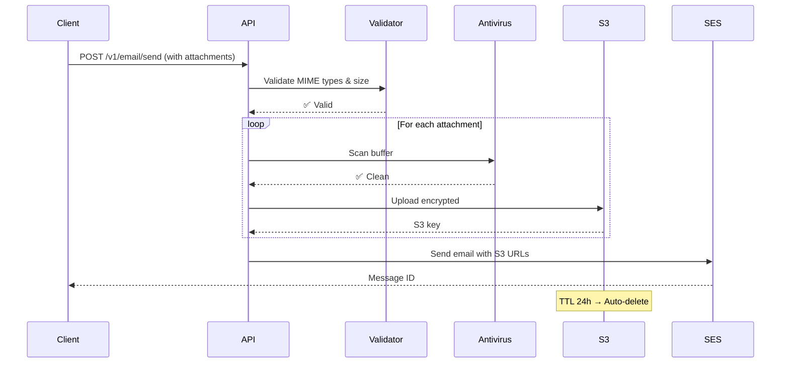

# 07-attachments-security

> **Tipo:** API | Segurança
> **Status:** Em Revisão
> **Última atualização:** 2025-10-23
> **Responsável:** Equipe MVP Email Gateway

## Visão Geral

Este documento define a **especificação de anexos** para emails, incluindo tipos permitidos (allowlist MIME), limites de tamanho, validação antivírus obrigatória, armazenamento temporário criptografado e políticas de segurança para prevenir vazamento de dados.

## Índice

- [Visão Geral](#visão-geral)
- [Objetivos](#objetivos)
- [Contexto](#contexto)
- [1. Tipos MIME Permitidos](#1-tipos-mime-permitidos)
- [2. Limites de Anexos](#2-limites-de-anexos)
- [3. Validação Antivírus](#3-validação-antivírus)
- [4. Armazenamento Temporário](#4-armazenamento-temporário)
- [5. Políticas de Segurança](#5-políticas-de-segurança)
- [6. API de Anexos](#6-api-de-anexos)
- [7. Implementação](#7-implementação)
- [8. Troubleshooting](#8-troubleshooting)
- [Referências](#referências)

## Objetivos

Este documento tem como objetivos:

- Definir allowlist de tipos MIME aceitos para anexos
- Especificar limites de quantidade e tamanho
- Documentar processo de validação antivírus obrigatória
- Definir estratégia de armazenamento temporário criptografado
- Estabelecer políticas de segurança e compliance (LGPD)

## Contexto

### Quem deve ler este documento?

- **Desenvolvedores:** Implementar upload e validação de anexos
- **Segurança:** Validar políticas de antivírus e criptografia
- **DevOps/SRE:** Configurar ClamAV e armazenamento temporário
- **Compliance:** Validar conformidade com LGPD e retenção de dados

### Por que Validação de Anexos?

**Riscos sem validação:**
- ❌ Malware distribuído via emails (vírus, ransomware)
- ❌ Arquivos executáveis maliciosos (.exe, .bat, .sh)
- ❌ Exploits via arquivos Office com macros
- ❌ Uso indevido de storage (arquivos gigantes)
- ❌ Vazamento de dados via logs

**Benefícios da validação:**
- ✅ Proteção contra malware e vírus
- ✅ Controle de custos de armazenamento e envio
- ✅ Conformidade com políticas de segurança
- ✅ Proteção de reputação do sender
- ✅ LGPD compliance (não reter dados além do necessário)

### MVP Constraints

- **Tipos permitidos:** PDF, PNG, JPG, TXT, XLSX, DOCX (6 tipos)
- **Limite por anexo:** 512 KB (0,5 MB)
- **Limite total:** 5 anexos por email
- **Tamanho total:** Máximo 2,5 MB (5 × 512 KB)
- **Antivírus:** ClamAV obrigatório (scan antes de envio)
- **Armazenamento:** S3 com criptografia server-side, TTL 24h
- **Retenção:** Deletar após 24h (LGPD compliance)

---

## 1. Tipos MIME Permitidos

### 1.1 Allowlist de MIME Types

**Apenas os seguintes tipos são aceitos:**

| Tipo | MIME Type | Extensão | Uso Comum |
|------|-----------|----------|-----------|
| PDF | `application/pdf` | `.pdf` | Documentos, boletos, faturas |
| PNG | `image/png` | `.png` | Imagens, logos, comprovantes |
| JPEG | `image/jpeg` | `.jpg`, `.jpeg` | Fotos, imagens comprimidas |
| TXT | `text/plain` | `.txt` | Texto simples, logs |
| Excel | `application/vnd.openxmlformats-officedocument.spreadsheetml.sheet` | `.xlsx` | Planilhas |
| Word | `application/vnd.openxmlformats-officedocument.wordprocessingml.document` | `.docx` | Documentos editáveis |

**⚠️ IMPORTANTE:** Esta allowlist é **restritiva**. Qualquer tipo não listado será **rejeitado**.

### 1.2 Tipos **NÃO** Permitidos

| Tipo | Motivo de Bloqueio |
|------|-------------------|
| `.exe`, `.bat`, `.sh` | Executáveis (malware risk) |
| `.zip`, `.rar`, `.7z` | Arquivos comprimidos (podem conter malware) |
| `.doc`, `.xls` (Office 97-2003) | Formatos antigos com vulnerabilidades conhecidas |
| `.js`, `.vbs`, `.ps1` | Scripts (risco de execução maliciosa) |
| `.html`, `.htm` | HTML pode conter JavaScript malicioso |
| `.svg` | Pode conter scripts embutidos |

### 1.3 Validação de MIME Type

**Validação em 2 camadas:**

1. **Header `Content-Type`:** Verificar MIME type declarado
2. **Magic Bytes:** Verificar assinatura binária do arquivo (prevenir MIME type spoofing)

**Exemplo de magic bytes:**

```typescript
const MIME_SIGNATURES = {
  'application/pdf': [0x25, 0x50, 0x44, 0x46], // %PDF
  'image/png': [0x89, 0x50, 0x4E, 0x47], // �PNG
  'image/jpeg': [0xFF, 0xD8, 0xFF], // ÿØÿ
  'application/zip': [0x50, 0x4B, 0x03, 0x04], // PK (usado por .docx, .xlsx)
};

function verifyMagicBytes(buffer: Buffer, mimeType: string): boolean {
  const signature = MIME_SIGNATURES[mimeType];
  if (!signature) return false;

  for (let i = 0; i < signature.length; i++) {
    if (buffer[i] !== signature[i]) return false;
  }

  return true;
}
```

---

## 2. Limites de Anexos

### 2.1 Limites por Email

| Limite | Valor | Motivo |
|--------|-------|--------|
| **Máximo de anexos** | 5 | Evitar sobrecarga de processamento e envio |
| **Tamanho por anexo** | 512 KB | Limitar tamanho de email final |
| **Tamanho total** | 2,5 MB | Soma de todos os anexos (5 × 512 KB) |
| **Nome do arquivo** | 255 caracteres | Limite de filesystem |

### 2.2 Validação de Limites

**Validação na API:**

```typescript
// DTO para validação
import { IsArray, ArrayMaxSize, ValidateNested, MaxLength } from 'class-validator';
import { Type } from 'class-transformer';

class AttachmentDto {
  @IsString()
  @MaxLength(255)
  filename: string;

  @IsString()
  @IsIn([
    'application/pdf',
    'image/png',
    'image/jpeg',
    'text/plain',
    'application/vnd.openxmlformats-officedocument.spreadsheetml.sheet',
    'application/vnd.openxmlformats-officedocument.wordprocessingml.document',
  ])
  mimeType: string;

  @IsString()
  content: string; // Base64 encoded

  @IsOptional()
  @IsNumber()
  @Max(524288) // 512 KB in bytes
  size?: number;
}

class SendEmailDto {
  // ... outros campos

  @IsArray()
  @ArrayMaxSize(5)
  @ValidateNested({ each: true })
  @Type(() => AttachmentDto)
  attachments?: AttachmentDto[];
}
```

**Validação de tamanho total:**

```typescript
function validateTotalSize(attachments: AttachmentDto[]): void {
  const totalSize = attachments.reduce((sum, att) => {
    // Decode base64 to get real size
    const buffer = Buffer.from(att.content, 'base64');
    return sum + buffer.length;
  }, 0);

  const MAX_TOTAL_SIZE = 2.5 * 1024 * 1024; // 2.5 MB

  if (totalSize > MAX_TOTAL_SIZE) {
    throw new BadRequestException({
      code: 'ATTACHMENTS_TOO_LARGE',
      message: `Total attachments size (${(totalSize / 1024 / 1024).toFixed(2)} MB) exceeds limit of 2.5 MB`,
      totalSize,
      maxSize: MAX_TOTAL_SIZE,
    });
  }
}
```

### 2.3 Limites do AWS SES

**AWS SES tem limite de 10 MB por email** (incluindo headers, body, attachments). Nosso limite de 2,5 MB para anexos deixa margem para:
- Body HTML (< 1 MB típico)
- Headers (< 10 KB)
- Encoding overhead (Base64 aumenta ~33%)

---

## 3. Validação Antivírus

### 3.1 ClamAV Integration

**Antivírus obrigatório:** Todos os anexos devem ser escaneados com ClamAV antes do envio.

**Instalação ClamAV:**

```bash
# Ubuntu/Debian
sudo apt-get update
sudo apt-get install clamav clamav-daemon

# Atualizar banco de vírus
sudo freshclam

# Iniciar daemon
sudo systemctl start clamav-daemon
sudo systemctl enable clamav-daemon
```

**Docker Compose:**

```yaml
# docker-compose.yml
services:
  clamav:
    image: clamav/clamav:latest
    ports:
      - "3310:3310"
    volumes:
      - clamav-data:/var/lib/clamav
    environment:
      - CLAMAV_NO_FRESHCLAM=false
    healthcheck:
      test: ["CMD", "/usr/local/bin/clamd", "--ping"]
      interval: 30s
      timeout: 10s
      retries: 3

volumes:
  clamav-data:
```

### 3.2 Implementação do Scanner

```typescript
// apps/api/src/modules/attachments/services/antivirus.service.ts
import { Injectable, Logger } from '@nestjs/common';
import { NodeClam } from 'clamscan';

@Injectable()
export class AntivirusService {
  private readonly logger = new Logger(AntivirusService.name);
  private clam: NodeClam;

  constructor() {
    this.clam = new NodeClam({
      clamdscan: {
        host: process.env.CLAMAV_HOST || 'localhost',
        port: parseInt(process.env.CLAMAV_PORT || '3310', 10),
        timeout: 60000, // 60 seconds
      },
      preference: 'clamdscan',
    });
  }

  async scanBuffer(buffer: Buffer, filename: string): Promise<ScanResult> {
    const startTime = Date.now();

    try {
      const { isInfected, viruses } = await this.clam.scanBuffer(buffer);

      const duration = Date.now() - startTime;

      if (isInfected) {
        this.logger.warn({
          message: 'Malware detected in attachment',
          filename,
          viruses,
          duration,
        });

        return {
          safe: false,
          viruses,
          scanDuration: duration,
        };
      }

      this.logger.log({
        message: 'Attachment scan completed - clean',
        filename,
        size: buffer.length,
        duration,
      });

      return {
        safe: true,
        scanDuration: duration,
      };
    } catch (error) {
      this.logger.error({
        message: 'Antivirus scan failed',
        filename,
        error: error.message,
      });

      // IMPORTANTE: Fail-safe - rejeitar em caso de erro
      throw new ServiceUnavailableException({
        code: 'ANTIVIRUS_UNAVAILABLE',
        message: 'Antivirus scan failed. Please try again later.',
      });
    }
  }

  async scanFile(filePath: string): Promise<ScanResult> {
    const { isInfected, viruses } = await this.clam.scanFile(filePath);

    return {
      safe: !isInfected,
      viruses: isInfected ? viruses : undefined,
    };
  }
}

interface ScanResult {
  safe: boolean;
  viruses?: string[];
  scanDuration?: number;
}
```

### 3.3 Integração no Fluxo de Upload

```typescript
// apps/api/src/modules/email/services/email-send.service.ts
async sendEmail(dto: SendEmailDto) {
  // 1. Validar anexos (se existirem)
  if (dto.attachments && dto.attachments.length > 0) {
    for (const attachment of dto.attachments) {
      // Decode base64
      const buffer = Buffer.from(attachment.content, 'base64');

      // Scan antivírus
      const scanResult = await this.antivirusService.scanBuffer(buffer, attachment.filename);

      if (!scanResult.safe) {
        throw new BadRequestException({
          code: 'MALWARE_DETECTED',
          message: `Malware detected in attachment: ${attachment.filename}`,
          viruses: scanResult.viruses,
        });
      }

      // Upload para S3 (após validação)
      const s3Key = await this.attachmentService.upload(buffer, attachment);
      attachment.s3Key = s3Key; // Guardar referência
    }
  }

  // 2. Continuar com envio do email...
}
```

### 3.4 Métricas de Antivírus

```typescript
import { Counter, Histogram } from 'prom-client';

const virusScanDuration = new Histogram({
  name: 'virus_scan_duration_seconds',
  help: 'Duration of virus scan',
  labelNames: ['result'], // 'clean' ou 'infected'
  buckets: [0.1, 0.5, 1, 2, 5, 10],
});

const virusDetected = new Counter({
  name: 'virus_detected_total',
  help: 'Total viruses detected',
  labelNames: ['virus_name'],
});

// Uso
virusScanDuration.labels('clean').observe(scanResult.scanDuration / 1000);

if (!scanResult.safe) {
  for (const virus of scanResult.viruses) {
    virusDetected.labels(virus).inc();
  }
}
```

---

## 4. Armazenamento Temporário

### 4.1 Arquitetura de Armazenamento

**Anexos são armazenados temporariamente em S3** antes do envio via SES.

```
Cliente → API → Antivírus → S3 (encrypted) → SES → Destinatário
                                ↓
                         TTL 24h → Auto-delete
```

### 4.2 Configuração S3

**Bucket configuration:**

```typescript
// Terraform
resource "aws_s3_bucket" "email_attachments" {
  bucket = "email-gateway-attachments-${var.environment}"

  tags = {
    Name        = "Email Attachments"
    Environment = var.environment
  }
}

resource "aws_s3_bucket_server_side_encryption_configuration" "attachments" {
  bucket = aws_s3_bucket.email_attachments.id

  rule {
    apply_server_side_encryption_by_default {
      sse_algorithm = "AES256"
    }
  }
}

resource "aws_s3_bucket_lifecycle_configuration" "attachments" {
  bucket = aws_s3_bucket.email_attachments.id

  rule {
    id     = "delete-after-24h"
    status = "Enabled"

    expiration {
      days = 1 # 24 horas
    }

    noncurrent_version_expiration {
      noncurrent_days = 1
    }
  }
}

resource "aws_s3_bucket_public_access_block" "attachments" {
  bucket = aws_s3_bucket.email_attachments.id

  block_public_acls       = true
  block_public_policy     = true
  ignore_public_acls      = true
  restrict_public_buckets = true
}
```

### 4.3 Upload Service

```typescript
// apps/api/src/modules/attachments/services/attachment-storage.service.ts
import { Injectable } from '@nestjs/common';
import { S3Client, PutObjectCommand, DeleteObjectCommand } from '@aws-sdk/client-s3';
import { randomUUID } from 'crypto';

@Injectable()
export class AttachmentStorageService {
  private s3Client: S3Client;
  private bucketName: string;

  constructor() {
    this.s3Client = new S3Client({
      region: process.env.AWS_REGION || 'us-east-1',
    });
    this.bucketName = process.env.S3_ATTACHMENTS_BUCKET || 'email-gateway-attachments';
  }

  async upload(buffer: Buffer, attachment: AttachmentDto): Promise<string> {
    const key = this.generateKey(attachment.filename);

    await this.s3Client.send(
      new PutObjectCommand({
        Bucket: this.bucketName,
        Key: key,
        Body: buffer,
        ContentType: attachment.mimeType,
        ServerSideEncryption: 'AES256',
        Metadata: {
          'original-filename': attachment.filename,
          'uploaded-at': new Date().toISOString(),
        },
        // IMPORTANTE: Tag para lifecycle policy
        Tagging: 'ttl=24h',
      })
    );

    return key;
  }

  private generateKey(filename: string): string {
    const uuid = randomUUID();
    const timestamp = Date.now();
    const ext = filename.split('.').pop();

    // Pattern: attachments/YYYY-MM-DD/UUID.ext
    const date = new Date().toISOString().split('T')[0];
    return `attachments/${date}/${uuid}.${ext}`;
  }

  async delete(key: string): Promise<void> {
    await this.s3Client.send(
      new DeleteObjectCommand({
        Bucket: this.bucketName,
        Key: key,
      })
    );
  }

  getUrl(key: string): string {
    // Gerar URL pré-assinada (válida por 1 hora)
    return `https://${this.bucketName}.s3.amazonaws.com/${key}`;
  }
}
```

### 4.4 Limpeza Automática

**S3 Lifecycle policy** deleta automaticamente após 24h.

**Cronjob de backup (fail-safe):**

```typescript
// apps/worker/src/jobs/cleanup-attachments.job.ts
import { Injectable, Logger } from '@nestjs/common';
import { Cron, CronExpression } from '@nestjs/schedule';
import { S3Client, ListObjectsV2Command, DeleteObjectsCommand } from '@aws-sdk/client-s3';

@Injectable()
export class CleanupAttachmentsJob {
  private readonly logger = new Logger(CleanupAttachmentsJob.name);

  @Cron(CronExpression.EVERY_HOUR)
  async cleanup() {
    this.logger.log('Starting attachments cleanup job');

    const s3 = new S3Client({ region: process.env.AWS_REGION });
    const bucket = process.env.S3_ATTACHMENTS_BUCKET;

    // Listar objetos mais antigos que 24h
    const cutoffDate = new Date(Date.now() - 24 * 60 * 60 * 1000);

    const objects = await s3.send(
      new ListObjectsV2Command({
        Bucket: bucket,
        Prefix: 'attachments/',
      })
    );

    const toDelete = objects.Contents.filter(
      (obj) => obj.LastModified < cutoffDate
    );

    if (toDelete.length === 0) {
      this.logger.log('No attachments to clean up');
      return;
    }

    // Deletar em batch
    await s3.send(
      new DeleteObjectsCommand({
        Bucket: bucket,
        Delete: {
          Objects: toDelete.map((obj) => ({ Key: obj.Key })),
        },
      })
    );

    this.logger.log(`Cleaned up ${toDelete.length} attachments`);
  }
}
```

---

## 5. Políticas de Segurança

### 5.1 Nunca Logar Conteúdo

**⚠️ CRÍTICO:** Conteúdo de anexos **NUNCA** deve ser logado.

**Regras:**

1. ❌ **Não logar:** `attachment.content` (base64)
2. ❌ **Não logar:** Buffer de arquivos
3. ❌ **Não logar:** S3 URLs com credenciais
4. ✅ **Pode logar:** Filename, MIME type, size, scan result

**Exemplo correto:**

```typescript
// ❌ ERRADO
this.logger.log({
  message: 'Processing attachment',
  attachment: attachment, // Contém content!
});

// ✅ CORRETO
this.logger.log({
  message: 'Processing attachment',
  filename: attachment.filename,
  mimeType: attachment.mimeType,
  size: attachment.size,
  safe: scanResult.safe,
});
```

### 5.2 Criptografia em Trânsito

- ✅ **HTTPS obrigatório:** API só aceita HTTPS
- ✅ **TLS 1.2+:** Configurado no ALB/CloudFront
- ✅ **S3 → SES:** Conexão interna AWS (encrypted by default)

### 5.3 Criptografia em Repouso

- ✅ **S3 SSE-AES256:** Server-side encryption habilitada
- ✅ **Banco de dados:** RDS com encryption at rest
- ✅ **Backups:** Encrypted snapshots

### 5.4 Controle de Acesso

**IAM Policy para S3:**

```json
{
  "Version": "2012-10-17",
  "Statement": [
    {
      "Effect": "Allow",
      "Action": [
        "s3:PutObject",
        "s3:GetObject",
        "s3:DeleteObject"
      ],
      "Resource": "arn:aws:s3:::email-gateway-attachments/*",
      "Condition": {
        "StringEquals": {
          "s3:x-amz-server-side-encryption": "AES256"
        }
      }
    }
  ]
}
```

### 5.5 LGPD Compliance

**Direito ao esquecimento:**

- ✅ Anexos deletados após 24h automaticamente
- ✅ Logs de anexos sem PII (apenas metadata)
- ✅ S3 versionamento desabilitado (evitar retenção acidental)
- ✅ Backups com retenção limitada (30 dias)

---

## 6. API de Anexos

### 6.1 Enviar Email com Anexos

```http
POST /v1/email/send
Content-Type: application/json
X-API-Key: sk_live_abc123

{
  "externalId": "BOL-M2-2025-00456",
  "recipient": "user@example.com",
  "subject": "Boleto - Fatura Janeiro 2025",
  "html": "<html><body><h1>Sua fatura</h1></body></html>",
  "attachments": [
    {
      "filename": "boleto-janeiro-2025.pdf",
      "mimeType": "application/pdf",
      "content": "JVBERi0xLjMKJcTl8uXrp/Og0MTGCjQgMCBvYmoKPD..."
    },
    {
      "filename": "comprovante.png",
      "mimeType": "image/png",
      "content": "iVBORw0KGgoAAAANSUhEUgAAAAUA..."
    }
  ]
}
```

**Response 201:**

```json
{
  "outboxId": "out_01HQABC789",
  "status": "QUEUED",
  "attachments": [
    {
      "filename": "boleto-janeiro-2025.pdf",
      "size": 245678,
      "s3Key": "attachments/2025-10-23/uuid1.pdf",
      "scanResult": "clean"
    },
    {
      "filename": "comprovante.png",
      "size": 89234,
      "s3Key": "attachments/2025-10-23/uuid2.png",
      "scanResult": "clean"
    }
  ]
}
```

**Response 400 - Malware Detected:**

```json
{
  "code": "MALWARE_DETECTED",
  "message": "Malware detected in attachment: suspicious.pdf",
  "viruses": ["Win.Trojan.Generic-12345"],
  "attachment": {
    "filename": "suspicious.pdf",
    "index": 0
  }
}
```

**Response 400 - Invalid MIME Type:**

```json
{
  "code": "INVALID_MIME_TYPE",
  "message": "MIME type 'application/x-msdownload' is not allowed",
  "allowedTypes": [
    "application/pdf",
    "image/png",
    "image/jpeg",
    "text/plain",
    "application/vnd.openxmlformats-officedocument.spreadsheetml.sheet",
    "application/vnd.openxmlformats-officedocument.wordprocessingml.document"
  ]
}
```

**Response 413 - Attachment Too Large:**

```json
{
  "code": "ATTACHMENT_TOO_LARGE",
  "message": "Attachment 'large-file.pdf' exceeds 512 KB limit",
  "size": 678901,
  "maxSize": 524288,
  "filename": "large-file.pdf"
}
```

---

## 7. Implementação

### 7.1 Fluxo Completo



### 7.2 Controller Implementation

```typescript
// apps/api/src/modules/email/controllers/email.controller.ts
@Post('send')
@HttpCode(201)
async sendEmail(@Body() dto: SendEmailDto, @Req() req) {
  // 1. Validar anexos
  if (dto.attachments) {
    await this.attachmentService.validateAttachments(dto.attachments);
  }

  // 2. Enviar email
  const result = await this.emailService.sendEmail(dto, req.companyId);

  return result;
}
```

### 7.3 Attachment Service

```typescript
// apps/api/src/modules/attachments/services/attachment.service.ts
@Injectable()
export class AttachmentService {
  constructor(
    private antivirusService: AntivirusService,
    private storageService: AttachmentStorageService,
  ) {}

  async validateAttachments(attachments: AttachmentDto[]): Promise<void> {
    // 1. Validar quantidade
    if (attachments.length > 5) {
      throw new BadRequestException('Maximum 5 attachments allowed');
    }

    let totalSize = 0;

    for (const [index, attachment] of attachments.entries()) {
      // 2. Decode base64
      const buffer = Buffer.from(attachment.content, 'base64');

      // 3. Validar tamanho individual
      if (buffer.length > 512 * 1024) {
        throw new BadRequestException({
          code: 'ATTACHMENT_TOO_LARGE',
          message: `Attachment '${attachment.filename}' exceeds 512 KB`,
          size: buffer.length,
          maxSize: 512 * 1024,
          index,
        });
      }

      totalSize += buffer.length;

      // 4. Validar MIME type (magic bytes)
      const isValid = this.verifyMagicBytes(buffer, attachment.mimeType);
      if (!isValid) {
        throw new BadRequestException({
          code: 'MIME_TYPE_MISMATCH',
          message: `File content does not match declared MIME type for '${attachment.filename}'`,
          index,
        });
      }

      // 5. Scan antivírus
      const scanResult = await this.antivirusService.scanBuffer(buffer, attachment.filename);
      if (!scanResult.safe) {
        throw new BadRequestException({
          code: 'MALWARE_DETECTED',
          message: `Malware detected in '${attachment.filename}'`,
          viruses: scanResult.viruses,
          index,
        });
      }

      // 6. Upload para S3
      const s3Key = await this.storageService.upload(buffer, attachment);
      attachment.s3Key = s3Key;
    }

    // 7. Validar tamanho total
    if (totalSize > 2.5 * 1024 * 1024) {
      throw new BadRequestException({
        code: 'ATTACHMENTS_TOO_LARGE',
        message: 'Total attachments size exceeds 2.5 MB',
        totalSize,
        maxSize: 2.5 * 1024 * 1024,
      });
    }
  }

  private verifyMagicBytes(buffer: Buffer, mimeType: string): boolean {
    // Implementação conforme seção 1.3
    // ...
  }
}
```

---

## 8. Troubleshooting

### 8.1 Antivírus Indisponível

**Sintomas:**
- Erro 503 ao enviar emails com anexos
- Logs: "Antivirus scan failed"

**Diagnóstico:**

```bash
# Verificar se ClamAV está rodando
docker ps | grep clamav
sudo systemctl status clamav-daemon

# Testar conexão
telnet localhost 3310

# Verificar logs
docker logs clamav
```

**Solução:**
- Reiniciar ClamAV daemon
- Verificar firewall (porta 3310)
- Atualizar banco de vírus: `sudo freshclam`

---

### 8.2 Attachment Rejeitado (MIME mismatch)

**Sintomas:**
- Erro 400: "MIME_TYPE_MISMATCH"

**Causa:** Arquivo foi renomeado mas mantém assinatura original.

**Solução:**
- Usar ferramenta `file` para verificar tipo real:
  ```bash
  file --mime-type attachment.pdf
  ```
- Cliente deve enviar MIME type correto

---

### 8.3 S3 Upload Timeout

**Sintomas:**
- Timeout ao fazer upload de anexos
- Logs: "S3 PutObject timeout"

**Diagnóstico:**
```bash
# Testar conectividade S3
aws s3 ls s3://email-gateway-attachments/

# Verificar latência
time aws s3 cp test.pdf s3://bucket/test.pdf
```

**Solução:**
- Aumentar timeout no SDK (default 60s)
- Verificar IAM permissions
- Verificar se bucket existe e região está correta

---

## Referências

- [Pacote de Documentos de Arquitetura — MVP](docs/00-pacote-documentos-arquitetura-mvp.md)
- [API Contract - Email Send](docs/api/03-email-send-contract.md)
- [ClamAV Documentation](https://docs.clamav.net/)
- [AWS SES - Sending Email with Attachments](https://docs.aws.amazon.com/ses/latest/dg/send-email-raw.html)
- [AWS S3 - Server-Side Encryption](https://docs.aws.amazon.com/AmazonS3/latest/userguide/serv-side-encryption.html)
- [OWASP - File Upload Security](https://owasp.org/www-community/vulnerabilities/Unrestricted_File_Upload)
- [LGPD - Lei Geral de Proteção de Dados](https://www.gov.br/esporte/pt-br/acesso-a-informacao/lgpd)

---

**Template version:** 1.0
**Last updated:** 2025-10-23
