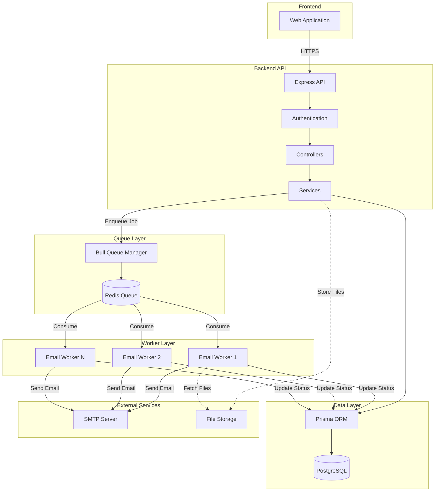
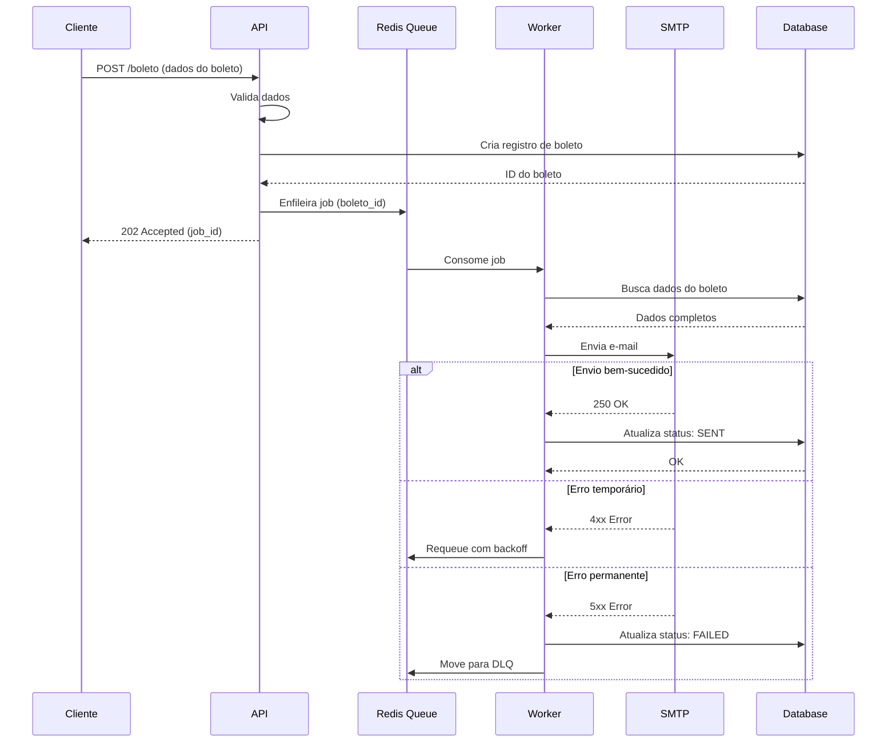
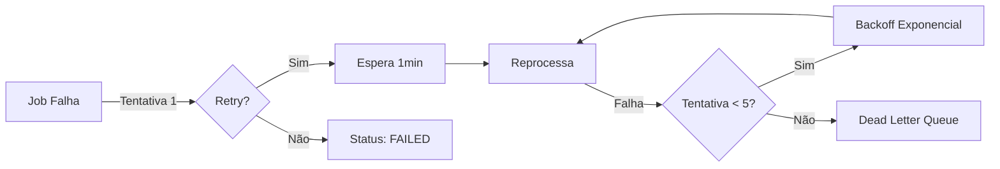

# 01-visao-geral-sistema

> **Tipo:** Arquitetura
> **Status:** Aprovado
> **Última atualização:** 2025-10-16
> **Responsável:** Equipe de Arquitetura

## Visão Geral

Este documento apresenta a visão geral da arquitetura do sistema de envio de boletos por e-mail, descrevendo seus principais componentes, fluxos de dados e decisões arquiteturais.

## Índice

- [Visão Geral](#visão-geral)
- [Objetivos](#objetivos)
- [Contexto](#contexto)
- [Arquitetura do Sistema](#arquitetura-do-sistema)
- [Componentes Principais](#componentes-principais)
- [Fluxos de Dados](#fluxos-de-dados)
- [Considerações](#considerações)
- [Referências](#referências)

## Objetivos

- Fornecer visão arquitetural completa do sistema
- Documentar decisões de design e suas justificativas
- Servir como referência para novos desenvolvedores
- Facilitar manutenção e evolução do sistema

## Contexto

O sistema de envio de boletos por e-mail é uma solução MVP para automatizar o envio de notificações de boletos bancários aos clientes. O sistema deve ser:

- **Confiável**: Garantir entrega dos e-mails ou notificar falhas
- **Escalável**: Processar grandes volumes de boletos
- **Resiliente**: Lidar com falhas temporárias de serviços externos
- **Observável**: Permitir monitoramento e troubleshooting

## Arquitetura do Sistema

### Diagrama de Arquitetura

### Padrão Arquitetural

O sistema segue uma **arquitetura distribuída baseada em filas** com os seguintes princípios:

1. **Separação de Responsabilidades**: API e Workers têm responsabilidades distintas
2. **Processamento Assíncrono**: E-mails são processados em background
3. **Retry Automático**: Falhas temporárias são tratadas com retry exponencial
4. **Idempotência**: Jobs podem ser reprocessados sem efeitos colaterais

## Componentes Principais

### 1. Frontend (Web Application)

**Responsabilidades:**
- Interface para usuários gerenciarem boletos
- Visualização de status de envio
- Dashboard de monitoramento

**Tecnologias:**
- React/Next.js
- TypeScript
- Tailwind CSS

**Localização:** `/web`

### 2. API REST

**Responsabilidades:**
- Receber requisições de envio de boletos
- Validar e autenticar requisições
- Enfileirar jobs de envio
- Consultar status de envios

**Tecnologias:**
- Node.js + Express
- TypeScript
- Prisma ORM
- Zod (validação)

**Localização:** `/api`

**Principais Endpoints:**
- `POST /api/boleto` - Cria job de envio
- `GET /api/boleto/:id` - Consulta status
- `GET /api/boleto/:id/retry` - Reenvia boleto

### 3. Redis Queue

**Responsabilidades:**
- Gerenciar fila de jobs de envio
- Garantir entrega de mensagens
- Suportar retry e dead letter queue

**Tecnologias:**
- Redis 7.x
- Bull (queue manager)

**Configuração:**
- Persistência: AOF + RDB
- Retry: Exponential backoff
- DLQ: Após 5 tentativas

### 4. Workers

**Responsabilidades:**
- Consumir jobs da fila
- Enviar e-mails via SMTP
- Atualizar status no banco
- Tratar erros e retries

**Tecnologias:**
- Node.js
- Nodemailer
- Bull worker

**Localização:** `/worker`

**Características:**
- Escalável horizontalmente
- Processamento paralelo
- Graceful shutdown

### 5. PostgreSQL

**Responsabilidades:**
- Armazenar dados de boletos
- Histórico de envios
- Logs de tentativas
- Configurações

**Tecnologias:**
- PostgreSQL 15+
- Prisma ORM
- Migrations

**Localização:** `/database`

## Fluxos de Dados

### Fluxo de Envio de Boleto

### Fluxo de Retry

## Considerações

### Performance

- **Throughput**: ~1000 emails/minuto por worker
- **Latência API**: < 100ms (enfileiramento)
- **Latência E-mail**: 2-5 segundos (processamento)

### Segurança

- Autenticação JWT na API
- Rate limiting por cliente
- Validação de entrada com Zod
- Conexões TLS/SSL para SMTP

### Escalabilidade

- Workers escaláveis horizontalmente
- Redis Cluster para alta disponibilidade
- Connection pooling no PostgreSQL
- CDN para assets estáticos (frontend)

### Manutenibilidade

- TypeScript em toda codebase
- Testes automatizados (unitários + integração)
- Logging estruturado (Winston)
- Monitoramento (Prometheus + Grafana)

### Resiliência

- Retry exponencial com jitter
- Circuit breaker para SMTP
- Health checks em todos componentes
- Graceful shutdown de workers

## Roadmap

- [x] Implementação MVP básico
- [ ] Suporte a templates de e-mail
- [ ] Webhooks para notificações
- [ ] API de analytics
- [ ] Suporte multi-tenant

## Referências

- [ADR-20250116-escolha-redis-queue](../adrs/ADR-20250116-escolha-redis-queue.md)
- [Documentação API](../api/01-endpoints.md)
- [Configuração Workers](../worker/01-configuracao.md)
- [Estratégia de Retry](../worker/02-retry-strategy.md)

## Glossário

**Job**: Unidade de trabalho representando o envio de um e-mail

**DLQ (Dead Letter Queue)**: Fila para jobs que falham após todas tentativas

**Backoff Exponencial**: Estratégia de retry com intervalos crescentes

**Idempotência**: Propriedade onde múltiplas execuções produzem o mesmo resultado

---

**Template version:** 1.0
**Last updated:** 2025-10-16
