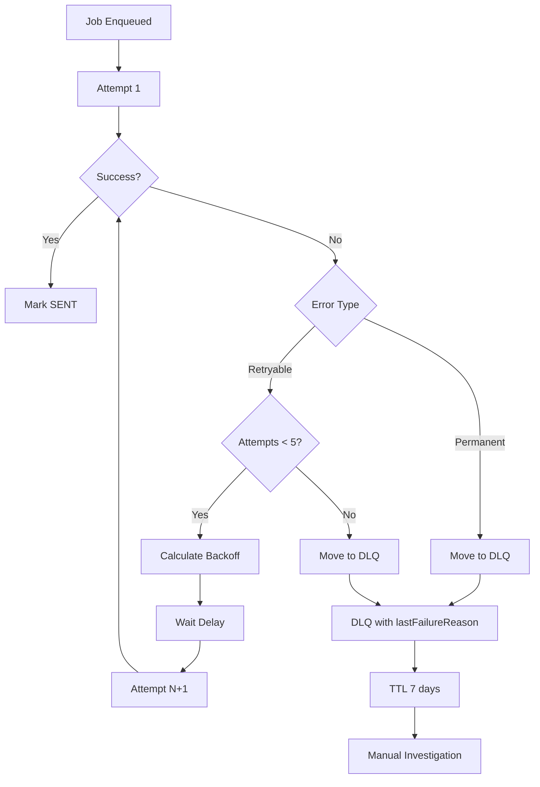
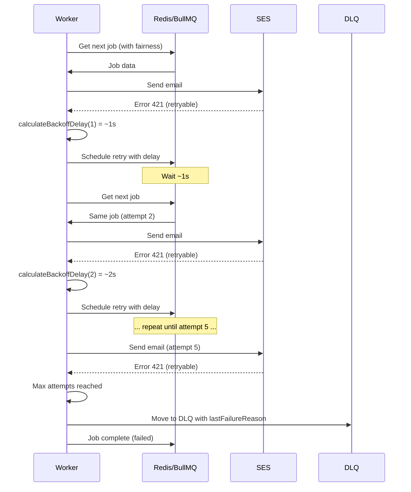

# 03-retry-backoff-dlq

> **Tipo:** Arquitetura
> **Status:** Implementado
> **Última atualização:** 2025-10-19
> **Responsável:** Equipe de Arquitetura
> **Relacionado:** TASK 3.2

## Visão Geral

Estratégia completa de retry, backoff exponencial, Dead Letter Queue (DLQ) e fairness por tenant para o sistema de envio de e-mails.

Este documento implementa os requisitos da **TASK 3.2**:

- Backoff exponencial com jitter (1s→60s)
- Mover à DLQ após 5 falhas
- TTL DLQ 7 dias
- `lastFailureReason` obrigatório
- AOF everysec, maxmemory-policy noeviction
- Round-robin por tenant (companyId)

## Contexto

Falhas temporárias são comuns em sistemas distribuídos, especialmente ao enviar e-mails via SMTP/SES. Uma estratégia robusta de retry é essencial para:

1. **Maximizar taxa de entrega**: Retry de erros temporários
2. **Evitar sobrecarga**: Backoff exponencial com jitter
3. **Garantir fairness**: Round-robin entre tenants
4. **Rastreabilidade**: DLQ para análise de falhas permanentes
5. **Confiabilidade**: Persistência Redis com AOF

## Estratégia de Retry

### Configuração

```typescript
const EMAIL_JOB_RETRY_CONFIG = {
  MAX_ATTEMPTS: 5,              // TASK 3.2: 5 tentativas antes de DLQ
  BASE_DELAY_MS: 1000,          // TASK 3.2: delay inicial 1s
  MAX_DELAY_MS: 60000,          // TASK 3.2: delay máximo 60s
  JITTER_FACTOR: 0.25,          // ±25% de jitter
  DLQ_TTL_MS: 604800000,        // TASK 3.2: 7 dias na DLQ
  DLQ_NAME: 'email:send:dlq',
  DLQ_MAX_SIZE: 10000,
};
```

### Backoff Exponencial com Jitter

**Fórmula:**

```
delay = min(MAX_DELAY, BASE_DELAY * 2^(attempt-1)) + jitter
jitter = random(-JITTER_FACTOR * delay, +JITTER_FACTOR * delay)
```

**Tabela de Delays (valores aproximados com jitter):**

| Tentativa | Delay Base | Com Jitter (±25%) | Range (ms) |
|-----------|------------|-------------------|------------|
| 1         | 1s         | ~1s               | 750-1250   |
| 2         | 2s         | ~2s               | 1500-2500  |
| 3         | 4s         | ~4s               | 3000-5000  |
| 4         | 8s         | ~8s               | 6000-10000 |
| 5         | 16s        | ~16s              | 12000-20000|
| 6+        | 60s (cap)  | ~60s              | 45000-75000|

**Benefícios do Jitter:**

- Evita "thundering herd" (múltiplos jobs retrying simultaneamente)
- Distribui carga no tempo
- Melhora taxa de sucesso em cenários de rate limit

### Implementação

```typescript
import { calculateBackoffDelay } from '@email-gateway/shared';

function calculateBackoffDelay(attempt: number): number {
  const exponentialDelay = BASE_DELAY_MS * Math.pow(2, attempt - 1);
  const cappedDelay = Math.min(exponentialDelay, MAX_DELAY_MS);

  const jitterRange = cappedDelay * JITTER_FACTOR;
  const jitter = (Math.random() * 2 - 1) * jitterRange;

  return Math.max(0, Math.round(cappedDelay + jitter));
}
```

## Dead Letter Queue (DLQ)

### Quando Jobs Vão para DLQ

Um job é movido para DLQ quando:

1. **Tentativas esgotadas**: Falhou em todas as 5 tentativas
2. **Erro permanente**: Erro não-retryable (ex: 550, MessageRejected)

### Schema de Entrada na DLQ

```typescript
{
  jobId: string;                    // UUID (= outboxId)
  outboxId: string;                 // UUID
  companyId: string;                // UUID (tenant)
  originalData: Record<string, unknown>;
  failedAttempts: number;           // >= 5
  lastFailureReason: string;        // OBRIGATÓRIO (TASK 3.2)
  lastFailureCode?: string;         // SMTP ou SES error code
  lastFailureTimestamp: string;     // ISO 8601
  enqueuedAt: string;               // ISO 8601
  movedToDLQAt: string;             // ISO 8601
  ttl: number;                      // 7 dias (TASK 3.2)
}
```

### Validação Obrigatória

**TASK 3.2: `lastFailureReason` é obrigatório**

```typescript
import { validateDLQEntry } from '@email-gateway/shared';

try {
  const dlqEntry = validateDLQEntry({
    // ... outros campos
    lastFailureReason: 'SMTP 550: Mailbox not found',
    // ...
  });
} catch (error) {
  // Erro se lastFailureReason ausente ou vazio
}
```

### Processamento da DLQ

#### Monitoramento

```typescript
// Métricas importantes
- Número de jobs na DLQ
- Taxa de entrada na DLQ (jobs/hora)
- Distribuição de errorCode
- Top empresas (companyId) na DLQ
```

#### Reprocessamento Manual

```typescript
// Processo para reprocessar job da DLQ:
1. Investigar lastFailureReason
2. Corrigir causa raiz (ex: domínio SES, configuração)
3. Re-enfileirar job com originalData
4. Remover da DLQ após sucesso
```

#### Alertas

```yaml
alertas:
  - nome: "DLQ Alto Volume"
    condicao: "jobs_na_dlq > 100"
    acao: "Notificar equipe de operações"

  - nome: "Taxa de DLQ Alta"
    condicao: "taxa_dlq > 2% dos envios"
    acao: "Investigar padrões de falha"

  - nome: "DLQ por Empresa"
    condicao: "jobs_dlq_por_empresa > 50"
    acao: "Notificar empresa específica"
```

## Códigos de Erro SMTP/SES

### Erros Retryable (Temporários)

```typescript
const RETRYABLE_ERRORS = [
  '421',  // Service not available
  '450',  // Mailbox unavailable
  '451',  // Local error in processing
  '452',  // Insufficient system storage
  'Throttling',           // AWS SES throttling
  'ServiceUnavailable',   // AWS SES indisponível
];
```

### Erros Permanentes (Não-Retryable)

```typescript
const PERMANENT_ERRORS = [
  '500',  // Syntax error
  '550',  // Mailbox unavailable (permanent)
  '554',  // Transaction failed
  'MessageRejected',              // AWS SES rejeitou
  'MailFromDomainNotVerified',    // Domínio não verificado
];
```

### Classificação

```typescript
import { isRetryableError } from '@email-gateway/shared';

const shouldRetry = isRetryableError(errorCode);

if (!shouldRetry) {
  // Mover direto para DLQ, não fazer retry
  await moveToDLQ(job, errorCode, errorReason);
}
```

## Fairness por Tenant (Round-Robin)

### Motivação

Evitar que uma única empresa monopolize capacidade de processamento do worker.

### Estratégia

```typescript
const EMAIL_JOB_FAIRNESS_CONFIG = {
  ENABLE_ROUND_ROBIN: true,
  MAX_JOBS_PER_TENANT_BATCH: 3,
  ROUND_ROBIN_BASE_PRIORITY: 5,
  PRIORITY_INCREMENT_PER_ROUND: 1,
  MAX_ROUND_ROBIN_PRIORITY: 1,  // 1 = máxima urgência
};
```

### Funcionamento

1. **Prioridade dinâmica**: Empresas sem jobs recentes recebem maior prioridade
2. **Batch limit**: Máximo 3 jobs consecutivos por empresa
3. **Incremento**: A cada rodada sem processar, prioridade aumenta

### Cálculo de Prioridade

```typescript
import { calculateRoundRobinPriority } from '@email-gateway/shared';

// Empresa ficou 3 rodadas sem processar
const priority = calculateRoundRobinPriority(3);
// priority = 2 (maior urgência)

// Empresa processou recentemente
const priority = calculateRoundRobinPriority(0);
// priority = 5 (prioridade base)
```

### Métricas por Tenant

```typescript
interface TenantFairnessMetrics {
  companyId: string;
  lastProcessedAt?: string;
  roundsWithoutProcessing: number;
  currentPriority: number;
  totalProcessed: number;
  consecutiveBatchCount: number;
}
```

### Implementação no Worker

```typescript
// Pseudo-código do worker
class EmailWorker {
  private tenantMetrics = new Map<string, TenantFairnessMetrics>();

  async processJobs() {
    while (true) {
      // 1. Obter próximo job considerando prioridade round-robin
      const job = await this.getNextJobWithFairness();

      // 2. Processar job
      await this.processJob(job);

      // 3. Atualizar métricas do tenant
      this.updateTenantMetrics(job.data.companyId);

      // 4. Verificar se atingiu batch limit
      if (this.shouldSwitchTenant(job.data.companyId)) {
        this.rotateTenant();
      }
    }
  }

  private shouldSwitchTenant(companyId: string): boolean {
    const metrics = this.tenantMetrics.get(companyId);
    return metrics.consecutiveBatchCount >= MAX_JOBS_PER_TENANT_BATCH;
  }
}
```

## Configuração do Redis

### TASK 3.2: AOF e Políticas de Memória

```ini
# Persistência AOF (Append-Only File)
appendonly yes
appendfsync everysec        # TASK 3.2: fsync a cada segundo

# Política de evicção
maxmemory 512mb
maxmemory-policy noeviction  # TASK 3.2: nunca remover jobs

# Configurações adicionais
aof-use-rdb-preamble yes
auto-aof-rewrite-percentage 100
auto-aof-rewrite-min-size 64mb
```

### Justificativa

**AOF everysec:**

- Balanceio entre durabilidade e performance
- Perda máxima de 1 segundo de dados em crash
- Performance ~99% do "no fsync"

**noeviction:**

- **CRÍTICO**: Garante que jobs nunca sejam removidos silenciosamente
- Sistema falha se memória encher (preferível a perder jobs)
- Requer monitoramento proativo de memória

### Monitoramento de Memória

```yaml
alertas:
  - nome: "Redis Memória 80%"
    condicao: "used_memory / maxmemory > 0.8"
    acao: "Alerta preventivo - revisar retenção"

  - nome: "Redis Memória 90%"
    condicao: "used_memory / maxmemory > 0.9"
    acao: "Alerta crítico - ação imediata necessária"

  - nome: "Redis OOM Errors"
    condicao: "rejected_connections > 0"
    acao: "Sistema falhando - aumentar memória ou limpar DLQ"
```

## Fluxo Completo de Retry



## Diagrama de Sequência



## Configuração BullMQ

### Job Options

```typescript
import { EMAIL_JOB_RETRY_CONFIG } from '@email-gateway/shared';

const jobOptions = {
  jobId: outboxId,  // jobId = outboxId (idempotência)

  attempts: EMAIL_JOB_RETRY_CONFIG.MAX_ATTEMPTS,

  backoff: {
    type: 'custom',  // Usar função customizada
    delay: EMAIL_JOB_RETRY_CONFIG.BASE_DELAY_MS,
  },

  removeOnComplete: true,
  removeOnFail: false,  // Não remover, mover para DLQ

  ttl: EMAIL_JOB_CONFIG.DEFAULT_TTL,  // 24h
};

// Adicionar job
await queue.add('email:send', jobData, jobOptions);
```

### Worker Configuration

```typescript
const worker = new Worker(
  'email:send',
  async (job) => {
    try {
      await processEmailJob(job);
    } catch (error) {
      if (job.attemptsMade >= EMAIL_JOB_RETRY_CONFIG.MAX_ATTEMPTS) {
        // Mover para DLQ
        await moveToDLQ(job, error);
        return; // Não fazer retry
      }

      if (!isRetryableError(error.code)) {
        // Erro permanente, DLQ direto
        await moveToDLQ(job, error);
        return;
      }

      // Calcular delay para próxima tentativa
      const delay = calculateBackoffDelay(job.attemptsMade + 1);

      // Re-throw para BullMQ fazer retry
      throw error;
    }
  },
  {
    connection: redisConnection,
    concurrency: 5,
    limiter: {
      max: 100,    // Máximo 100 jobs
      duration: 60000,  // por minuto
    },
  }
);
```

## Testes

### Cobertura de Testes

```typescript
// Localização: packages/shared/src/schemas/__tests__/email-job-retry.schema.spec.ts

- ✅ Validação de schemas Zod
- ✅ Cálculo de backoff exponencial
- ✅ Aplicação de jitter
- ✅ Validação de DLQ entry (lastFailureReason obrigatório)
- ✅ Cálculo de prioridade round-robin
- ✅ Classificação de erros (retryable vs permanent)
- ✅ Fluxo completo de retry até DLQ
- ✅ Simulação de fairness entre tenants
```

### Executar Testes

```bash
cd packages/shared
npm test -- email-job-retry.schema.spec
```

## Métricas e Observabilidade

### Métricas Essenciais

```typescript
// Retry metrics
- retry_attempts_total (counter por attempt number)
- retry_backoff_delay_seconds (histogram)
- retry_success_rate (gauge por attempt)

// DLQ metrics
- dlq_entries_total (counter)
- dlq_size (gauge)
- dlq_age_seconds (histogram)
- dlq_by_error_code (counter por error code)
- dlq_by_company (counter por companyId)

// Fairness metrics
- tenant_jobs_processed (counter por companyId)
- tenant_current_priority (gauge por companyId)
- tenant_consecutive_batch (gauge por companyId)
- tenant_rounds_without_processing (gauge por companyId)
```

### Logs Estruturados

```json
{
  "level": "warn",
  "message": "Job failed, scheduling retry",
  "jobId": "123e4567-e89b-12d3-a456-426614174000",
  "companyId": "789e4567-e89b-12d3-a456-426614174999",
  "attempt": 3,
  "maxAttempts": 5,
  "errorCode": "421",
  "errorReason": "Service temporarily unavailable",
  "nextRetryDelay": 4234,
  "isRetryable": true,
  "timestamp": "2025-10-19T10:30:00.000Z"
}
```

## Runbook Operacional

### Cenário 1: DLQ Crescendo Rapidamente

**Sintomas:**

- DLQ com > 100 jobs
- Taxa de entrada > 2% dos envios

**Ações:**

1. Verificar distribuição de `errorCode`:

   ```sql
   SELECT lastFailureCode, COUNT(*)
   FROM dlq
   GROUP BY lastFailureCode
   ORDER BY COUNT(*) DESC;
   ```

2. Identificar se é erro específico de empresa:

   ```sql
   SELECT companyId, COUNT(*)
   FROM dlq
   GROUP BY companyId
   ORDER BY COUNT(*) DESC
   LIMIT 10;
   ```

3. Investigar causa raiz conforme errorCode

4. Se correção aplicada, reprocessar jobs da DLQ

### Cenário 2: Redis Próximo do Limite de Memória

**Sintomas:**

- `used_memory / maxmemory > 0.9`
- Alertas de memória

**Ações:**

1. Verificar tamanho da DLQ:

   ```redis
   ZCARD email:send:dlq
   ```

2. Verificar jobs pendentes:

   ```redis
   ZCARD bull:email:send:wait
   ZCARD bull:email:send:active
   ZCARD bull:email:send:delayed
   ```

3. Se DLQ grande, exportar e limpar jobs antigos:

   ```bash
   # Exportar DLQ para análise
   redis-cli --scan --pattern "bull:email:send:dlq:*" > dlq_export.txt

   # Remover jobs com > 30 dias (se apropriado)
   ```

4. Se memória continuar alta, aumentar `maxmemory` ou escalar Redis

### Cenário 3: Tenant Monopolizando Fila

**Sintomas:**

- `consecutiveBatchCount` alto para uma empresa
- Outras empresas com `roundsWithoutProcessing` crescendo

**Ações:**

1. Verificar métricas de fairness
2. Ajustar `MAX_JOBS_PER_TENANT_BATCH` se necessário
3. Revisar prioridades calculadas
4. Considerar rate limit específico para empresa problemática

## Considerações de Performance

### Throughput

- **Backoff**: Não impacta jobs bem-sucedidos
- **Jitter**: Overhead mínimo (< 1ms por cálculo)
- **Fairness**: Overhead de ~5ms por job (lookup de métricas)

### Memória Redis

- **Estimativa**: ~2KB por job pendente
- **DLQ**: ~3KB por entry (dados originais + metadados)
- **Capacidade**: 512MB suporta ~250k jobs ou ~170k DLQ entries

### Latência

- **P50**: < 50ms (sem retry)
- **P95**: < 250ms (incluindo fairness lookup)
- **P99**: Depende de backoff (pode ser até 60s)

## Evolução Futura

### Pós-MVP

1. **Machine Learning**: Predizer erros retryable vs permanent
2. **Rate Limit Adaptativo**: Ajustar backoff baseado em taxa de sucesso
3. **DLQ Automática**: Reprocessamento automático após cooldown
4. **Fairness Avançado**: Pesos por tier de cliente
5. **Multi-região**: Fallback para região secundária em falhas

## Referências

- [TASK 3.2 Requirements](../00-pacote-documentos-arquitetura-mvp.md)
- [TASK 3.1 Job Contract](./02-job-contracts.md)
- [BullMQ Documentation](https://docs.bullmq.io/)
- [Redis AOF Persistence](https://redis.io/docs/management/persistence/)
- [RFC 5321 - SMTP](https://tools.ietf.org/html/rfc5321)
- [AWS SES Error Codes](https://docs.aws.amazon.com/ses/latest/dg/api-error-codes.html)

---

**Template version:** 1.0
**Last updated:** 2025-10-19
**Implemented by:** TASK 3.2
