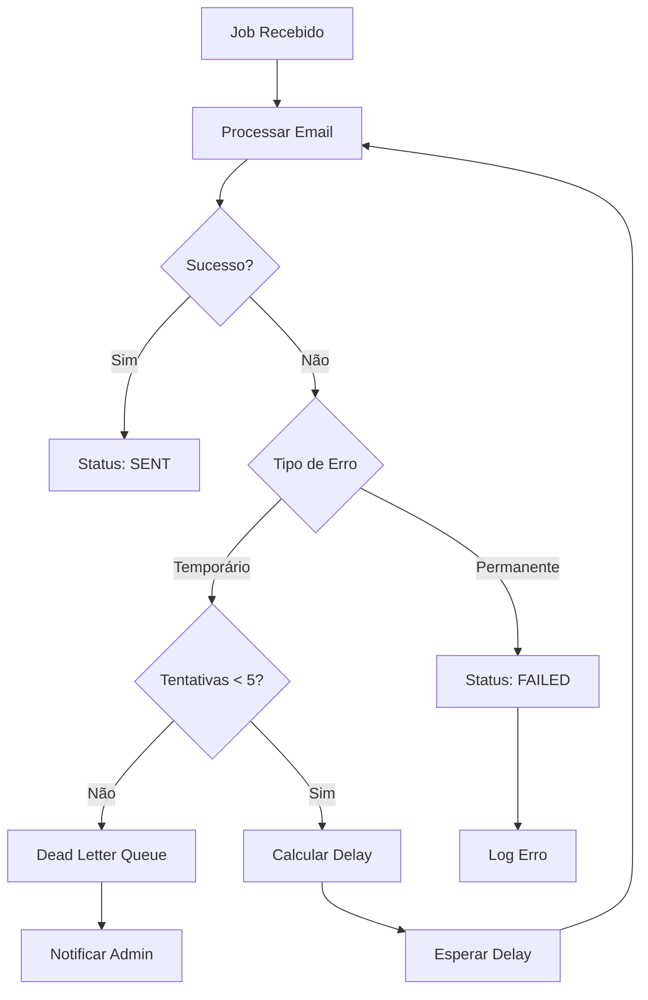

# 02-retry-strategy

> **Tipo:** Arquitetura
> **Status:** Aprovado
> **Última atualização:** 2025-01-16
> **Responsável:** Equipe de Arquitetura

## Visão Geral

Estratégia de retry para tratamento de falhas temporárias no envio de e-mails.

## Contexto

Falhas temporárias são comuns em sistemas distribuídos, especialmente ao enviar e-mails via SMTP. Uma estratégia robusta de retry é essencial para garantir a entrega dos e-mails.

## Estratégia de Retry

### Backoff Exponencial com Jitter

Utilizamos backoff exponencial com jitter para evitar "thundering herd" e distribuir tentativas no tempo.

**Fórmula:**
```
delay = min(max_delay, base_delay * 2^attempt + random_jitter)
```

**Parâmetros:**
- `base_delay`: 1 segundo
- `max_delay`: 300 segundos (5 minutos)
- `max_attempts`: 5 tentativas
- `jitter`: ±25% do delay calculado

### Códigos de Erro SMTP

#### Retry (Erros Temporários)
- `421`: Serviço temporariamente indisponível
- `450`: Mailbox temporariamente indisponível
- `451`: Erro local no processamento
- `452`: Espaço insuficiente no servidor
- `550`: Mailbox não disponível (temporário)

#### Não Retry (Erros Permanentes)
- `500`: Erro interno do servidor
- `501`: Sintaxe incorreta
- `502`: Comando não implementado
- `503`: Sequência de comandos incorreta
- `550`: Mailbox não disponível (permanente)
- `551`: Usuário não local
- `552`: Espaço insuficiente
- `553`: Mailbox não permitido
- `554`: Falha na transação

## Implementação

### Configuração Bull Queue

```typescript
const queueConfig = {
  defaultJobOptions: {
    attempts: 5,
    backoff: {
      type: 'exponential',
      delay: 1000, // 1 segundo base
    },
    removeOnComplete: 100,
    removeOnFail: 50,
  },
};
```

### Processamento de Erros

```typescript
async function processEmailJob(job: Job) {
  try {
    await sendEmail(job.data);
    await updateJobStatus(job.id, 'sent');
  } catch (error) {
    if (isRetryableError(error)) {
      throw error; // Bull fará o retry
    } else {
      await updateJobStatus(job.id, 'failed');
      await moveToDeadLetterQueue(job);
    }
  }
}

function isRetryableError(error: any): boolean {
  const retryableCodes = [421, 450, 451, 452];
  return retryableCodes.includes(error.code);
}
```

### Dead Letter Queue

Jobs que falham após todas tentativas são movidos para DLQ:

```typescript
const deadLetterQueue = new Queue('email-dlq', {
  connection: redisConfig,
});

// Processar DLQ manualmente
deadLetterQueue.process(async (job) => {
  // Análise manual ou notificação
  await notifyAdmin(job.data);
});
```

## Monitoramento

### Métricas de Retry

- Taxa de sucesso por tentativa
- Tempo médio entre tentativas
- Distribuição de códigos de erro
- Jobs na DLQ

### Alertas

- Taxa de falha > 10%
- DLQ com mais de 100 jobs
- Tempo de processamento > 5 minutos

## Diagrama de Fluxo



## Configuração por Ambiente

### Desenvolvimento
- `max_attempts`: 3
- `base_delay`: 500ms
- `max_delay`: 30s

### Produção
- `max_attempts`: 5
- `base_delay`: 1s
- `max_delay`: 300s

## Considerações

### Performance
- Retry não deve impactar throughput
- Delay máximo evita sobrecarga
- Jitter distribui carga

### Observabilidade
- Logs detalhados de cada tentativa
- Métricas de retry por tipo de erro
- Alertas para padrões anômalos

### Manutenibilidade
- Configuração centralizada
- Testes de retry automatizados
- Documentação de códigos de erro

## Referências

- [ADR-20250116-escolha-redis-queue](../adrs/ADR-20250116-escolha-redis-queue.md)
- [RFC 5321 - SMTP](https://tools.ietf.org/html/rfc5321)
- [Bull Queue Documentation](https://github.com/OptimalBits/bull)

---

**Template version:** 1.0
**Last updated:** 2025-01-16
