# Failure Modes & Recovery — Worker

> **TASK 4.3** — Falhas específicas e troubleshooting
>
> Documento: Cat\u00e1logo de falhas, runbooks de DLQ/reprocessamento e auditoria

---

## 1. Objetivo

Documentar os **modos de falha** do Worker, estratégias de **recuperação**, **runbooks** operacionais e procedimentos de **troubleshooting** para garantir resiliência e rastreabilidade do sistema.

---

## 2. Cat\u00e1logo de Falhas

### 2.1 Taxonomia de Falhas

As falhas são categorizadas em **6 categorias principais**:

| Categoria | Descri\u00e7\u00e3o | Retent\u00e1vel? | Exemplos |
|-----------|-------------|--------------|----------|
| **VALIDATION_ERROR** | Erros de valida\u00e7\u00e3o do payload | ❌ N\u00e3o | Payload inv\u00e1lido, outbox n\u00e3o encontrado |
| **PERMANENT_ERROR** | Erros permanentes que n\u00e3o devem ser retentados | ❌ N\u00e3o | Mensagem rejeitada, conta SES pausada |
| **TRANSIENT_ERROR** | Erros transit\u00f3rios que podem ser retentados | ✅ Sim | SES indispon\u00edvel, erro de rede |
| **QUOTA_ERROR** | Erros de quota/rate limit do SES | ✅ Sim | Throttling, quota di\u00e1ria excedida |
| **CONFIGURATION_ERROR** | Erros de configura\u00e7\u00e3o (DNS/SPF/DKIM) | ❌ N\u00e3o | Dom\u00ednio n\u00e3o verificado, Configuration Set inexistente |
| **TIMEOUT_ERROR** | Erros de timeout | ✅ Sim | Timeout ao enviar para SES |

---

### 2.2 Falhas Permanentes (Non-Retryable)

#### 2.2.1 Valida\u00e7\u00e3o de Payload

**C\u00f3digos de erro:**

- `INVALID_PAYLOAD` — Payload do job inv\u00e1lido
- `OUTBOX_NOT_FOUND` — Registro no outbox n\u00e3o encontrado
- `RECIPIENT_NOT_FOUND` — Destinat\u00e1rio n\u00e3o encontrado
- `INVALID_TEMPLATE` — Template/HTML inv\u00e1lido
- `INVALID_EMAIL` — Endere\u00e7o de email inv\u00e1lido

**Causas comuns:**

- Job corrompido ou incompleto
- Registro de outbox deletado antes do processamento
- HTML malformado ou muito grande (\u003e 512 KB)
- Email com formato inv\u00e1lido (ex: falta @)

**Recupera\u00e7\u00e3o:**

❌ **N\u00e3o reprocessar automaticamente**
✅ **A\u00e7\u00e3o:** Logar erro, marcar como `FAILED`, investigar causa raiz

**Troubleshooting:**

```bash
# Verificar outbox
psql -d email_gateway -c "
  SELECT id, company_id, status, created_at
  FROM email_outbox
  WHERE id = '<outbox_id>';
"

# Verificar tamanho do HTML
psql -d email_gateway -c "
  SELECT id, LENGTH(html) as html_size_bytes
  FROM email_outbox
  WHERE id = '<outbox_id>';
"
```

---

#### 2.2.2 SES — Mensagem Rejeitada

**C\u00f3digo de erro:** `SES_MESSAGE_REJECTED`

**Causas comuns:**

- Destinat\u00e1rio na lista de supress\u00e3o (bounce/complaint anterior)
- Conte\u00fado identificado como spam pelo SES
- Email inv\u00e1lido ou dom\u00ednio inexistente
- Viola\u00e7\u00e3o de pol\u00edticas de conte\u00fado

**Recupera\u00e7\u00e3o:**

❌ **N\u00e3o reprocessar automaticamente**
✅ **A\u00e7\u00e3o:** Verificar lista de supress\u00e3o, validar destinat\u00e1rio, revisar conte\u00fado

**Troubleshooting:**

```bash
# Verificar lista de supressão no SES
aws sesv2 list-suppressed-destinations \
  --region us-east-1 \
  --query "SuppressedDestinationSummaries[?EmailAddress=='destinatario@example.com']"

# Remover da supressão (se apropriado)
aws sesv2 delete-suppressed-destination \
  --region us-east-1 \
  --email-address destinatario@example.com
```

---

#### 2.2.3 SES — Configura\u00e7\u00e3o (DNS/SPF/DKIM)

**C\u00f3digos de erro:**

- `SES_MAIL_FROM_DOMAIN_NOT_VERIFIED` — Dom\u00ednio de envio n\u00e3o verificado
- `SES_CONFIGURATION_SET_DOES_NOT_EXIST` — Configuration Set inexistente

**Causas comuns:**

- Dom\u00ednio n\u00e3o verificado no SES
- Registros DNS (SPF/DKIM/DMARC) ausentes ou incorretos
- Configuration Set deletado ou com nome incorreto

**Recupera\u00e7\u00e3o:**

❌ **N\u00e3o reprocessar automaticamente**
✅ **A\u00e7\u00e3o:** Corrigir configura\u00e7\u00e3o, verificar DNS

**Troubleshooting:**

```bash
# Verificar status de verificação do domínio
aws ses get-identity-verification-attributes \
  --region us-east-1 \
  --identities noreply@certshift.com.br

# Verificar registros DNS
dig TXT _amazonses.certshift.com.br
dig TXT _dmarc.certshift.com.br
dig TXT default._domainkey.certshift.com.br

# Listar Configuration Sets
aws sesv2 list-configuration-sets --region us-east-1
```

---

#### 2.2.4 SES — Conta Pausada

**C\u00f3digo de erro:** `SES_ACCOUNT_SENDING_PAUSED`

**Causas comuns:**

- Viola\u00e7\u00e3o de pol\u00edticas da AWS
- Taxa de bounce/complaint muito alta
- Atividade suspeita de spam

**Recupera\u00e7\u00e3o:**

❌ **N\u00e3o reprocessar automaticamente**
🚨 **A\u00e7\u00e3o:** Abrir ticket com AWS Support imediatamente

**Troubleshooting:**

```bash
# Verificar status da conta
aws sesv2 get-account --region us-east-1

# Verificar reputação de envio
aws sesv2 get-account --region us-east-1 \
  --query 'SendingEnabled'
```

---

### 2.3 Falhas Transientes (Retryable)

#### 2.3.1 SES — Servi\u00e7o Indispon\u00edvel

**C\u00f3digos de erro:**

- `SES_SERVICE_UNAVAILABLE` — SES temporariamente indispon\u00edvel
- `NETWORK_ERROR` — Erro de rede ao conectar com SES

**Causas comuns:**

- Indisponibilidade tempor\u00e1ria do SES (raro)
- Problemas de conectividade de rede
- Timeout de conex\u00e3o

**Recupera\u00e7\u00e3o:**

✅ **Reprocessar automaticamente** com backoff exponencial
⏱️ **Retries:** At\u00e9 5 tentativas (configurado em `EMAIL_JOB_CONFIG.MAX_ATTEMPTS`)

**Backoff:**

- Tentativa 1: imediato
- Tentativa 2: +2s
- Tentativa 3: +4s
- Tentativa 4: +8s
- Tentativa 5: +16s

**Troubleshooting:**

```bash
# Verificar conectividade com SES
curl -I https://email.us-east-1.amazonaws.com/

# Verificar status do serviço SES
# https://status.aws.amazon.com/

# Testar envio manual
aws ses send-email \
  --region us-east-1 \
  --from noreply@certshift.com.br \
  --to test@example.com \
  --subject "Test" \
  --text "Test"
```

---

#### 2.3.2 SES — Quota e Rate Limiting

**C\u00f3digos de erro:**

- `SES_THROTTLING` — Taxa de requisi\u00e7\u00f5es excedida (HTTP 429)
- `SES_MAX_SEND_RATE_EXCEEDED` — Taxa m\u00e1xima de envio/segundo excedida
- `SES_DAILY_QUOTA_EXCEEDED` — Quota di\u00e1ria excedida

**Causas comuns:**

- Volume de envios excede limite da conta SES
- Burst de requisi\u00e7\u00f5es muito r\u00e1pido
- Conta em tier Sandbox (limite de 1 email/s, 200 emails/24h)

**Recupera\u00e7\u00e3o:**

✅ **Reprocessar automaticamente** com backoff exponencial
⏱️ **Delay adicional:** 30s a 60s entre retries para quota

**Monitoramento preventivo:**

```bash
# Verificar quota atual
aws sesv2 get-account --region us-east-1 \
  --query 'SendQuota'

# Exemplo de resposta:
# {
#   "Max24HourSend": 50000.0,
#   "MaxSendRate": 14.0,
#   "SentLast24Hours": 1234.0
# }
```

**Alerta proativo:**

```bash
# Configurar alarme quando 80% da quota for atingida
# (implementado via CloudWatch ou script de monitoramento)
```

Ver **Runbook de Quota SES** (se\u00e7\u00e3o 4.2) para detalhes.

---

#### 2.3.3 Timeout

**C\u00f3digo de erro:** `SES_TIMEOUT`

**Causas comuns:**

- Requisi\u00e7\u00e3o ao SES excede 30s (configurado em `PIPELINE_CONSTANTS.SES_SEND_TIMEOUT_MS`)
- Conex\u00e3o lenta ou inst\u00e1vel
- SES sob carga pesada

**Recupera\u00e7\u00e3o:**

✅ **Reprocessar automaticamente**
⏱️ **Timeout:** 30s por tentativa

**Troubleshooting:**

```bash
# Medir latência para SES
time curl -I https://email.us-east-1.amazonaws.com/

# Verificar latência de rede
ping email.us-east-1.amazonaws.com
traceroute email.us-east-1.amazonaws.com
```

---

### 2.4 Erros Desconhecidos

**C\u00f3digo de erro:** `UNKNOWN_ERROR`

**Comportamento:**

- **Categoria:** `PERMANENT_ERROR` (conservador)
- **Retent\u00e1vel:** ❌ N\u00e3o (por padr\u00e3o)

**A\u00e7\u00e3o:**

1. Logar erro completo com stack trace
2. Marcar como `FAILED`
3. Investigar causa raiz
4. Adicionar mapeamento espec\u00edfico se necess\u00e1rio

**Troubleshooting:**

```bash
# Verificar logs do worker
tail -f /var/log/email-gateway/worker.log | grep "UNKNOWN_ERROR"

# Buscar erro nos logs do Prisma
grep "outbox_id" /var/log/email-gateway/worker.log | grep -A 10 "<outbox_id>"
```

---

## 3. Pipeline de Estados e Recupera\u00e7\u00e3o

### 3.1 Fluxo Normal

```mermaid
stateDiagram-v2
    [*] --> RECEIVED
    RECEIVED --> VALIDATED: Validações OK
    VALIDATED --> SENT_ATTEMPT: Iniciar envio
    SENT_ATTEMPT --> SENT: SES sucesso
    SENT --> [*]
```



### 3.2 Fluxo com Retry (Erro Transiente)


### 3.3 Fluxo com Falha Permanente


### 3.4 Fluxo para DLQ (M\u00e1ximo de Retries)


---

## 4. Runbooks Operacionais

### 4.1 Runbook: Reprocessamento de DLQ

**Objetivo:** Reprocessar jobs que foram movidos para a Dead Letter Queue (DLQ) ap\u00f3s esgotarem retries.

#### Quando usar

- Ap\u00f3s resolver causa raiz de falha transit\u00f3ria (ex: SES voltou ao ar, quota renovada)
- Jobs em DLQ com erro `SES_THROTTLING` ou `SES_SERVICE_UNAVAILABLE`

#### Pr\u00e9-requisitos

- Causa raiz da falha foi resolvida
- Verificar que jobs em DLQ s\u00e3o eleg\u00edveis para reprocessamento

#### Passo a passo

**1. Listar jobs em DLQ**

```bash
# Via Redis CLI
redis-cli -h localhost -p 6379

# Listar jobs na DLQ
LRANGE bull:email:send:failed 0 -1

# Contar jobs
LLEN bull:email:send:failed
```

**2. Inspecionar job espec\u00edfico**

```bash
# Buscar detalhes do job
redis-cli -h localhost -p 6379 GET "bull:email:send:<job_id>"
```

**3. Reprocessar job individual**

```typescript
// Script Node.js para reprocessamento manual
import { Queue } from 'bullmq';

const emailQueue = new Queue('email:send', {
  connection: { host: 'localhost', port: 6379 },
});

// Buscar job da DLQ
const failedJob = await emailQueue.getJob('<job_id>');

if (failedJob) {
  // Resetar tentativas
  await failedJob.updateData({
    ...failedJob.data,
    attempt: 1, // Resetar contador
  });

  // Mover de volta para fila principal
  await failedJob.retry();

  console.log(`Job ${failedJob.id} reprocessado`);
}
```

**4. Reprocessamento em lote (com cuidado!)**

```typescript
// Reprocessar todos os jobs da DLQ (CUIDADO: pode causar pico de carga)
const failedJobs = await emailQueue.getFailed();

for (const job of failedJobs) {
  const error = job.failedReason;

  // Filtrar apenas erros transientes
  if (error.includes('SES_THROTTLING') || error.includes('SES_SERVICE_UNAVAILABLE')) {
    await job.retry();
    console.log(`Retrying job ${job.id}`);

    // Delay entre reprocessamentos para evitar sobrecarga
    await new Promise(resolve => setTimeout(resolve, 1000));
  }
}
```

**5. Monitorar reprocessamento**

```bash
# Acompanhar progresso
watch -n 5 'redis-cli LLEN bull:email:send:failed'

# Verificar logs do worker
tail -f /var/log/email-gateway/worker.log | grep "RETRY"
```

#### Precau\u00e7\u00f5es

⚠️ **N\u00e3o reprocessar em lote durante hor\u00e1rio de pico**
⚠️ **Verificar quota SES antes de reprocessar** (ver Runbook 4.2)
⚠️ **Filtrar apenas erros retent\u00e1veis** (n\u00e3o reprocessar `PERMANENT_ERROR`)

---

### 4.2 Runbook: Monitoramento de Quota SES

**Objetivo:** Monitorar e prevenir estouro de quota SES.

#### M\u00e9tricas-chave

- **Max24HourSend:** Quota di\u00e1ria m\u00e1xima (ex: 50.000 emails/dia)
- **MaxSendRate:** Taxa m\u00e1xima de envio por segundo (ex: 14 emails/s)
- **SentLast24Hours:** Enviados nas \u00faltimas 24h

#### Script de monitoramento

```bash
#!/bin/bash
# monitor-ses-quota.sh

REGION="us-east-1"
ALERT_THRESHOLD=0.8  # 80%

# Buscar quota
QUOTA=$(aws sesv2 get-account --region $REGION --query 'SendQuota' --output json)

MAX_24H=$(echo $QUOTA | jq -r '.Max24HourSend')
SENT_24H=$(echo $QUOTA | jq -r '.SentLast24Hours')
MAX_RATE=$(echo $QUOTA | jq -r '.MaxSendRate')

# Calcular percentual usado
USAGE_PCT=$(echo "scale=2; $SENT_24H / $MAX_24H" | bc)

echo "SES Quota Status:"
echo "  Max 24h: $MAX_24H"
echo "  Sent 24h: $SENT_24H"
echo "  Usage: $(echo "$USAGE_PCT * 100" | bc)%"
echo "  Max rate: $MAX_RATE emails/s"

# Alertar se acima do threshold
if (( $(echo "$USAGE_PCT > $ALERT_THRESHOLD" | bc -l) )); then
  echo "⚠️  ALERT: Quota usage above ${ALERT_THRESHOLD}%"
  # Enviar notifica\u00e7\u00e3o (email, Slack, etc.)
fi
```

#### Automatizar via cron

```bash
# Executar a cada 30 minutos
*/30 * * * * /opt/scripts/monitor-ses-quota.sh >> /var/log/ses-quota.log
```

#### A\u00e7\u00f5es quando quota pr\u00f3xima do limite

1. **80-90% da quota:**
   - Reduzir concorr\u00eancia do worker (diminuir `WORKER_CONCURRENCY`)
   - Adiar jobs n\u00e3o urgentes

2. **90-100% da quota:**
   - Pausar processamento de novos jobs
   - Aguardar renova\u00e7\u00e3o da quota (24h rolling)

3. **Quota excedida:**
   - Jobs retornar\u00e3o `SES_DAILY_QUOTA_EXCEEDED`
   - Ser\u00e3o automaticamente retentados ap\u00f3s backoff

#### Solicitar aumento de quota

```bash
# Abrir ticket via AWS Support Console
# Ou via CLI:
aws support create-case \
  --subject "SES Quota Increase Request" \
  --service-code "ses" \
  --category-code "quota-increase" \
  --communication-body "Request increase to 100,000 emails/day" \
  --severity-code "normal"
```

---

### 4.3 Runbook: Troubleshooting de Falha Espec\u00edfica

**Objetivo:** Investigar e resolver falha de envio espec\u00edfica.

#### Entrada

- `outboxId` ou `requestId` do envio com falha

#### Passo a passo

**1. Buscar logs do envio**

```sql
-- No banco de dados
SELECT
  el.id,
  el.outbox_id,
  el.request_id,
  el.status,
  el.ses_message_id,
  el.error_code,
  el.error_reason,
  el.attempts,
  el.created_at,
  el.updated_at
FROM email_logs el
WHERE el.outbox_id = '<outbox_id>'
  OR el.request_id = '<request_id>';
```

**2. Buscar eventos do envio**

```sql
SELECT
  ee.id,
  ee.type,
  ee.metadata,
  ee.created_at
FROM email_events ee
JOIN email_logs el ON ee.email_log_id = el.id
WHERE el.outbox_id = '<outbox_id>'
ORDER BY ee.created_at ASC;
```

**3. Identificar categoria do erro**

```typescript
// Mapeamento de erro → categoria
const errorCode = emailLog.error_code;

// Consultar taxonomia
// Ver: packages/shared/src/types/email-pipeline.types.ts
```

**4. A\u00e7\u00e3o conforme categoria**

| Erro | A\u00e7\u00e3o |
|------|-------|
| `SES_MESSAGE_REJECTED` | Verificar lista de supress\u00e3o (se\u00e7\u00e3o 2.2.2) |
| `SES_MAIL_FROM_DOMAIN_NOT_VERIFIED` | Verificar DNS (se\u00e7\u00e3o 2.2.3) |
| `SES_THROTTLING` | Aguardar ou reprocessar ap\u00f3s backoff |
| `SES_SERVICE_UNAVAILABLE` | Verificar status SES |
| `INVALID_PAYLOAD` | Revisar dados do outbox |

**5. Reprocessamento manual (se aplic\u00e1vel)**

Ver **Runbook 4.1** para reprocessamento.

---

### 4.4 Runbook: Recupera\u00e7\u00e3o de Falha de Infraestrutura

**Objetivo:** Recuperar de falhas de infraestrutura (Redis down, DB down, etc.).

#### Cen\u00e1rio 1: Redis indispon\u00edvel

**Sintomas:**

- Worker n\u00e3o consegue conectar ao Redis
- Jobs n\u00e3o s\u00e3o processados
- Logs mostram erros de conex\u00e3o

**A\u00e7\u00e3o:**

```bash
# 1. Verificar status do Redis
systemctl status redis

# 2. Reiniciar Redis (se necess\u00e1rio)
systemctl restart redis

# 3. Verificar persist\u00eancia (AOF)
redis-cli CONFIG GET appendonly
# Deve retornar "yes"

# 4. Reiniciar worker
systemctl restart email-gateway-worker

# 5. Verificar se jobs retomaram
redis-cli LLEN bull:email:send:waiting
```

**Preven\u00e7\u00e3o:**

- Habilitar AOF (Append-Only File) para persist\u00eancia
- Configurar alertas de disponibilidade

---

#### Cen\u00e1rio 2: Postgres indispon\u00edvel

**Sintomas:**

- Worker falha ao gravar logs
- Erros de conex\u00e3o com banco

**A\u00e7\u00e3o:**

```bash
# 1. Verificar status do Postgres
systemctl status postgresql

# 2. Reiniciar Postgres (se necess\u00e1rio)
systemctl restart postgresql

# 3. Verificar conex\u00f5es ativas
psql -d email_gateway -c "SELECT count(*) FROM pg_stat_activity;"

# 4. Reiniciar worker
systemctl restart email-gateway-worker
```

**Recupera\u00e7\u00e3o de jobs perdidos:**

- Jobs que estavam processando ser\u00e3o automaticamente retentados pelo BullMQ
- Verificar logs de `email_outbox` com `status = 'PROCESSING'` e re-enfileirar se necess\u00e1rio

---

#### Cen\u00e1rio 3: Worker travado/crashed

**Sintomas:**

- Worker n\u00e3o processa jobs
- Fila crescendo (`waiting` aumentando)

**A\u00e7\u00e3o:**

```bash
# 1. Verificar status do worker
systemctl status email-gateway-worker

# 2. Verificar logs recentes
journalctl -u email-gateway-worker -n 100 --no-pager

# 3. Reiniciar worker
systemctl restart email-gateway-worker

# 4. Monitorar processamento
watch -n 5 'redis-cli LLEN bull:email:send:waiting'
```

**Preven\u00e7\u00e3o:**

- Configurar healthcheck e auto-restart
- Monitorar mem\u00f3ria e CPU do worker

---

## 5. Auditoria e Masking de Dados Sens\u00edveis

### 5.1 Dados Sens\u00edveis (PII)

Dados que devem ser **mascarados** ou **criptografados**:

- **CPF/CNPJ:** Sempre mascarado em logs (`***.***.***-**`)
- **Email:** Parcialmente mascarado em logs (`d***@example.com`)
- **Nome/Raz\u00e3o Social:** N\u00e3o mascarado (necess\u00e1rio para opera\u00e7\u00e3o)

### 5.2 Masking em Logs

**Implementa\u00e7\u00e3o atual:**

- Ver `LoggingService` (apps/worker/src/services/logging.service.ts)
- CPF/CNPJ nunca aparecem em claro nos logs

**Exemplo de log seguro:**

```json
{
  "level": "info",
  "message": "Email sent successfully",
  "outboxId": "uuid-123",
  "recipient": {
    "email": "d***@example.com",
    "cpfCnpj": "***.***.***-**"
  },
  "sesMessageId": "ABC123"
}
```

### 5.3 Auditoria de Acesso

**Logs de acesso ao dashboard:**

- Nginx registra todos os acessos ao dashboard (Basic Auth)
- Logs retidos por 90 dias

**Auditoria de consultas:**

- Implementar evento `EMAIL_LOG_VIEWED` ao abrir detalhe de envio no dashboard
- Registrar em `email_events` com metadata: `{ viewedBy, viewedAt, ipAddress }`

---

## 6. Alertas e Monitoramento

### 6.1 Alertas Cr\u00edticos

| Alerta | Condi\u00e7\u00e3o | A\u00e7\u00e3o |
|--------|----------|-------|
| **DLQ crescendo** | \u003e 100 jobs em DLQ | Investigar causa raiz |
| **Taxa de erro alta** | \u003e 5% de falhas em 5min | Verificar SES/conectividade |
| **Quota SES pr\u00f3xima** | \u003e 80% da quota di\u00e1ria | Reduzir concorr\u00eancia |
| **Worker parado** | 0 jobs processados em 5min | Reiniciar worker |
| **Fila crescendo** | \u003e 1000 jobs `waiting` | Aumentar concorr\u00eancia ou workers |

### 6.2 M\u00e9tricas Essenciais

- **Taxa de sucesso:** `SENT / (SENT + FAILED)` \u003e 95%
- **Tempo m\u00e9dio de processamento:** P95 \u003c 60s
- **Jobs em DLQ:** \u003c 50
- **Concorr\u00eancia do worker:** 2-5 jobs paralelos
- **Quota SES usada:** \u003c 80% da quota di\u00e1ria

---

## 7. Checklist de Troubleshooting

Ao investigar uma falha:

- [ ] Coletar `outboxId`, `requestId`, `jobId`
- [ ] Consultar `email_logs` e `email_events` no banco
- [ ] Identificar c\u00f3digo de erro (`error_code`) e categoria
- [ ] Verificar se erro \u00e9 retent\u00e1vel
- [ ] Consultar logs do worker (`journalctl` ou arquivo de log)
- [ ] Se erro SES, verificar quota e configura\u00e7\u00e3o
- [ ] Se erro de rede, verificar conectividade
- [ ] Se erro de valida\u00e7\u00e3o, revisar dados do outbox
- [ ] Decidir se reprocessar manualmente (ver Runbook 4.1)
- [ ] Documentar causa raiz e resolu\u00e7\u00e3o

---

## 8. Refer\u00eancias

- **Taxonomia de erros:** `packages/shared/src/types/email-pipeline.types.ts`
- **Error mapping service:** `apps/worker/src/services/error-mapping.service.ts`
- **SES error codes:** [AWS SES API Error Codes](https://docs.aws.amazon.com/ses/latest/dg/api-error-codes.html)
- **BullMQ retry/DLQ:** [BullMQ Retry Docs](https://docs.bullmq.io/guide/retrying-failing-jobs)

---

**\u00daltima atualiza\u00e7\u00e3o:** 2025-10-19
**Autor:** TASK 4.3 — Falhas espec\u00edficas e troubleshooting
